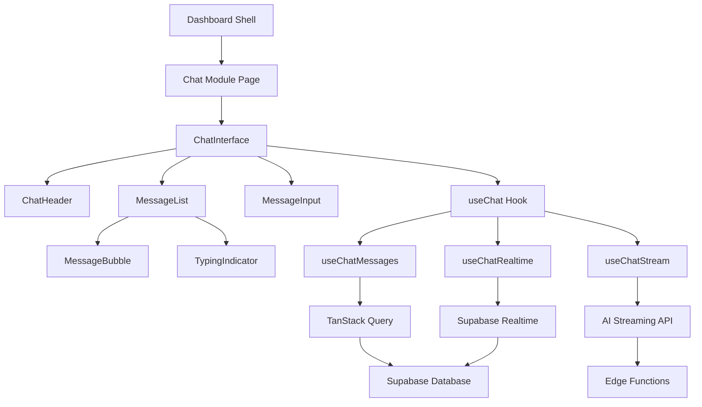

# Chatbot Architecture for Nality

*Compatible with existing modular dashboard architecture*

---

## 1. Overview

The chatbot module integrates seamlessly into the existing Nality dashboard as a real-time messaging interface with AI capabilities. It follows the established modular pattern while providing robust conversation management, message persistence, and intelligent life event extraction.

```
┌─────────────────┐    ┌──────────────────┐    ┌─────────────────┐
│   Chat Module   │◄──►│  Dashboard Shell │◄──►│ Existing Modules│
│  (Real-time)    │    │   (Navigation)   │    │ (Timeline, etc.)│
└─────────┬───────┘    └──────────────────┘    └─────────────────┘
          │
          ▼
┌─────────────────┐    ┌──────────────────┐    ┌─────────────────┐
│  Chat Messages  │◄──►│   Supabase DB    │◄──►│  AI Processing  │
│   (TanStack)    │    │  (Real-time)     │    │ (Edge Functions)│
└─────────────────┘    └──────────────────┘    └─────────────────┘
```

## 2. File & Folder Structure

```
apps/web/src/
├── app/
│   ├── (protected)/
│   │   └── dash/
│   │       └── chat/
│   │           ├── page.tsx                    # Chat module entry point
│   │           └── loading.tsx                 # Chat loading state
│   └── api/
│       └── chat/
│           ├── messages/
│           │   └── route.ts                    # CRUD operations for messages
│           ├── stream/
│           │   └── route.ts                    # AI streaming endpoint
│           └── sessions/
│               └── route.ts                    # Chat session management
├── components/
│   └── chat/
│       ├── ChatInterface.tsx                   # Main chat container
│       ├── MessageList.tsx                     # Message display component
│       ├── MessageInput.tsx                    # Input field with send button
│       ├── MessageBubble.tsx                   # Individual message styling
│       ├── TypingIndicator.tsx                 # Real-time typing feedback
│       ├── ChatHeader.tsx                      # Chat session info
│       └── ChatErrorBoundary.tsx               # Chat-specific error handling
├── hooks/
│   ├── useChat.ts                             # Main chat state management
│   ├── useChatMessages.ts                     # Message CRUD operations
│   ├── useChatStream.ts                       # AI streaming integration
│   └── useChatRealtime.ts                     # Supabase real-time subscriptions
├── lib/
│   ├── chat/
│   │   ├── types.ts                           # Chat-specific TypeScript types
│   │   ├── api.ts                             # Chat API client functions
│   │   └── constants.ts                       # Chat configuration constants
│   └── ai/
│       ├── prompts.ts                         # AI system prompts
│       └── streaming.ts                       # AI streaming utilities
└── store/
    └── chat.ts                                # Chat UI state (Zustand)

packages/schema/
└── chat.ts                                    # Shared chat types and validation

supabase/
├── migrations/
│   └── 004_create_chat_tables.sql             # Chat database schema
└── functions/
    ├── chat-ai-stream/
    │   └── index.ts                           # AI conversation processing
    └── chat-extract-events/
        └── index.ts                           # Life event extraction from chat
```

## 3. What Each Part Does

### 3.1 Core Components

| Component | Responsibility | Key Features |
|-----------|----------------|--------------|
| **ChatInterface** | Main chat container | Message list, input, header, real-time updates |
| **MessageList** | Message display & scrolling | Virtual scrolling, message grouping, timestamps |
| **MessageInput** | User input handling | Text input, send button, typing indicators |
| **MessageBubble** | Individual message styling | User/AI distinction, status indicators, actions |
| **TypingIndicator** | Real-time feedback | Shows when AI is processing or typing |
| **ChatHeader** | Session information | Session title, participant count, settings |

### 3.2 Data Layer

| Hook/Service | Purpose | Integration |
|--------------|---------|-------------|
| **useChat** | Central chat state orchestration | Combines messages, sessions, and real-time |
| **useChatMessages** | Message CRUD operations | TanStack Query + Supabase |
| **useChatStream** | AI streaming conversations | Server-Sent Events + OpenAI/Gemini |
| **useChatRealtime** | Real-time message sync | Supabase channels + optimistic updates |

### 3.3 API Routes

| Endpoint | Method | Purpose | Response |
|----------|--------|---------|----------|
| `/api/chat/messages` | GET | Fetch message history | Paginated messages |
| `/api/chat/messages` | POST | Send new message | Created message |
| `/api/chat/stream` | POST | Stream AI conversation | Server-Sent Events |
| `/api/chat/sessions` | GET/POST | Manage chat sessions | Session metadata |

### 3.4 Database Schema

```sql
-- Chat Sessions
CREATE TABLE chat_sessions (
  id UUID PRIMARY KEY DEFAULT gen_random_uuid(),
  user_id UUID REFERENCES auth.users(id) ON DELETE CASCADE,
  title TEXT NOT NULL,
  context JSONB DEFAULT '{}',
  created_at TIMESTAMP WITH TIME ZONE DEFAULT NOW(),
  updated_at TIMESTAMP WITH TIME ZONE DEFAULT NOW()
);

-- Chat Messages
CREATE TABLE chat_messages (
  id UUID PRIMARY KEY DEFAULT gen_random_uuid(),
  session_id UUID REFERENCES chat_sessions(id) ON DELETE CASCADE,
  role TEXT NOT NULL CHECK (role IN ('user', 'assistant', 'system')),
  content TEXT NOT NULL,
  metadata JSONB DEFAULT '{}',
  created_at TIMESTAMP WITH TIME ZONE DEFAULT NOW()
);

-- Extracted Life Events
CREATE TABLE chat_extracted_events (
  id UUID PRIMARY KEY DEFAULT gen_random_uuid(),
  message_id UUID REFERENCES chat_messages(id) ON DELETE CASCADE,
  life_event_data JSONB NOT NULL,
  confidence_score DECIMAL(3,2),
  review_status TEXT DEFAULT 'pending' CHECK (review_status IN ('pending', 'approved', 'rejected')),
  created_at TIMESTAMP WITH TIME ZONE DEFAULT NOW()
);
```

## 4. State Management & Connections

### 4.1 State Architecture

```typescript
// Global State (Zustand)
interface ChatUIState {
  isTyping: boolean
  activeSessionId: string | null
  inputText: string
  scrollPosition: number
  isMinimized: boolean
}

// Server State (TanStack Query)
interface ChatServerState {
  sessions: ChatSession[]
  messages: Record<string, ChatMessage[]>
  realtimeConnection: RealtimeChannel | null
}

// Dashboard Integration
interface DashboardChatState {
  hasUnreadMessages: boolean
  lastMessageTimestamp: Date | null
  isOnboardingComplete: boolean
}
```

### 4.2 Component Connections



### 4.3 Data Flow

1. **Message Creation Flow:**
   ```
   User Input → MessageInput → useChat → API Route → Supabase → Real-time Update → MessageList
   ```

2. **AI Response Flow:**
   ```
   User Message → AI Stream API → Edge Function → OpenAI → Streamed Response → MessageList
   ```

3. **Life Event Extraction:**
   ```
   AI Response → Background Processing → Event Extraction → User Review → Timeline Integration
   ```

## 5. Integration Points

### 5.1 Dashboard Integration

```typescript
// Dashboard State Enhancement
interface DashboardStore {
  // ... existing state
  chatState: {
    unreadCount: number
    lastActivity: Date | null
    onboardingProgress: number
  }
}

// Tab Navigation Update
const tabs = [
  { id: 'dashboard', label: 'Dashboard', path: '/dash' },
  { id: 'timeline', label: 'Timeline', path: '/dash/timeline' },
  { id: 'chat', label: 'Chat', path: '/dash/chat', badge: unreadCount },
  // ... other tabs
]
```

### 5.2 Authentication Integration

```typescript
// Automatic session creation on first chat access
export function useChatSession() {
  const { user } = useAuth()
  
  return useQuery({
    queryKey: ['chat-session', user?.id],
    queryFn: () => getOrCreateChatSession(user.id),
    enabled: !!user
  })
}
```

### 5.3 Timeline Integration

```typescript
// Life event suggestion from chat
interface ChatEventSuggestion {
  messageId: string
  extractedData: Partial<LifeEvent>
  confidence: number
  status: 'pending' | 'approved' | 'rejected'
}
```

## 6. Failure Catalogue & Instrumentation

### 6.1 Expected Failures

| Failure Mode | Detection | Graceful Degradation | Recovery |
|--------------|-----------|---------------------|----------|
| **AI Service Outage** | HTTP timeout/error | Show "AI temporarily unavailable" | Retry with exponential backoff |
| **Real-time Connection Loss** | WebSocket disconnect | Fall back to polling | Auto-reconnect with visual indicator |
| **Message Send Failure** | API error response | Show retry button on message | Queue messages for retry |
| **Rate Limiting** | 429 HTTP response | Show cooldown timer | Implement client-side rate limiting |
| **Long Conversation Memory** | Token limit exceeded | Summarize old context | Background context compression |

### 6.2 Instrumentation Blueprint

```typescript
// Performance Metrics
interface ChatMetrics {
  messageLatency: number        // Time from send to display
  aiResponseTime: number        // AI processing duration
  realtimeLatency: number       // Real-time update delay
  sessionDuration: number       // Chat session length
  extractionAccuracy: number    // Life event extraction success rate
}

// Health Indicators
interface ChatHealthChecks {
  realtimeConnectionStatus: 'connected' | 'reconnecting' | 'failed'
  aiServiceStatus: 'healthy' | 'degraded' | 'unavailable'
  messageDeliveryRate: number   // Percentage of successful sends
  errorRate: number             // Errors per 100 operations
}
```

### 6.3 Error Boundaries

```typescript
// Chat-specific error boundary with recovery options
export function ChatErrorBoundary({ children }: PropsWithChildren) {
  return (
    <ErrorBoundary
      fallback={({ error, resetError }) => (
        <ChatErrorFallback 
          error={error}
          onRetry={resetError}
          onResetSession={() => clearChatSession()}
        />
      )}
    >
      {children}
    </ErrorBoundary>
  )
}
```

## 7. Non-Functional Goals

### 7.1 Performance Targets

- **Message Send Latency:** < 200ms (local display)
- **AI Response Start:** < 2s (first token)
- **Real-time Updates:** < 500ms (cross-client)
- **Message History Load:** < 1s (50 messages)
- **Memory Usage:** < 20MB (active session)

### 7.2 Scalability Considerations

- **Message Pagination:** Load 50 messages per page
- **Virtual Scrolling:** Handle 1000+ messages efficiently
- **Context Compression:** Summarize conversations > 4000 tokens
- **Connection Pooling:** Efficient real-time connection management

### 7.3 Accessibility Compliance

- **WCAG 2.1 AA:** Full keyboard navigation and screen reader support
- **Live Regions:** Announce new messages for assistive technology
- **High Contrast:** Support for user preference themes
- **Focus Management:** Proper focus handling during real-time updates

## 8. Development Phases

### Phase 1: Core Chat Infrastructure
- Basic message display and input
- Database schema and API routes
- Real-time message synchronization

### Phase 2: AI Integration
- Streaming AI responses
- System prompt configuration
- Error handling for AI services

### Phase 3: Life Event Extraction
- Background processing of conversations
- Event suggestion interface
- Timeline integration

### Phase 4: Advanced Features
- Message search and filtering
- Conversation export
- Advanced AI context management

---

This architecture provides a robust, scalable chatbot system that integrates seamlessly with the existing Nality dashboard while maintaining high performance and reliability standards.
