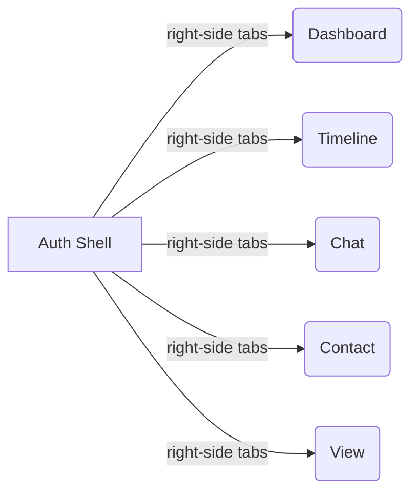

### Authenticated Area Redesign

*(Markdown technical overview)*

---

#### 1 . Entry Flow

```
Welcome → Login → Auth ✅ → **Modular Dashboard (new)**
```

* The **Modular Dashboard** becomes the single post‑login shell.
* It owns navigation, global state (user + journey meta‑data), and lazy‑loads feature modules on demand.

---

#### 2 . High‑Level Layout



| Area                  | Purpose                          | Key Components                    |
| --------------------- | -------------------------------- | --------------------------------- |
| **Header (optional)** | Logo, user avatar, quick actions | `<Header>`                        |
| **Content Pane**      | Injects the active tab’s module  | `<RouterOutlet>`                  |
| **Right Tab Rail**    | Icon + label buttons (vertical)  | `<NavTabs orientation="right" />` |

---

#### 3 . Navigation Contract

| Tab       | Route       | Lazy Chunk           | Guard(s)            | Notes                        |
| --------- | ----------- | -------------------- | ------------------- | ---------------------------- |
| Dashboard | `/dash`     | `dash.module.js`     | `auth`              | Default landing              |
| Timeline  | `/timeline` | `timeline.module.js` | `auth • dataLoaded` | Reuses current timeline core |
| Chat      | `/chat`     | `chat.module.js`     | `auth`              | MVP placeholder              |
| Contact   | `/contact`  | `contact.module.js`  | `auth`              | MVP placeholder              |
| View      | `/view`     | `view.module.js`     | `auth`              | Future configurator          |

---

#### 4 . Module Specs

##### 4.1  Dashboard

| Widget                | Data Source                                          | UI Idea                                                    |
| --------------------- | ---------------------------------------------------- | ---------------------------------------------------------- |
| **Life‑Event Count**  | `GET /api/life-events/count`                         | KPI card                                                   |
| **Covered Duration**  | `GET /api/life-events/range` → `{start, end}`        | Horizontal bar or plain text e.g. “1990 – 2025 (35 y 7 m)” |
| **Category Coverage** | `GET /api/life-events/categories` → `% per category` | Donut / progress bars                                      |

##### 4.2  Timeline

* Re‑mount the existing timeline component inside the new shell.
* Shares global journey store (`journeyContext`).

##### 4.3  Chat (Preview)

```html
<section class="flex h-full items-center justify-center">
  <div class="text-center space-y-4">
    <h2 class="text-2xl font-semibold">Chat coming soon 🤖</h2>
    <p class="text-gray-500">You’ll be able to discuss life events in real‑time.</p>
    <button class="btn-primary" disabled>Start Chat</button>
  </div>
</section>
```

##### 4.4  Contact (Preview)

```html
<section class="max-w-md mx-auto space-y-6">
  <h2 class="text-xl font-semibold">Get in touch</h2>

  <form class="space-y-4">
    <textarea placeholder="Your message..." class="w-full border rounded p-2"></textarea>

    <div class="flex gap-3">
      <button class="btn-primary w-full">Send Message</button>
      <button class="btn-secondary w-full">Request Call‑Back</button>
      <button class="btn-secondary w-full">Start Video Call</button>
    </div>
  </form>
</section>
```

##### 4.5  View (Configurator Preview)

```html
<section class="grid place-items-center h-full text-center space-y-4">
  <h2 class="text-2xl font-semibold">Timeline View Configurator</h2>
  <p class="text-gray-500 max-w-sm">
    Soon you’ll be able to tailor how your entire life story is condensed—pick categories, zoom levels, and visual styles.
  </p>
  <button class="btn-primary" disabled>Design My View</button>
</section>
```

---

#### 5 . Folder Structure (suggested)

```
/src
  /modules
    /dash
    /timeline
    /chat
    /contact
    /view
  /components
    header/
    nav-tabs/
  /services
    lifeEvents.service.ts
    auth.guard.ts
  app.routes.ts
```

---

#### 6 . Tech Notes & Next Steps

1. **Routing & Code‑Splitting** – use dynamic `import()` per tab to keep first paint fast.
2. **Global Store** – consider Zustand/Pinia/Redux for shared journey metrics.
3. **Permission Layers** – if future roles emerge (e.g., guest vs. editor), extend guards.
4. **Accessibility** – ensure right‑side tab rail is keyboard navigable (roving tabindex).
5. **Progressive Enhancement** – ship the static previews above; iterate toward full features.

---

> **Outcome**: After sign‑in, users land on a clean, tab‑driven workspace that already delivers value (Dashboard, Timeline) while clearly signaling upcoming capabilities (Chat, Contact, View).
