# Nality Documentation Hub

*Comprehensive documentation for the Nality life timeline application*

---

## 🏗️ **System Overview**

Nality is a life timeline application built with Next.js 15 and Supabase, designed to help users document, organize, and share their personal life journey through chronological events, media, and AI-assisted storytelling.

### **Quick Navigation**

```mermaid
graph TD
    A[📋 Documentation Hub] --> B[🏛️ Architecture]
    A --> C[🗄️ Database]
    A --> D[👤 User Experience]
    A --> E[🔌 API Reference]
    A --> F[💻 Development]
    A --> G[💼 Business Context]
    
    B --> B1[System Overview]
    B --> B2[Component Architecture]
    B --> B3[Infrastructure Design]
    
    C --> C1[Database Schema]
    C --> C2[Data Flow Diagrams]
    C --> C3[Security Model]
    
    D --> D1[User Journeys]
    D --> D2[Feature Documentation]
    D --> D3[Accessibility Guide]
    
    E --> E1[REST Endpoints]
    E --> E2[Authentication]
    E --> E3[Integrations]
    
    F --> F1[Setup Guide]
    F --> F2[Coding Standards]
    F --> F3[Deployment Process]
    
    G --> G1[Product Overview]
    G --> G2[Business Requirements]
    G --> G3[Roadmap]
```

---

## 📚 **Documentation Sections**

### 🏛️ **Architecture Documentation**
- **[System Overview](./architecture/overview.md)** - High-level system architecture and technology stack
- **[Component Architecture](./architecture/components.md)** - Detailed component structure and relationships
- **[Infrastructure Design](./architecture/infrastructure.md)** - Deployment architecture and infrastructure components
- **[Decision Records](./architecture/decisions/)** - Architectural Decision Records (ADRs) for key technical choices

### 🗄️ **Database Documentation**
- **[Database Schema](./database/schema.md)** - Complete database schema with ERD diagrams
- **[Data Flow Diagrams](./database/data-flows.md)** - Information flow through the system
- **[Security Model](./database/security.md)** - Row Level Security policies and access control
- **[Migration Strategy](./database/migrations.md)** - Database migration history and procedures

### 👤 **User Experience Documentation**
- **[User Journeys](./user-experience/user-journeys.md)** - Complete user workflow documentation
- **[Feature Guide](./user-experience/features.md)** - Feature-by-feature documentation with examples
- **[Accessibility Guide](./user-experience/accessibility.md)** - Accessibility features and responsive design
- **[Error Handling](./user-experience/error-handling.md)** - Error states and edge case documentation

### 🔌 **API Documentation**
- **[REST Endpoints](./api/endpoints.md)** - Complete API endpoint documentation
- **[Authentication Guide](./api/authentication.md)** - Authentication and authorization flows
- **[Integration Guide](./api/integrations.md)** - Third-party service integrations
- **[Data Contracts](./api/data-contracts.md)** - Request/response schemas and validation

### 💻 **Development Documentation**
- **[Setup Guide](./development/setup.md)** - Development environment setup and configuration
- **[Contributing Guide](./development/contributing.md)** - Code style, standards, and contribution process
- **[Deployment Guide](./development/deployment.md)** - Deployment process and release procedures
- **[Troubleshooting Guide](./development/troubleshooting.md)** - Common issues and debugging procedures

### 💼 **Business Documentation**
- **[Product Overview](./business/overview.md)** - Product vision, target users, and value proposition
- **[Requirements Documentation](./business/requirements.md)** - Business requirements and feature specifications
- **[Competitive Analysis](./business/competitive-analysis.md)** - Market positioning and competitive landscape
- **[Product Roadmap](./business/roadmap.md)** - Future development plans and feature timeline

---

## 🚀 **Getting Started**

### For Developers
1. Start with **[Development Setup](./development/setup.md)** to configure your environment
2. Review **[Architecture Overview](./architecture/overview.md)** to understand the system design
3. Explore **[Database Schema](./database/schema.md)** to understand data structures
4. Check **[API Documentation](./api/endpoints.md)** for integration details

### For Product Managers
1. Begin with **[Product Overview](./business/overview.md)** for business context
2. Review **[User Journeys](./user-experience/user-journeys.md)** to understand user workflows
3. Check **[Feature Guide](./user-experience/features.md)** for current capabilities
4. Explore **[Roadmap](./business/roadmap.md)** for future planning

### For System Administrators
1. Start with **[Infrastructure Design](./architecture/infrastructure.md)** for deployment understanding
2. Review **[Security Model](./database/security.md)** for access control policies
3. Check **[Deployment Guide](./development/deployment.md)** for operational procedures
4. Reference **[Troubleshooting Guide](./development/troubleshooting.md)** for issue resolution

---

## 🔄 **Documentation Maintenance**

### Update Process
- Documentation is reviewed and updated with each major feature release
- Changes to database schema require corresponding documentation updates
- New API endpoints must include complete documentation before deployment
- User experience changes need updated journey documentation

### Version Control
- All documentation is version controlled alongside the codebase
- Breaking changes require documentation updates before merge
- Documentation follows semantic versioning aligned with application releases

### Quality Assurance
- Cross-references are validated monthly to ensure no broken links
- Code examples are tested as part of the CI/CD pipeline
- User feedback on documentation is collected and addressed quarterly

---

## 📞 **Support and Feedback**

- **Technical Issues**: Reference [Troubleshooting Guide](./development/troubleshooting.md)
- **Documentation Updates**: Create issues in the main repository
- **Feature Requests**: Submit via the product feedback process
- **Security Concerns**: Follow the security reporting procedure

---

## 📈 **Documentation Metrics**

- **Last Updated**: October 12, 2025
- **Coverage**: Complete documentation for all implemented features
- **Accuracy**: Validated against current codebase (v1.4.0)
- **Completeness**: 100% of MVP features documented

---

*This documentation hub is maintained by the Nality development team and updated with each release. For the most current information, always reference the latest version in the main repository.*
