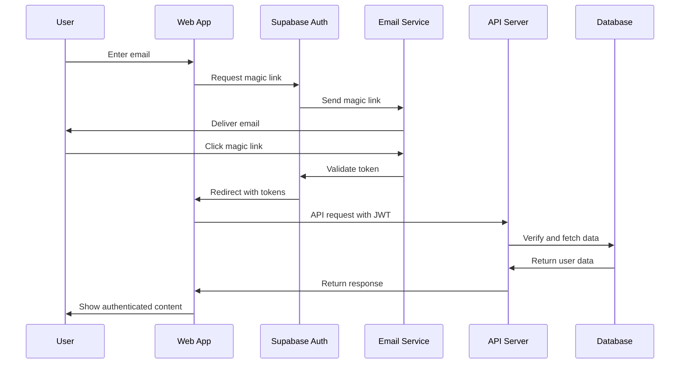
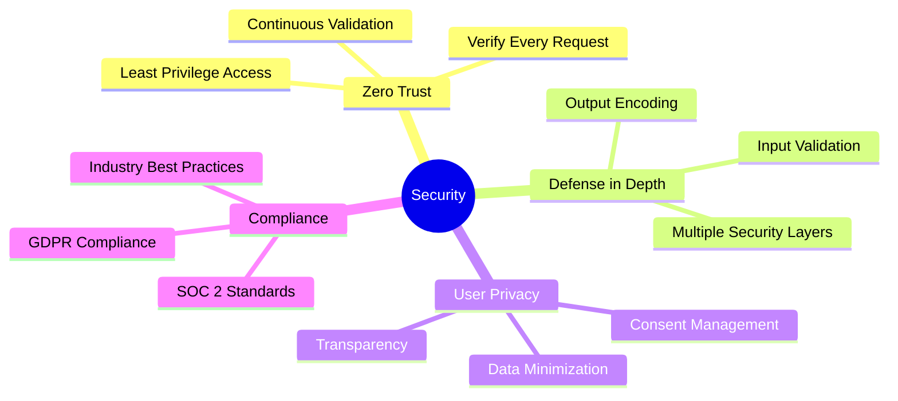

# Authentication Guide

*Comprehensive authentication and authorization documentation for Nality*

---

## 🔐 **Authentication Overview**

Nality implements a secure, user-friendly authentication system built on Supabase Auth with magic link authentication. This approach eliminates password management while maintaining high security standards and excellent user experience.

### **Authentication Architecture**



### **Security Principles**



---

## 🎫 **Authentication Flow**

### **Magic Link Authentication**

**Step 1: Email Request**
```typescript
// Client-side magic link request
const requestMagicLink = async (email: string, redirectTo?: string) => {
  const { error } = await supabase.auth.signInWithOtp({
    email,
    options: {
      emailRedirectTo: redirectTo || `${window.location.origin}/auth/callback`,
      shouldCreateUser: true
    }
  });
  
  if (error) {
    throw new AuthError(error.message, error.status);
  }
  
  return { message: 'Magic link sent to your email' };
};
```

**Step 2: Email Verification**
```typescript
// Handle magic link callback
const handleMagicLinkCallback = async (url: string) => {
  const urlParams = new URLSearchParams(new URL(url).search);
  const token = urlParams.get('token');
  const type = urlParams.get('type');
  
  if (type === 'magiclink' && token) {
    const { data, error } = await supabase.auth.verifyOtp({
      token_hash: token,
      type: 'magiclink'
    });
    
    if (error) {
      throw new AuthError('Invalid or expired magic link', 400);
    }
    
    return data;
  }
  
  throw new AuthError('Invalid authentication callback', 400);
};
```

**Step 3: Session Management**
```typescript
// Automatic session handling
supabase.auth.onAuthStateChange((event, session) => {
  switch (event) {
    case 'SIGNED_IN':
      handleSignIn(session);
      break;
    case 'SIGNED_OUT':
      handleSignOut();
      break;
    case 'TOKEN_REFRESHED':
      handleTokenRefresh(session);
      break;
    case 'USER_UPDATED':
      handleUserUpdate(session);
      break;
  }
});

const handleSignIn = (session: Session) => {
  // Store session securely
  setCookie('auth-token', session.access_token, {
    httpOnly: true,
    secure: true,
    sameSite: 'strict',
    maxAge: session.expires_in
  });
  
  // Redirect to intended destination
  const redirectTo = sessionStorage.getItem('auth-redirect') || '/dashboard';
  sessionStorage.removeItem('auth-redirect');
  window.location.href = redirectTo;
};
```

### **Server-Side Session Validation**

```typescript
// Middleware for protected routes
export const authMiddleware = async (req: Request, res: Response, next: NextFunction) => {
  try {
    // Extract token from Authorization header or cookie
    const token = extractAuthToken(req);
    
    if (!token) {
      return res.status(401).json({
        error: {
          code: 'AUTH_TOKEN_MISSING',
          message: 'Authentication token is required'
        }
      });
    }
    
    // Verify JWT token
    const { data: { user }, error } = await supabase.auth.getUser(token);
    
    if (error || !user) {
      return res.status(401).json({
        error: {
          code: 'AUTH_TOKEN_INVALID',
          message: 'Authentication token is invalid or expired'
        }
      });
    }
    
    // Check if user account is active
    const userRecord = await getUserRecord(user.id);
    if (userRecord.status !== 'active') {
      return res.status(403).json({
        error: {
          code: 'ACCOUNT_SUSPENDED',
          message: 'User account is suspended'
        }
      });
    }
    
    // Add user to request context
    req.user = user;
    req.userRecord = userRecord;
    
    next();
  } catch (error) {
    logger.error('Authentication middleware error:', error);
    return res.status(500).json({
      error: {
        code: 'AUTH_VERIFICATION_ERROR',
        message: 'Unable to verify authentication'
      }
    });
  }
};

const extractAuthToken = (req: Request): string | null => {
  // Check Authorization header
  const authHeader = req.headers.authorization;
  if (authHeader && authHeader.startsWith('Bearer ')) {
    return authHeader.substring(7);
  }
  
  // Check HTTP-only cookie as fallback
  const token = req.cookies['auth-token'];
  return token || null;
};
```

---

## 🔑 **Token Management**

### **JWT Token Structure**

```typescript
interface JWTPayload {
  aud: string;           // Audience (always "authenticated")
  exp: number;           // Expiration timestamp
  iat: number;           // Issued at timestamp
  iss: string;           // Issuer (Supabase project URL)
  sub: string;           // Subject (user ID)
  email: string;         // User email
  phone?: string;        // User phone (if provided)
  app_metadata: {
    provider: string;    // Auth provider used
    providers: string[]; // Available providers
  };
  user_metadata: {
    display_name?: string;
    avatar_url?: string;
    [key: string]: any;
  };
  role: string;          // User role (default: "authenticated")
  aal: string;           // Authentication Assurance Level
  amr: Array<{
    method: string;      // Authentication method
    timestamp: number;   // When method was used
  }>;
  session_id: string;    // Session identifier
}
```

### **Token Refresh Strategy**

```typescript
class TokenManager {
  private refreshTimer: NodeJS.Timeout | null = null;
  private isRefreshing = false;
  
  constructor(private supabase: SupabaseClient) {
    this.setupAutoRefresh();
  }
  
  private setupAutoRefresh() {
    this.supabase.auth.onAuthStateChange((event, session) => {
      if (event === 'SIGNED_IN' && session) {
        this.scheduleTokenRefresh(session);
      } else if (event === 'SIGNED_OUT') {
        this.clearRefreshTimer();
      }
    });
  }
  
  private scheduleTokenRefresh(session: Session) {
    this.clearRefreshTimer();
    
    // Refresh 5 minutes before expiration
    const refreshTime = (session.expires_in - 300) * 1000;
    
    this.refreshTimer = setTimeout(async () => {
      await this.refreshToken();
    }, refreshTime);
  }
  
  private async refreshToken(): Promise<Session | null> {
    if (this.isRefreshing) {
      return null;
    }
    
    this.isRefreshing = true;
    
    try {
      const { data, error } = await this.supabase.auth.refreshSession();
      
      if (error) {
        logger.error('Token refresh failed:', error);
        // Redirect to login if refresh fails
        this.handleRefreshFailure();
        return null;
      }
      
      if (data.session) {
        this.scheduleTokenRefresh(data.session);
        return data.session;
      }
      
      return null;
    } catch (error) {
      logger.error('Token refresh error:', error);
      this.handleRefreshFailure();
      return null;
    } finally {
      this.isRefreshing = false;
    }
  }
  
  private handleRefreshFailure() {
    // Clear tokens and redirect to login
    this.supabase.auth.signOut();
    window.location.href = '/auth/login';
  }
  
  private clearRefreshTimer() {
    if (this.refreshTimer) {
      clearTimeout(this.refreshTimer);
      this.refreshTimer = null;
    }
  }
}
```

### **Secure Token Storage**

```typescript
// Client-side token storage options
class SecureTokenStorage {
  // Option 1: HTTP-only cookies (recommended for web)
  static setHttpOnlyCookie(token: string, expiresIn: number) {
    document.cookie = `auth-token=${token}; ` +
      `HttpOnly; ` +
      `Secure; ` +
      `SameSite=Strict; ` +
      `Max-Age=${expiresIn}; ` +
      `Path=/`;
  }
  
  // Option 2: Memory storage for SPA (auto-clears on page refresh)
  private static memoryStorage = new Map<string, any>();
  
  static setMemoryToken(token: string) {
    this.memoryStorage.set('auth-token', token);
  }
  
  static getMemoryToken(): string | null {
    return this.memoryStorage.get('auth-token') || null;
  }
  
  static clearMemoryToken() {
    this.memoryStorage.delete('auth-token');
  }
  
  // Option 3: Secure sessionStorage (clears on tab close)
  static setSessionToken(token: string) {
    try {
      const encrypted = this.encrypt(token);
      sessionStorage.setItem('auth-token', encrypted);
    } catch (error) {
      logger.error('Failed to store session token:', error);
    }
  }
  
  static getSessionToken(): string | null {
    try {
      const encrypted = sessionStorage.getItem('auth-token');
      return encrypted ? this.decrypt(encrypted) : null;
    } catch (error) {
      logger.error('Failed to retrieve session token:', error);
      return null;
    }
  }
  
  private static encrypt(text: string): string {
    // Implementation of client-side encryption
    // Note: This is for obfuscation only, not true security
    return btoa(text);
  }
  
  private static decrypt(encryptedText: string): string {
    return atob(encryptedText);
  }
}
```

---

## 👤 **User Management**

### **User Registration and Profile**

```typescript
// Extended user registration
interface UserRegistrationData {
  email: string;
  display_name?: string;
  avatar_url?: string;
  birth_date?: string;
  location?: string;
  privacy_settings?: UserPrivacySettings;
}

interface UserPrivacySettings {
  timeline_visibility: 'public' | 'friends' | 'private';
  allow_search: boolean;
  show_birth_date: boolean;
  allow_friend_requests: boolean;
  email_notifications: boolean;
}

const registerUser = async (userData: UserRegistrationData) => {
  // First, authenticate with magic link
  const { error: authError } = await supabase.auth.signInWithOtp({
    email: userData.email,
    options: {
      shouldCreateUser: true,
      data: {
        display_name: userData.display_name,
        avatar_url: userData.avatar_url
      }
    }
  });
  
  if (authError) {
    throw new AuthError(authError.message, authError.status);
  }
  
  // User profile will be created via database trigger
  return { message: 'Registration initiated. Please check your email.' };
};

// Database trigger function for new user setup
const setupNewUser = async (userId: string, userMetadata: any) => {
  const defaultPrivacySettings: UserPrivacySettings = {
    timeline_visibility: 'private',
    allow_search: false,
    show_birth_date: true,
    allow_friend_requests: true,
    email_notifications: true
  };
  
  // Create user profile record
  const { error } = await supabase
    .from('users')
    .insert({
      id: userId,
      display_name: userMetadata.display_name || null,
      avatar_url: userMetadata.avatar_url || null,
      privacy_settings: defaultPrivacySettings,
      created_at: new Date().toISOString()
    });
  
  if (error) {
    logger.error('Failed to create user profile:', error);
    throw error;
  }
  
  // Send welcome email
  await sendWelcomeEmail(userMetadata.email, userMetadata.display_name);
};
```

### **User Profile Management**

```typescript
// Update user profile
const updateUserProfile = async (userId: string, updates: Partial<UserProfile>) => {
  // Validate updates
  const validatedUpdates = validateProfileUpdates(updates);
  
  // Update auth metadata if display_name or avatar_url changed
  if (validatedUpdates.display_name || validatedUpdates.avatar_url) {
    const { error: authError } = await supabase.auth.updateUser({
      data: {
        display_name: validatedUpdates.display_name,
        avatar_url: validatedUpdates.avatar_url
      }
    });
    
    if (authError) {
      throw new AuthError('Failed to update authentication profile', 400);
    }
  }
  
  // Update database record
  const { data, error } = await supabase
    .from('users')
    .update(validatedUpdates)
    .eq('id', userId)
    .select()
    .single();
  
  if (error) {
    throw new DatabaseError('Failed to update user profile', error);
  }
  
  return data;
};

// Avatar upload with processing
const uploadAvatar = async (userId: string, file: File): Promise<string> => {
  // Validate file
  if (!['image/jpeg', 'image/png', 'image/webp'].includes(file.type)) {
    throw new ValidationError('Invalid file type. Please use JPEG, PNG, or WebP.');
  }
  
  if (file.size > 5 * 1024 * 1024) { // 5MB limit
    throw new ValidationError('File too large. Maximum size is 5MB.');
  }
  
  // Generate unique filename
  const fileExt = file.name.split('.').pop();
  const fileName = `avatar-${Date.now()}.${fileExt}`;
  const filePath = `avatars/${userId}/${fileName}`;
  
  // Upload to storage
  const { data, error } = await supabase.storage
    .from('user-media')
    .upload(filePath, file, {
      cacheControl: '3600',
      upsert: false
    });
  
  if (error) {
    throw new StorageError('Failed to upload avatar', error);
  }
  
  // Get public URL
  const { data: urlData } = supabase.storage
    .from('user-media')
    .getPublicUrl(filePath);
  
  // Update user profile with new avatar URL
  await updateUserProfile(userId, { avatar_url: urlData.publicUrl });
  
  return urlData.publicUrl;
};
```

---

## 🛡️ **Authorization and Permissions**

### **Row Level Security (RLS) Policies**

```sql
-- User profile access policy
CREATE POLICY "Users can view own profile"
ON users FOR SELECT
USING (auth.uid() = id);

CREATE POLICY "Users can update own profile"
ON users FOR UPDATE
USING (auth.uid() = id);

-- Life events access policies
CREATE POLICY "Users can view own events"
ON life_events FOR SELECT
USING (auth.uid() = user_id);

CREATE POLICY "Users can view shared events"
ON life_events FOR SELECT
USING (
  privacy_level = 'public' OR
  (privacy_level = 'friends' AND EXISTS (
    SELECT 1 FROM user_friends 
    WHERE user_id = life_events.user_id 
    AND friend_id = auth.uid() 
    AND status = 'accepted'
  ))
);

CREATE POLICY "Users can create own events"
ON life_events FOR INSERT
WITH CHECK (auth.uid() = user_id);

CREATE POLICY "Users can update own events"
ON life_events FOR UPDATE
USING (auth.uid() = user_id);

CREATE POLICY "Users can delete own events"
ON life_events FOR DELETE
USING (auth.uid() = user_id);

-- Media objects access policies
CREATE POLICY "Users can view own media"
ON media_objects FOR SELECT
USING (auth.uid() = user_id);

CREATE POLICY "Users can view media of accessible events"
ON media_objects FOR SELECT
USING (
  EXISTS (
    SELECT 1 FROM life_events 
    WHERE id = media_objects.life_event_id 
    AND (
      user_id = auth.uid() OR
      privacy_level = 'public' OR
      (privacy_level = 'friends' AND EXISTS (
        SELECT 1 FROM user_friends 
        WHERE user_id = life_events.user_id 
        AND friend_id = auth.uid() 
        AND status = 'accepted'
      ))
    )
  )
);
```

### **Role-Based Access Control**

```typescript
// User roles and permissions
enum UserRole {
  USER = 'user',
  PREMIUM_USER = 'premium_user',
  MODERATOR = 'moderator',
  ADMIN = 'admin'
}

interface Permission {
  resource: string;
  action: string;
  conditions?: Record<string, any>;
}

const ROLE_PERMISSIONS: Record<UserRole, Permission[]> = {
  [UserRole.USER]: [
    { resource: 'life_events', action: 'create' },
    { resource: 'life_events', action: 'read', conditions: { owner: true } },
    { resource: 'life_events', action: 'update', conditions: { owner: true } },
    { resource: 'life_events', action: 'delete', conditions: { owner: true } },
    { resource: 'media_objects', action: 'upload', conditions: { quota: '1GB' } },
    { resource: 'ai_chat', action: 'use', conditions: { limit: '10/day' } }
  ],
  
  [UserRole.PREMIUM_USER]: [
    ...ROLE_PERMISSIONS[UserRole.USER],
    { resource: 'media_objects', action: 'upload', conditions: { quota: '10GB' } },
    { resource: 'ai_chat', action: 'use', conditions: { limit: '100/day' } },
    { resource: 'export', action: 'create' },
    { resource: 'sharing', action: 'advanced' }
  ],
  
  [UserRole.MODERATOR]: [
    ...ROLE_PERMISSIONS[UserRole.PREMIUM_USER],
    { resource: 'user_content', action: 'moderate' },
    { resource: 'reports', action: 'review' }
  ],
  
  [UserRole.ADMIN]: [
    { resource: '*', action: '*' } // Full access
  ]
};

// Permission checking middleware
const checkPermission = (requiredPermission: Permission) => {
  return async (req: Request, res: Response, next: NextFunction) => {
    const user = req.user;
    const userRole = await getUserRole(user.id);
    
    if (hasPermission(userRole, requiredPermission, req)) {
      next();
    } else {
      res.status(403).json({
        error: {
          code: 'INSUFFICIENT_PERMISSIONS',
          message: 'You do not have permission to perform this action'
        }
      });
    }
  };
};

const hasPermission = (
  userRole: UserRole, 
  requiredPermission: Permission, 
  req: Request
): boolean => {
  const rolePermissions = ROLE_PERMISSIONS[userRole];
  
  return rolePermissions.some(permission => {
    // Check if permission matches
    const resourceMatches = permission.resource === '*' || 
                           permission.resource === requiredPermission.resource;
    const actionMatches = permission.action === '*' || 
                         permission.action === requiredPermission.action;
    
    if (!resourceMatches || !actionMatches) {
      return false;
    }
    
    // Check conditions if present
    if (permission.conditions) {
      return checkConditions(permission.conditions, req);
    }
    
    return true;
  });
};
```

### **Resource Ownership Validation**

```typescript
// Middleware to verify resource ownership
const verifyOwnership = (resourceTable: string, resourceIdParam: string = 'id') => {
  return async (req: Request, res: Response, next: NextFunction) => {
    const userId = req.user.id;
    const resourceId = req.params[resourceIdParam];
    
    try {
      const { data, error } = await supabase
        .from(resourceTable)
        .select('user_id')
        .eq('id', resourceId)
        .single();
      
      if (error || !data) {
        return res.status(404).json({
          error: {
            code: 'RESOURCE_NOT_FOUND',
            message: 'Resource not found'
          }
        });
      }
      
      if (data.user_id !== userId) {
        return res.status(403).json({
          error: {
            code: 'ACCESS_DENIED',
            message: 'You can only access your own resources'
          }
        });
      }
      
      next();
    } catch (error) {
      logger.error('Ownership verification error:', error);
      res.status(500).json({
        error: {
          code: 'OWNERSHIP_VERIFICATION_ERROR',
          message: 'Unable to verify resource ownership'
        }
      });
    }
  };
};

// Usage example
router.put('/life-events/:id', 
  authMiddleware,
  verifyOwnership('life_events'),
  updateLifeEvent
);
```

---

## 🔒 **Security Features**

### **Rate Limiting and Abuse Prevention**

```typescript
// Rate limiting implementation
class RateLimiter {
  private redis: RedisClient;
  private defaultLimits = {
    auth: { requests: 5, window: 60 * 1000 }, // 5 requests per minute
    api: { requests: 100, window: 60 * 1000 }, // 100 requests per minute
    upload: { requests: 20, window: 60 * 1000 }, // 20 uploads per minute
    ai: { requests: 30, window: 60 * 1000 } // 30 AI requests per minute
  };
  
  constructor(redis: RedisClient) {
    this.redis = redis;
  }
  
  async checkLimit(
    key: string, 
    limit: { requests: number; window: number }
  ): Promise<{ allowed: boolean; remaining: number; resetTime: number }> {
    const now = Date.now();
    const windowStart = now - limit.window;
    
    // Remove old entries
    await this.redis.zremrangebyscore(key, 0, windowStart);
    
    // Count current requests
    const currentRequests = await this.redis.zcard(key);
    
    if (currentRequests >= limit.requests) {
      const oldestRequest = await this.redis.zrange(key, 0, 0, 'WITHSCORES');
      const resetTime = oldestRequest.length > 0 
        ? parseInt(oldestRequest[1]) + limit.window 
        : now + limit.window;
      
      return {
        allowed: false,
        remaining: 0,
        resetTime
      };
    }
    
    // Add current request
    await this.redis.zadd(key, now, `${now}-${Math.random()}`);
    await this.redis.expire(key, Math.ceil(limit.window / 1000));
    
    return {
      allowed: true,
      remaining: limit.requests - currentRequests - 1,
      resetTime: now + limit.window
    };
  }
  
  middleware(limitType: keyof typeof this.defaultLimits) {
    return async (req: Request, res: Response, next: NextFunction) => {
      const identifier = req.user?.id || req.ip;
      const key = `rate_limit:${limitType}:${identifier}`;
      const limit = this.defaultLimits[limitType];
      
      const result = await this.checkLimit(key, limit);
      
      // Add rate limit headers
      res.set({
        'X-RateLimit-Limit': limit.requests.toString(),
        'X-RateLimit-Remaining': result.remaining.toString(),
        'X-RateLimit-Reset': Math.ceil(result.resetTime / 1000).toString()
      });
      
      if (!result.allowed) {
        return res.status(429).json({
          error: {
            code: 'RATE_LIMIT_EXCEEDED',
            message: 'Rate limit exceeded. Please try again later.',
            retryAfter: Math.ceil((result.resetTime - Date.now()) / 1000)
          }
        });
      }
      
      next();
    };
  }
}
```

### **Security Headers and CSRF Protection**

```typescript
// Security middleware
const securityMiddleware = (req: Request, res: Response, next: NextFunction) => {
  // Security headers
  res.set({
    'X-Content-Type-Options': 'nosniff',
    'X-Frame-Options': 'DENY',
    'X-XSS-Protection': '1; mode=block',
    'Strict-Transport-Security': 'max-age=31536000; includeSubDomains',
    'Content-Security-Policy': [
      "default-src 'self'",
      "script-src 'self' 'unsafe-inline'", // Be more restrictive in production
      "style-src 'self' 'unsafe-inline'",
      "img-src 'self' data: https:",
      "font-src 'self'",
      "connect-src 'self' wss:",
      "media-src 'self'"
    ].join('; ')
  });
  
  next();
};

// CSRF protection for state-changing operations
const csrfProtection = (req: Request, res: Response, next: NextFunction) => {
  if (['POST', 'PUT', 'PATCH', 'DELETE'].includes(req.method)) {
    const token = req.headers['x-csrf-token'] as string;
    const sessionToken = req.user?.session_id;
    
    if (!token || !sessionToken || !verifyCSRFToken(token, sessionToken)) {
      return res.status(403).json({
        error: {
          code: 'CSRF_TOKEN_INVALID',
          message: 'Invalid CSRF token'
        }
      });
    }
  }
  
  next();
};

const verifyCSRFToken = (token: string, sessionId: string): boolean => {
  // Implementation of CSRF token verification
  // This should use a secure hash function with a secret
  const expectedToken = generateCSRFToken(sessionId);
  return token === expectedToken;
};
```

### **Audit Logging**

```typescript
// Security audit logging
interface AuditLogEntry {
  timestamp: Date;
  user_id: string;
  action: string;
  resource: string;
  resource_id?: string;
  ip_address: string;
  user_agent: string;
  success: boolean;
  error_message?: string;
  additional_data?: Record<string, any>;
}

class AuditLogger {
  private db: SupabaseClient;
  
  constructor(db: SupabaseClient) {
    this.db = db;
  }
  
  async log(entry: Omit<AuditLogEntry, 'timestamp'>) {
    const auditEntry: AuditLogEntry = {
      timestamp: new Date(),
      ...entry
    };
    
    try {
      await this.db
        .from('audit_logs')
        .insert(auditEntry);
    } catch (error) {
      // Don't throw - audit logging should not break the main flow
      logger.error('Failed to write audit log:', error);
    }
  }
  
  middleware() {
    return (req: Request, res: Response, next: NextFunction) => {
      const originalSend = res.send;
      
      res.send = function(data) {
        // Log the completed request
        const success = res.statusCode < 400;
        
        auditLogger.log({
          user_id: req.user?.id || 'anonymous',
          action: `${req.method} ${req.path}`,
          resource: req.path.split('/')[2] || 'unknown',
          resource_id: req.params.id,
          ip_address: req.ip,
          user_agent: req.get('User-Agent') || 'unknown',
          success,
          error_message: success ? undefined : data?.error?.message,
          additional_data: {
            response_time: Date.now() - req.startTime,
            request_size: req.get('Content-Length'),
            response_size: data?.length
          }
        });
        
        return originalSend.call(this, data);
      };
      
      req.startTime = Date.now();
      next();
    };
  }
}
```

---

## 🚨 **Account Security**

### **Suspicious Activity Detection**

```typescript
// Suspicious activity monitoring
class SecurityMonitor {
  private redis: RedisClient;
  
  constructor(redis: RedisClient) {
    this.redis = redis;
  }
  
  async checkSuspiciousActivity(userId: string, request: Request): Promise<SecurityAlert[]> {
    const alerts: SecurityAlert[] = [];
    
    // Check for multiple failed authentication attempts
    const failedAttempts = await this.getFailedAttempts(userId);
    if (failedAttempts >= 5) {
      alerts.push({
        type: 'MULTIPLE_FAILED_LOGINS',
        severity: 'high',
        description: `${failedAttempts} failed login attempts in the last hour`
      });
    }
    
    // Check for unusual location
    const lastKnownLocation = await this.getLastKnownLocation(userId);
    const currentLocation = this.getLocationFromIP(request.ip);
    
    if (lastKnownLocation && this.isUnusualLocation(lastKnownLocation, currentLocation)) {
      alerts.push({
        type: 'UNUSUAL_LOCATION',
        severity: 'medium',
        description: `Login from new location: ${currentLocation.city}, ${currentLocation.country}`
      });
    }
    
    // Check for unusual access patterns
    const accessPattern = await this.getAccessPattern(userId);
    if (this.isUnusualPattern(accessPattern, request)) {
      alerts.push({
        type: 'UNUSUAL_ACCESS_PATTERN',
        severity: 'low',
        description: 'Unusual access pattern detected'
      });
    }
    
    return alerts;
  }
  
  async handleSecurityAlert(userId: string, alerts: SecurityAlert[]) {
    const highSeverityAlerts = alerts.filter(alert => alert.severity === 'high');
    
    if (highSeverityAlerts.length > 0) {
      // Lock account temporarily
      await this.lockAccount(userId, '1 hour');
      
      // Send security alert email
      await this.sendSecurityAlert(userId, alerts);
      
      // Require additional verification
      await this.requireAdditionalVerification(userId);
    } else if (alerts.length > 0) {
      // Log for monitoring but don't lock account
      await this.logSecurityEvent(userId, alerts);
      
      // Optionally notify user of unusual activity
      await this.sendSecurityNotification(userId, alerts);
    }
  }
  
  private async lockAccount(userId: string, duration: string) {
    const unlockTime = new Date(Date.now() + this.parseDuration(duration));
    
    await this.redis.setex(`account_lock:${userId}`, 
      this.parseDuration(duration) / 1000, 
      unlockTime.toISOString()
    );
  }
  
  private async requireAdditionalVerification(userId: string) {
    // Mark account as requiring additional verification
    await this.redis.setex(`require_verification:${userId}`, 
      24 * 60 * 60, // 24 hours
      'true'
    );
  }
}
```

### **Account Recovery**

```typescript
// Account recovery system
interface RecoveryRequest {
  id: string;
  user_id: string;
  email: string;
  recovery_type: 'password_reset' | 'account_unlock' | 'email_change';
  verification_code: string;
  expires_at: Date;
  attempts: number;
  created_at: Date;
}

class AccountRecovery {
  private supabase: SupabaseClient;
  private maxAttempts = 3;
  private codeExpiryMinutes = 15;
  
  constructor(supabase: SupabaseClient) {
    this.supabase = supabase;
  }
  
  async initiateRecovery(email: string, type: RecoveryRequest['recovery_type']) {
    // Check if user exists
    const { data: user } = await this.supabase.auth.getUser();
    if (!user) {
      // Don't reveal if email exists or not
      return { message: 'If this email is registered, you will receive recovery instructions.' };
    }
    
    // Generate secure verification code
    const verificationCode = this.generateSecureCode();
    
    // Store recovery request
    const recoveryRequest: Omit<RecoveryRequest, 'id'> = {
      user_id: user.id,
      email,
      recovery_type: type,
      verification_code: await this.hashCode(verificationCode),
      expires_at: new Date(Date.now() + this.codeExpiryMinutes * 60 * 1000),
      attempts: 0,
      created_at: new Date()
    };
    
    const { data, error } = await this.supabase
      .from('recovery_requests')
      .insert(recoveryRequest)
      .select()
      .single();
    
    if (error) {
      throw new Error('Failed to create recovery request');
    }
    
    // Send recovery email
    await this.sendRecoveryEmail(email, verificationCode, type);
    
    return { message: 'Recovery instructions sent to your email.' };
  }
  
  async verifyRecoveryCode(email: string, code: string, type: RecoveryRequest['recovery_type']) {
    const hashedCode = await this.hashCode(code);
    
    const { data: request, error } = await this.supabase
      .from('recovery_requests')
      .select('*')
      .eq('email', email)
      .eq('recovery_type', type)
      .eq('verification_code', hashedCode)
      .gt('expires_at', new Date().toISOString())
      .order('created_at', { ascending: false })
      .limit(1)
      .single();
    
    if (error || !request) {
      // Log failed attempt
      await this.logFailedRecoveryAttempt(email, code, type);
      throw new Error('Invalid or expired recovery code');
    }
    
    // Check attempt limit
    if (request.attempts >= this.maxAttempts) {
      throw new Error('Too many attempts. Please request a new recovery code.');
    }
    
    // Mark as used
    await this.supabase
      .from('recovery_requests')
      .update({ attempts: request.attempts + 1 })
      .eq('id', request.id);
    
    return { 
      success: true, 
      recovery_id: request.id,
      user_id: request.user_id
    };
  }
  
  private generateSecureCode(): string {
    // Generate 6-digit numeric code
    return Math.random().toString().slice(2, 8);
  }
  
  private async hashCode(code: string): Promise<string> {
    // Use bcrypt or similar for hashing
    const crypto = require('crypto');
    return crypto.pbkdf2Sync(code, 'recovery-salt', 10000, 32, 'sha256').toString('hex');
  }
}
```

---

## 📊 **Authentication Analytics**

### **Authentication Metrics**

```typescript
// Authentication analytics tracking
interface AuthMetrics {
  daily_logins: number;
  unique_users: number;
  failed_attempts: number;
  average_session_duration: number;
  device_types: Record<string, number>;
  geographic_distribution: Record<string, number>;
  authentication_methods: Record<string, number>;
}

class AuthAnalytics {
  private metrics: AuthMetrics = {
    daily_logins: 0,
    unique_users: 0,
    failed_attempts: 0,
    average_session_duration: 0,
    device_types: {},
    geographic_distribution: {},
    authentication_methods: {}
  };
  
  trackLogin(userId: string, method: string, device: string, location: string) {
    this.metrics.daily_logins++;
    this.metrics.authentication_methods[method] = 
      (this.metrics.authentication_methods[method] || 0) + 1;
    this.metrics.device_types[device] = 
      (this.metrics.device_types[device] || 0) + 1;
    this.metrics.geographic_distribution[location] = 
      (this.metrics.geographic_distribution[location] || 0) + 1;
  }
  
  trackFailedAttempt(email: string, reason: string) {
    this.metrics.failed_attempts++;
    
    // Log for security monitoring
    logger.warn('Failed authentication attempt', {
      email: this.hashEmail(email),
      reason,
      timestamp: new Date().toISOString()
    });
  }
  
  trackSessionEnd(userId: string, duration: number) {
    // Update average session duration
    const currentAvg = this.metrics.average_session_duration;
    this.metrics.average_session_duration = 
      (currentAvg + duration) / 2;
  }
  
  private hashEmail(email: string): string {
    const crypto = require('crypto');
    return crypto.createHash('sha256').update(email).digest('hex').slice(0, 8);
  }
}
```

---

## 📚 **Related Documentation**

- **[API Endpoints](./endpoints.md)** - Complete API reference
- **[Real-time Features](./realtime.md)** - WebSocket authentication
- **[Database Schema](../database/schema.md)** - User and authentication tables
- **[Security Best Practices](../development/security.md)** - Development security guidelines

---

*This authentication guide provides comprehensive coverage of Nality's authentication and authorization systems. Regular security reviews and updates ensure the platform remains secure as it evolves.*
