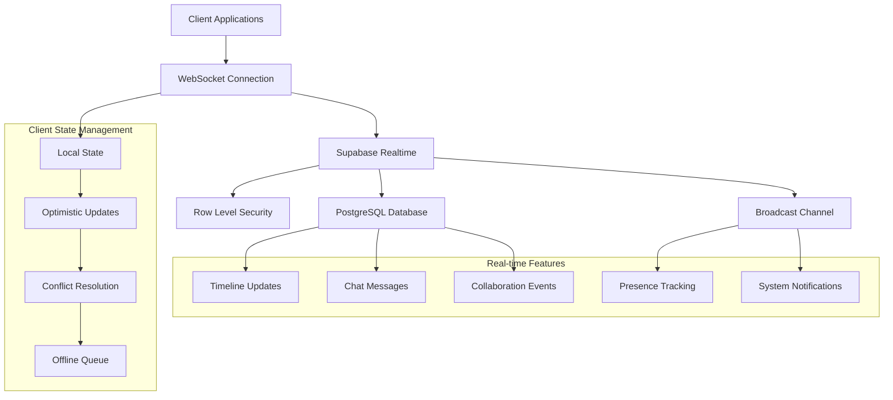
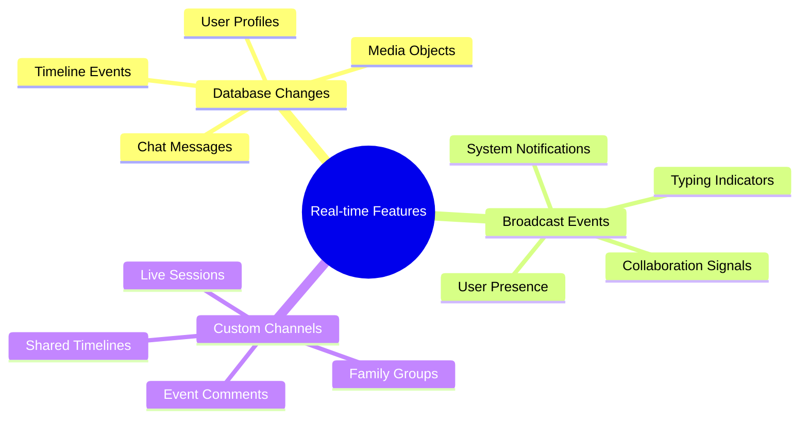

# Real-time Features Documentation

*Comprehensive guide to WebSocket connections and live data synchronization in Nality*

---

## ⚡ **Real-time Overview**

Nality leverages Supabase Real-time to provide instant data synchronization, live chat interactions, and collaborative features. This creates a dynamic, responsive user experience where changes are immediately reflected across all connected clients.

### **Real-time Architecture**



### **Real-time Capabilities**



---

## 🔌 **WebSocket Connection Management**

### **Connection Initialization**

```typescript
// Real-time client setup
import { createClient, RealtimeChannel } from '@supabase/supabase-js';

interface RealtimeConfig {
  heartbeatIntervalMs: number;
  reconnectAfterMs: number[];
  timeoutMs: number;
  transport: 'websocket';
}

class NalityRealtime {
  private supabase: SupabaseClient;
  private channels: Map<string, RealtimeChannel> = new Map();
  private connectionState: 'disconnected' | 'connecting' | 'connected' = 'disconnected';
  private reconnectAttempts = 0;
  private maxReconnectAttempts = 5;
  
  constructor(supabaseUrl: string, supabaseKey: string) {
    this.supabase = createClient(supabaseUrl, supabaseKey, {
      realtime: {
        params: {
          eventsPerSecond: 10
        }
      }
    });
    
    this.setupConnectionHandlers();
  }
  
  private setupConnectionHandlers() {
    // Global connection state handling
    this.supabase.realtime.onOpen(() => {
      this.connectionState = 'connected';
      this.reconnectAttempts = 0;
      this.onConnectionStateChange('connected');
      console.log('Real-time connection established');
    });
    
    this.supabase.realtime.onClose(() => {
      this.connectionState = 'disconnected';
      this.onConnectionStateChange('disconnected');
      console.log('Real-time connection closed');
      
      if (this.reconnectAttempts < this.maxReconnectAttempts) {
        this.attemptReconnection();
      }
    });
    
    this.supabase.realtime.onError((error) => {
      console.error('Real-time connection error:', error);
      this.onConnectionError(error);
    });
  }
  
  private async attemptReconnection() {
    this.connectionState = 'connecting';
    this.reconnectAttempts++;
    
    const delay = Math.min(1000 * Math.pow(2, this.reconnectAttempts), 30000);
    console.log(`Attempting reconnection in ${delay}ms (attempt ${this.reconnectAttempts})`);
    
    setTimeout(async () => {
      try {
        await this.supabase.realtime.connect();
      } catch (error) {
        console.error('Reconnection failed:', error);
        if (this.reconnectAttempts < this.maxReconnectAttempts) {
          this.attemptReconnection();
        }
      }
    }, delay);
  }
  
  private onConnectionStateChange(state: string) {
    // Emit connection state change event
    window.dispatchEvent(new CustomEvent('realtime:connection', {
      detail: { state, attempts: this.reconnectAttempts }
    }));
  }
  
  private onConnectionError(error: any) {
    // Emit error event
    window.dispatchEvent(new CustomEvent('realtime:error', {
      detail: { error }
    }));
  }
  
  getConnectionState() {
    return this.connectionState;
  }
}
```

### **Channel Management**

```typescript
// Channel subscription management
class ChannelManager {
  private realtime: NalityRealtime;
  private subscriptions: Map<string, RealtimeChannel> = new Map();
  
  constructor(realtime: NalityRealtime) {
    this.realtime = realtime;
  }
  
  subscribeToTimeline(userId: string, callbacks: TimelineCallbacks) {
    const channelName = `timeline:${userId}`;
    
    if (this.subscriptions.has(channelName)) {
      console.warn(`Already subscribed to ${channelName}`);
      return this.subscriptions.get(channelName)!;
    }
    
    const channel = this.realtime.supabase
      .channel(channelName)
      .on('postgres_changes', {
        event: '*',
        schema: 'public',
        table: 'life_events',
        filter: `user_id=eq.${userId}`
      }, (payload) => {
        this.handleTimelineChange(payload, callbacks);
      })
      .on('postgres_changes', {
        event: '*',
        schema: 'public',
        table: 'media_objects',
        filter: `user_id=eq.${userId}`
      }, (payload) => {
        this.handleMediaChange(payload, callbacks);
      })
      .subscribe((status) => {
        console.log(`Timeline subscription status: ${status}`);
        if (status === 'SUBSCRIBED') {
          callbacks.onSubscribed?.();
        }
      });
    
    this.subscriptions.set(channelName, channel);
    return channel;
  }
  
  subscribeToChat(sessionId: string, callbacks: ChatCallbacks) {
    const channelName = `chat:${sessionId}`;
    
    const channel = this.realtime.supabase
      .channel(channelName)
      .on('postgres_changes', {
        event: 'INSERT',
        schema: 'public',
        table: 'chat_messages',
        filter: `session_id=eq.${sessionId}`
      }, (payload) => {
        callbacks.onNewMessage?.(payload.new as ChatMessage);
      })
      .on('broadcast', {
        event: 'typing'
      }, (payload) => {
        callbacks.onTyping?.(payload.payload);
      })
      .on('presence', {
        event: 'sync'
      }, () => {
        const presence = channel.presenceState();
        callbacks.onPresenceChange?.(presence);
      })
      .subscribe();
    
    this.subscriptions.set(channelName, channel);
    return channel;
  }
  
  unsubscribe(channelName: string) {
    const channel = this.subscriptions.get(channelName);
    if (channel) {
      this.realtime.supabase.removeChannel(channel);
      this.subscriptions.delete(channelName);
    }
  }
  
  unsubscribeAll() {
    this.subscriptions.forEach((channel, name) => {
      this.realtime.supabase.removeChannel(channel);
    });
    this.subscriptions.clear();
  }
  
  private handleTimelineChange(payload: any, callbacks: TimelineCallbacks) {
    switch (payload.eventType) {
      case 'INSERT':
        callbacks.onEventAdded?.(payload.new);
        break;
      case 'UPDATE':
        callbacks.onEventUpdated?.(payload.new, payload.old);
        break;
      case 'DELETE':
        callbacks.onEventDeleted?.(payload.old);
        break;
    }
  }
  
  private handleMediaChange(payload: any, callbacks: TimelineCallbacks) {
    switch (payload.eventType) {
      case 'INSERT':
        callbacks.onMediaAdded?.(payload.new);
        break;
      case 'UPDATE':
        callbacks.onMediaUpdated?.(payload.new, payload.old);
        break;
      case 'DELETE':
        callbacks.onMediaDeleted?.(payload.old);
        break;
    }
  }
}
```

---

## 📱 **Timeline Real-time Updates**

### **Live Timeline Synchronization**

```typescript
// Timeline real-time integration
interface TimelineCallbacks {
  onEventAdded?: (event: LifeEvent) => void;
  onEventUpdated?: (event: LifeEvent, oldEvent: LifeEvent) => void;
  onEventDeleted?: (event: LifeEvent) => void;
  onMediaAdded?: (media: MediaObject) => void;
  onMediaUpdated?: (media: MediaObject, oldMedia: MediaObject) => void;
  onMediaDeleted?: (media: MediaObject) => void;
  onSubscribed?: () => void;
  onError?: (error: any) => void;
}

class TimelineRealtimeManager {
  private channelManager: ChannelManager;
  private userId: string;
  private callbacks: TimelineCallbacks;
  private optimisticUpdates: Map<string, any> = new Map();
  
  constructor(channelManager: ChannelManager, userId: string) {
    this.channelManager = channelManager;
    this.userId = userId;
  }
  
  subscribe(callbacks: TimelineCallbacks) {
    this.callbacks = callbacks;
    
    return this.channelManager.subscribeToTimeline(this.userId, {
      ...callbacks,
      onEventAdded: (event) => {
        // Check if this was an optimistic update
        if (this.optimisticUpdates.has(event.id)) {
          this.resolveOptimisticUpdate(event.id, event);
        } else {
          callbacks.onEventAdded?.(event);
        }
      },
      onEventUpdated: (event, oldEvent) => {
        if (this.optimisticUpdates.has(event.id)) {
          this.resolveOptimisticUpdate(event.id, event);
        } else {
          callbacks.onEventUpdated?.(event, oldEvent);
        }
      },
      onEventDeleted: (event) => {
        if (this.optimisticUpdates.has(event.id)) {
          this.optimisticUpdates.delete(event.id);
        }
        callbacks.onEventDeleted?.(event);
      }
    });
  }
  
  // Optimistic updates for better UX
  addEventOptimistically(event: Partial<LifeEvent>) {
    const optimisticId = `temp_${Date.now()}_${Math.random()}`;
    const optimisticEvent = {
      ...event,
      id: optimisticId,
      created_at: new Date().toISOString(),
      updated_at: new Date().toISOString()
    } as LifeEvent;
    
    this.optimisticUpdates.set(optimisticId, optimisticEvent);
    this.callbacks.onEventAdded?.(optimisticEvent);
    
    return optimisticId;
  }
  
  updateEventOptimistically(eventId: string, updates: Partial<LifeEvent>) {
    // Store the optimistic update
    this.optimisticUpdates.set(eventId, updates);
    
    // Apply updates immediately to UI
    const existingEvent = this.getEventFromUI(eventId);
    if (existingEvent) {
      const updatedEvent = { ...existingEvent, ...updates };
      this.callbacks.onEventUpdated?.(updatedEvent, existingEvent);
    }
  }
  
  private resolveOptimisticUpdate(optimisticId: string, serverEvent: LifeEvent) {
    const optimisticUpdate = this.optimisticUpdates.get(optimisticId);
    this.optimisticUpdates.delete(optimisticId);
    
    // If server event differs from optimistic update, trigger correction
    if (optimisticUpdate && this.hasConflict(optimisticUpdate, serverEvent)) {
      this.callbacks.onEventUpdated?.(serverEvent, optimisticUpdate);
    }
  }
  
  private hasConflict(optimistic: any, server: any): boolean {
    // Compare relevant fields to detect conflicts
    const conflictFields = ['title', 'description', 'start_date', 'importance'];
    return conflictFields.some(field => optimistic[field] !== server[field]);
  }
  
  private getEventFromUI(eventId: string): LifeEvent | null {
    // This would be implemented based on your state management
    // For example, if using Redux or Zustand
    return null;
  }
}
```

### **Conflict Resolution**

```typescript
// Conflict resolution for simultaneous edits
interface ConflictResolution {
  strategy: 'server_wins' | 'client_wins' | 'merge' | 'prompt_user';
  mergeFields?: string[];
}

class ConflictResolver {
  private resolutionStrategy: ConflictResolution = {
    strategy: 'server_wins' // Default strategy
  };
  
  setResolutionStrategy(strategy: ConflictResolution) {
    this.resolutionStrategy = strategy;
  }
  
  resolveConflict(
    localVersion: LifeEvent,
    serverVersion: LifeEvent,
    conflictFields: string[]
  ): LifeEvent {
    switch (this.resolutionStrategy.strategy) {
      case 'server_wins':
        return serverVersion;
        
      case 'client_wins':
        return localVersion;
        
      case 'merge':
        return this.mergeVersions(localVersion, serverVersion, conflictFields);
        
      case 'prompt_user':
        this.promptUserForResolution(localVersion, serverVersion, conflictFields);
        return serverVersion; // Temporary fallback
        
      default:
        return serverVersion;
    }
  }
  
  private mergeVersions(
    local: LifeEvent,
    server: LifeEvent,
    conflictFields: string[]
  ): LifeEvent {
    const merged = { ...server }; // Start with server version
    
    // Apply merge rules for specific fields
    conflictFields.forEach(field => {
      switch (field) {
        case 'tags':
          // Merge tags arrays
          merged.tags = [...new Set([...server.tags, ...local.tags])];
          break;
          
        case 'description':
          // For description, prefer the longer version
          if (local.description && local.description.length > server.description?.length) {
            merged.description = local.description;
          }
          break;
          
        case 'importance':
          // For importance, prefer the higher value
          merged.importance = Math.max(local.importance, server.importance);
          break;
          
        default:
          // Default to server version for other fields
          break;
      }
    });
    
    return merged;
  }
  
  private promptUserForResolution(
    local: LifeEvent,
    server: LifeEvent,
    conflictFields: string[]
  ) {
    // Emit event for UI to handle conflict resolution
    window.dispatchEvent(new CustomEvent('timeline:conflict', {
      detail: {
        localVersion: local,
        serverVersion: server,
        conflictFields,
        onResolve: (resolution: LifeEvent) => {
          // Apply user's resolution
          this.applyResolution(resolution);
        }
      }
    }));
  }
  
  private applyResolution(resolution: LifeEvent) {
    // Apply the user's conflict resolution
    // This would typically involve updating the local state and syncing to server
  }
}
```

---

## 💬 **Real-time Chat Integration**

### **AI Chat Real-time Features**

```typescript
// Chat real-time management
interface ChatMessage {
  id: string;
  session_id: string;
  content: string;
  message_type: 'user_message' | 'assistant_response' | 'system_message';
  created_at: string;
  metadata?: Record<string, any>;
}

interface ChatCallbacks {
  onNewMessage?: (message: ChatMessage) => void;
  onTyping?: (data: TypingIndicator) => void;
  onPresenceChange?: (presence: any) => void;
  onConnectionChange?: (connected: boolean) => void;
}

interface TypingIndicator {
  user_id: string;
  is_typing: boolean;
  timestamp: number;
}

class ChatRealtimeManager {
  private channelManager: ChannelManager;
  private sessionId: string;
  private userId: string;
  private channel: RealtimeChannel | null = null;
  private typingTimeout: NodeJS.Timeout | null = null;
  
  constructor(channelManager: ChannelManager, sessionId: string, userId: string) {
    this.channelManager = channelManager;
    this.sessionId = sessionId;
    this.userId = userId;
  }
  
  subscribe(callbacks: ChatCallbacks) {
    this.channel = this.channelManager.subscribeToChat(this.sessionId, {
      onNewMessage: (message) => {
        // Filter out messages from current user to avoid duplicates
        if (message.message_type !== 'user_message' || this.isFromCurrentUser(message)) {
          callbacks.onNewMessage?.(message);
        }
      },
      onTyping: (data) => {
        // Only show typing indicators from other users
        if (data.user_id !== this.userId) {
          callbacks.onTyping?.(data);
        }
      },
      onPresenceChange: callbacks.onPresenceChange
    });
    
    // Track presence
    this.trackPresence();
    
    return this.channel;
  }
  
  sendMessage(content: string): Promise<ChatMessage> {
    // Optimistically add message to UI
    const optimisticMessage: ChatMessage = {
      id: `temp_${Date.now()}`,
      session_id: this.sessionId,
      content,
      message_type: 'user_message',
      created_at: new Date().toISOString(),
      metadata: { optimistic: true }
    };
    
    // Immediately show in UI
    this.callbacks?.onNewMessage?.(optimisticMessage);
    
    // Send to server
    return this.sendToServer(content);
  }
  
  private async sendToServer(content: string): Promise<ChatMessage> {
    const response = await fetch('/functions/v1/chat/messages', {
      method: 'POST',
      headers: {
        'Content-Type': 'application/json',
        'Authorization': `Bearer ${this.getAuthToken()}`
      },
      body: JSON.stringify({
        session_id: this.sessionId,
        message: content,
        message_type: 'user_message'
      })
    });
    
    if (!response.ok) {
      throw new Error('Failed to send message');
    }
    
    return response.json();
  }
  
  sendTypingIndicator(isTyping: boolean) {
    if (!this.channel) return;
    
    this.channel.send({
      type: 'broadcast',
      event: 'typing',
      payload: {
        user_id: this.userId,
        is_typing: isTyping,
        timestamp: Date.now()
      }
    });
    
    // Auto-clear typing indicator after 3 seconds
    if (isTyping) {
      if (this.typingTimeout) {
        clearTimeout(this.typingTimeout);
      }
      
      this.typingTimeout = setTimeout(() => {
        this.sendTypingIndicator(false);
      }, 3000);
    }
  }
  
  private trackPresence() {
    if (!this.channel) return;
    
    this.channel.track({
      user_id: this.userId,
      online_at: new Date().toISOString()
    });
  }
  
  private isFromCurrentUser(message: ChatMessage): boolean {
    // Logic to determine if message is from current user
    // This could check metadata or other identifiers
    return message.metadata?.user_id === this.userId;
  }
  
  private getAuthToken(): string {
    // Get current auth token
    return localStorage.getItem('auth-token') || '';
  }
  
  unsubscribe() {
    if (this.channel) {
      this.channelManager.unsubscribe(`chat:${this.sessionId}`);
      this.channel = null;
    }
    
    if (this.typingTimeout) {
      clearTimeout(this.typingTimeout);
      this.typingTimeout = null;
    }
  }
}
```

### **Typing Indicators and Presence**

```typescript
// Enhanced presence and typing management
class PresenceManager {
  private channel: RealtimeChannel;
  private userId: string;
  private heartbeatInterval: NodeJS.Timeout | null = null;
  private lastActivity: number = Date.now();
  
  constructor(channel: RealtimeChannel, userId: string) {
    this.channel = channel;
    this.userId = userId;
    this.setupPresenceTracking();
  }
  
  private setupPresenceTracking() {
    // Track initial presence
    this.updatePresence('online');
    
    // Set up heartbeat to maintain presence
    this.heartbeatInterval = setInterval(() => {
      const now = Date.now();
      const timeSinceActivity = now - this.lastActivity;
      
      if (timeSinceActivity > 5 * 60 * 1000) { // 5 minutes
        this.updatePresence('away');
      } else {
        this.updatePresence('online');
      }
    }, 30000); // Check every 30 seconds
    
    // Track user activity
    this.setupActivityTracking();
    
    // Handle page visibility changes
    document.addEventListener('visibilitychange', () => {
      if (document.hidden) {
        this.updatePresence('away');
      } else {
        this.updatePresence('online');
        this.lastActivity = Date.now();
      }
    });
    
    // Handle beforeunload to clean up presence
    window.addEventListener('beforeunload', () => {
      this.updatePresence('offline');
    });
  }
  
  private setupActivityTracking() {
    const events = ['mousedown', 'keydown', 'scroll', 'touchstart'];
    
    const updateActivity = () => {
      this.lastActivity = Date.now();
    };
    
    events.forEach(event => {
      document.addEventListener(event, updateActivity, { passive: true });
    });
  }
  
  private updatePresence(status: 'online' | 'away' | 'offline') {
    this.channel.track({
      user_id: this.userId,
      status,
      last_seen: new Date().toISOString()
    });
  }
  
  getPresenceState() {
    return this.channel.presenceState();
  }
  
  destroy() {
    if (this.heartbeatInterval) {
      clearInterval(this.heartbeatInterval);
      this.heartbeatInterval = null;
    }
    
    this.updatePresence('offline');
  }
}

// Typing indicator component
class TypingIndicator {
  private typingUsers: Map<string, NodeJS.Timeout> = new Map();
  private onUpdate: (users: string[]) => void;
  
  constructor(onUpdate: (users: string[]) => void) {
    this.onUpdate = onUpdate;
  }
  
  handleTypingEvent(data: TypingIndicator) {
    const { user_id, is_typing } = data;
    
    if (is_typing) {
      // Add user to typing list
      if (this.typingUsers.has(user_id)) {
        clearTimeout(this.typingUsers.get(user_id)!);
      }
      
      // Auto-remove after 5 seconds
      const timeout = setTimeout(() => {
        this.removeTypingUser(user_id);
      }, 5000);
      
      this.typingUsers.set(user_id, timeout);
    } else {
      // Remove user from typing list
      this.removeTypingUser(user_id);
    }
    
    this.onUpdate(Array.from(this.typingUsers.keys()));
  }
  
  private removeTypingUser(userId: string) {
    const timeout = this.typingUsers.get(userId);
    if (timeout) {
      clearTimeout(timeout);
      this.typingUsers.delete(userId);
    }
  }
  
  destroy() {
    this.typingUsers.forEach(timeout => clearTimeout(timeout));
    this.typingUsers.clear();
  }
}
```

---

## 🤝 **Collaborative Features**

### **Shared Timeline Collaboration**

```typescript
// Collaborative timeline editing
interface CollaborationEvent {
  type: 'cursor_move' | 'selection_change' | 'edit_start' | 'edit_end';
  user_id: string;
  data: any;
  timestamp: number;
}

class CollaborativeTimelineManager {
  private channel: RealtimeChannel;
  private userId: string;
  private activeEditors: Map<string, CollaborationEvent> = new Map();
  
  constructor(timelineId: string, userId: string, supabase: SupabaseClient) {
    this.userId = userId;
    this.channel = supabase.channel(`timeline_collab:${timelineId}`);
    this.setupCollaboration();
  }
  
  private setupCollaboration() {
    this.channel
      .on('broadcast', { event: 'collaboration' }, (payload) => {
        this.handleCollaborationEvent(payload.payload);
      })
      .on('presence', { event: 'sync' }, () => {
        this.updateCollaborators();
      })
      .subscribe();
  }
  
  broadcastEditStart(eventId: string) {
    this.channel.send({
      type: 'broadcast',
      event: 'collaboration',
      payload: {
        type: 'edit_start',
        user_id: this.userId,
        data: { event_id: eventId },
        timestamp: Date.now()
      }
    });
  }
  
  broadcastEditEnd(eventId: string) {
    this.channel.send({
      type: 'broadcast',
      event: 'collaboration',
      payload: {
        type: 'edit_end',
        user_id: this.userId,
        data: { event_id: eventId },
        timestamp: Date.now()
      }
    });
  }
  
  private handleCollaborationEvent(event: CollaborationEvent) {
    if (event.user_id === this.userId) return; // Ignore own events
    
    switch (event.type) {
      case 'edit_start':
        this.showEditIndicator(event.user_id, event.data.event_id);
        break;
        
      case 'edit_end':
        this.hideEditIndicator(event.user_id, event.data.event_id);
        break;
    }
  }
  
  private showEditIndicator(userId: string, eventId: string) {
    // Show visual indicator that another user is editing this event
    const eventElement = document.querySelector(`[data-event-id="${eventId}"]`);
    if (eventElement) {
      eventElement.classList.add('being-edited');
      eventElement.setAttribute('data-editor', userId);
    }
  }
  
  private hideEditIndicator(userId: string, eventId: string) {
    const eventElement = document.querySelector(`[data-event-id="${eventId}"]`);
    if (eventElement && eventElement.getAttribute('data-editor') === userId) {
      eventElement.classList.remove('being-edited');
      eventElement.removeAttribute('data-editor');
    }
  }
  
  private updateCollaborators() {
    const presence = this.channel.presenceState();
    const collaborators = Object.values(presence).flat();
    
    // Update UI to show active collaborators
    this.onCollaboratorsUpdate?.(collaborators);
  }
  
  onCollaboratorsUpdate?: (collaborators: any[]) => void;
}
```

### **Real-time Comments System**

```typescript
// Real-time comments on events
interface EventComment {
  id: string;
  event_id: string;
  user_id: string;
  content: string;
  created_at: string;
  updated_at: string;
  user?: {
    display_name: string;
    avatar_url: string;
  };
}

class EventCommentsManager {
  private channelManager: ChannelManager;
  private eventId: string;
  private callbacks: {
    onCommentAdded?: (comment: EventComment) => void;
    onCommentUpdated?: (comment: EventComment) => void;
    onCommentDeleted?: (commentId: string) => void;
  };
  
  constructor(channelManager: ChannelManager, eventId: string) {
    this.channelManager = channelManager;
    this.eventId = eventId;
  }
  
  subscribe(callbacks: typeof this.callbacks) {
    this.callbacks = callbacks;
    
    const channel = this.channelManager.realtime.supabase
      .channel(`event_comments:${this.eventId}`)
      .on('postgres_changes', {
        event: 'INSERT',
        schema: 'public',
        table: 'event_comments',
        filter: `event_id=eq.${this.eventId}`
      }, (payload) => {
        this.callbacks.onCommentAdded?.(payload.new as EventComment);
      })
      .on('postgres_changes', {
        event: 'UPDATE',
        schema: 'public',
        table: 'event_comments',
        filter: `event_id=eq.${this.eventId}`
      }, (payload) => {
        this.callbacks.onCommentUpdated?.(payload.new as EventComment);
      })
      .on('postgres_changes', {
        event: 'DELETE',
        schema: 'public',
        table: 'event_comments',
        filter: `event_id=eq.${this.eventId}`
      }, (payload) => {
        this.callbacks.onCommentDeleted?.(payload.old.id);
      })
      .subscribe();
    
    return channel;
  }
  
  async addComment(content: string): Promise<EventComment> {
    const response = await fetch('/rest/v1/event_comments', {
      method: 'POST',
      headers: {
        'Content-Type': 'application/json',
        'Authorization': `Bearer ${this.getAuthToken()}`
      },
      body: JSON.stringify({
        event_id: this.eventId,
        content,
        user_id: this.getCurrentUserId()
      })
    });
    
    if (!response.ok) {
      throw new Error('Failed to add comment');
    }
    
    return response.json();
  }
  
  private getAuthToken(): string {
    // Implementation to get current auth token
    return '';
  }
  
  private getCurrentUserId(): string {
    // Implementation to get current user ID
    return '';
  }
}
```

---

## 📡 **System Notifications**

### **Real-time Notification System**

```typescript
// System-wide notification management
interface SystemNotification {
  id: string;
  type: 'info' | 'warning' | 'error' | 'success';
  title: string;
  message: string;
  action_url?: string;
  action_label?: string;
  expires_at?: string;
  created_at: string;
}

class NotificationManager {
  private channel: RealtimeChannel;
  private userId: string;
  private notifications: SystemNotification[] = [];
  private onUpdate: (notifications: SystemNotification[]) => void;
  
  constructor(supabase: SupabaseClient, userId: string, onUpdate: (notifications: SystemNotification[]) => void) {
    this.userId = userId;
    this.onUpdate = onUpdate;
    
    this.channel = supabase.channel(`notifications:${userId}`)
      .on('postgres_changes', {
        event: 'INSERT',
        schema: 'public',
        table: 'user_notifications',
        filter: `user_id=eq.${userId}`
      }, (payload) => {
        this.addNotification(payload.new as SystemNotification);
      })
      .on('broadcast', { event: 'system_notification' }, (payload) => {
        this.handleSystemNotification(payload.payload);
      })
      .subscribe();
    
    // Load existing notifications
    this.loadNotifications();
  }
  
  private async loadNotifications() {
    const response = await fetch(`/rest/v1/user_notifications?user_id=eq.${this.userId}&read=eq.false&order=created_at.desc`);
    if (response.ok) {
      this.notifications = await response.json();
      this.onUpdate(this.notifications);
    }
  }
  
  private addNotification(notification: SystemNotification) {
    this.notifications.unshift(notification);
    this.onUpdate(this.notifications);
    
    // Show browser notification if permission granted
    this.showBrowserNotification(notification);
    
    // Auto-remove after expiry
    if (notification.expires_at) {
      const expiryTime = new Date(notification.expires_at).getTime() - Date.now();
      if (expiryTime > 0) {
        setTimeout(() => {
          this.removeNotification(notification.id);
        }, expiryTime);
      }
    }
  }
  
  private handleSystemNotification(notification: SystemNotification) {
    // Handle system-wide notifications (maintenance, outages, etc.)
    this.addNotification({
      ...notification,
      id: `system_${Date.now()}`
    });
  }
  
  private showBrowserNotification(notification: SystemNotification) {
    if ('Notification' in window && Notification.permission === 'granted') {
      new Notification(notification.title, {
        body: notification.message,
        icon: '/icon-192x192.png',
        tag: notification.id
      });
    }
  }
  
  markAsRead(notificationId: string) {
    fetch(`/rest/v1/user_notifications?id=eq.${notificationId}`, {
      method: 'PATCH',
      headers: {
        'Content-Type': 'application/json',
        'Authorization': `Bearer ${this.getAuthToken()}`
      },
      body: JSON.stringify({ read: true })
    });
    
    this.removeNotification(notificationId);
  }
  
  private removeNotification(notificationId: string) {
    this.notifications = this.notifications.filter(n => n.id !== notificationId);
    this.onUpdate(this.notifications);
  }
  
  private getAuthToken(): string {
    // Implementation to get auth token
    return '';
  }
  
  requestNotificationPermission() {
    if ('Notification' in window && Notification.permission === 'default') {
      return Notification.requestPermission();
    }
    return Promise.resolve(Notification.permission);
  }
  
  destroy() {
    this.channel.unsubscribe();
  }
}
```

### **Push Notification Integration**

```typescript
// Service Worker for push notifications
class PushNotificationManager {
  private registration: ServiceWorkerRegistration | null = null;
  private userId: string;
  
  constructor(userId: string) {
    this.userId = userId;
    this.setupServiceWorker();
  }
  
  private async setupServiceWorker() {
    if ('serviceWorker' in navigator) {
      try {
        this.registration = await navigator.serviceWorker.register('/sw.js');
        console.log('Service Worker registered');
        
        // Subscribe to push notifications
        await this.subscribeToPush();
      } catch (error) {
        console.error('Service Worker registration failed:', error);
      }
    }
  }
  
  private async subscribeToPush() {
    if (!this.registration) return;
    
    try {
      const subscription = await this.registration.pushManager.subscribe({
        userVisibleOnly: true,
        applicationServerKey: this.urlBase64ToUint8Array(VAPID_PUBLIC_KEY)
      });
      
      // Send subscription to server
      await this.sendSubscriptionToServer(subscription);
    } catch (error) {
      console.error('Push subscription failed:', error);
    }
  }
  
  private async sendSubscriptionToServer(subscription: PushSubscription) {
    await fetch('/api/push-subscription', {
      method: 'POST',
      headers: {
        'Content-Type': 'application/json',
        'Authorization': `Bearer ${this.getAuthToken()}`
      },
      body: JSON.stringify({
        subscription,
        user_id: this.userId
      })
    });
  }
  
  private urlBase64ToUint8Array(base64String: string): Uint8Array {
    const padding = '='.repeat((4 - base64String.length % 4) % 4);
    const base64 = (base64String + padding)
      .replace(/-/g, '+')
      .replace(/_/g, '/');
    
    const rawData = window.atob(base64);
    const outputArray = new Uint8Array(rawData.length);
    
    for (let i = 0; i < rawData.length; ++i) {
      outputArray[i] = rawData.charCodeAt(i);
    }
    
    return outputArray;
  }
  
  private getAuthToken(): string {
    // Implementation to get auth token
    return '';
  }
}
```

---

## 🔄 **Offline Support and Sync**

### **Offline Queue Management**

```typescript
// Offline operation queue
interface QueuedOperation {
  id: string;
  type: 'create' | 'update' | 'delete';
  table: string;
  data: any;
  timestamp: number;
  retryCount: number;
}

class OfflineQueueManager {
  private queue: QueuedOperation[] = [];
  private isOnline: boolean = navigator.onLine;
  private syncInProgress: boolean = false;
  private maxRetries: number = 3;
  
  constructor() {
    this.loadQueueFromStorage();
    this.setupConnectivityHandlers();
  }
  
  private setupConnectivityHandlers() {
    window.addEventListener('online', () => {
      this.isOnline = true;
      this.syncQueue();
    });
    
    window.addEventListener('offline', () => {
      this.isOnline = false;
    });
  }
  
  private loadQueueFromStorage() {
    try {
      const stored = localStorage.getItem('offline_queue');
      if (stored) {
        this.queue = JSON.parse(stored);
      }
    } catch (error) {
      console.error('Failed to load offline queue:', error);
      this.queue = [];
    }
  }
  
  private saveQueueToStorage() {
    try {
      localStorage.setItem('offline_queue', JSON.stringify(this.queue));
    } catch (error) {
      console.error('Failed to save offline queue:', error);
    }
  }
  
  addOperation(operation: Omit<QueuedOperation, 'id' | 'timestamp' | 'retryCount'>) {
    const queuedOp: QueuedOperation = {
      ...operation,
      id: `${Date.now()}_${Math.random()}`,
      timestamp: Date.now(),
      retryCount: 0
    };
    
    this.queue.push(queuedOp);
    this.saveQueueToStorage();
    
    // Try to sync immediately if online
    if (this.isOnline) {
      this.syncQueue();
    }
  }
  
  async syncQueue() {
    if (this.syncInProgress || !this.isOnline || this.queue.length === 0) {
      return;
    }
    
    this.syncInProgress = true;
    
    const operations = [...this.queue];
    const successful: string[] = [];
    
    for (const operation of operations) {
      try {
        await this.executeOperation(operation);
        successful.push(operation.id);
      } catch (error) {
        console.error('Failed to sync operation:', error);
        
        // Increment retry count
        operation.retryCount++;
        
        // Remove if max retries exceeded
        if (operation.retryCount >= this.maxRetries) {
          successful.push(operation.id); // Remove from queue
          this.handleFailedOperation(operation, error);
        }
      }
    }
    
    // Remove successful operations from queue
    this.queue = this.queue.filter(op => !successful.includes(op.id));
    this.saveQueueToStorage();
    
    this.syncInProgress = false;
  }
  
  private async executeOperation(operation: QueuedOperation) {
    const { type, table, data } = operation;
    
    let url = `/rest/v1/${table}`;
    let method = 'POST';
    let body = JSON.stringify(data);
    
    switch (type) {
      case 'create':
        method = 'POST';
        break;
      case 'update':
        method = 'PATCH';
        url += `?id=eq.${data.id}`;
        break;
      case 'delete':
        method = 'DELETE';
        url += `?id=eq.${data.id}`;
        body = undefined;
        break;
    }
    
    const response = await fetch(url, {
      method,
      headers: {
        'Content-Type': 'application/json',
        'Authorization': `Bearer ${this.getAuthToken()}`
      },
      body
    });
    
    if (!response.ok) {
      throw new Error(`Operation failed: ${response.statusText}`);
    }
    
    return response.json();
  }
  
  private handleFailedOperation(operation: QueuedOperation, error: any) {
    // Log failed operation for manual review
    console.error('Operation failed after max retries:', operation, error);
    
    // Could emit event for UI to handle
    window.dispatchEvent(new CustomEvent('offline:operation_failed', {
      detail: { operation, error }
    }));
  }
  
  private getAuthToken(): string {
    // Implementation to get auth token
    return '';
  }
  
  getQueueStatus() {
    return {
      pending: this.queue.length,
      syncing: this.syncInProgress,
      online: this.isOnline
    };
  }
}
```

---

## 📈 **Performance Optimization**

### **Connection Pooling and Management**

```typescript
// Optimized connection management
class ConnectionPool {
  private connections: Map<string, RealtimeChannel> = new Map();
  private maxConnections: number = 10;
  private connectionStats: Map<string, { created: number; lastUsed: number; messageCount: number }> = new Map();
  
  getConnection(channelName: string, supabase: SupabaseClient): RealtimeChannel {
    // Check if connection already exists
    if (this.connections.has(channelName)) {
      const connection = this.connections.get(channelName)!;
      this.updateStats(channelName);
      return connection;
    }
    
    // Clean up old connections if at max capacity
    if (this.connections.size >= this.maxConnections) {
      this.cleanupOldConnections();
    }
    
    // Create new connection
    const channel = supabase.channel(channelName);
    this.connections.set(channelName, channel);
    this.connectionStats.set(channelName, {
      created: Date.now(),
      lastUsed: Date.now(),
      messageCount: 0
    });
    
    return channel;
  }
  
  private updateStats(channelName: string) {
    const stats = this.connectionStats.get(channelName);
    if (stats) {
      stats.lastUsed = Date.now();
      stats.messageCount++;
    }
  }
  
  private cleanupOldConnections() {
    const now = Date.now();
    const maxAge = 30 * 60 * 1000; // 30 minutes
    
    for (const [channelName, stats] of this.connectionStats.entries()) {
      if (now - stats.lastUsed > maxAge) {
        const connection = this.connections.get(channelName);
        if (connection) {
          connection.unsubscribe();
          this.connections.delete(channelName);
          this.connectionStats.delete(channelName);
        }
      }
    }
  }
  
  closeConnection(channelName: string) {
    const connection = this.connections.get(channelName);
    if (connection) {
      connection.unsubscribe();
      this.connections.delete(channelName);
      this.connectionStats.delete(channelName);
    }
  }
  
  closeAllConnections() {
    for (const connection of this.connections.values()) {
      connection.unsubscribe();
    }
    this.connections.clear();
    this.connectionStats.clear();
  }
  
  getStats() {
    return {
      activeConnections: this.connections.size,
      connectionDetails: Array.from(this.connectionStats.entries()).map(([name, stats]) => ({
        name,
        ...stats,
        ageMinutes: (Date.now() - stats.created) / (1000 * 60)
      }))
    };
  }
}
```

### **Message Batching and Throttling**

```typescript
// Message batching for performance
class MessageBatcher {
  private batches: Map<string, any[]> = new Map();
  private timers: Map<string, NodeJS.Timeout> = new Map();
  private batchSize: number = 10;
  private batchTimeout: number = 100; // ms
  
  addMessage(channelId: string, message: any, callback: (batch: any[]) => void) {
    // Get or create batch for this channel
    if (!this.batches.has(channelId)) {
      this.batches.set(channelId, []);
    }
    
    const batch = this.batches.get(channelId)!;
    batch.push(message);
    
    // Process batch if it reaches max size
    if (batch.length >= this.batchSize) {
      this.processBatch(channelId, callback);
      return;
    }
    
    // Set timer for batch processing if not already set
    if (!this.timers.has(channelId)) {
      const timer = setTimeout(() => {
        this.processBatch(channelId, callback);
      }, this.batchTimeout);
      
      this.timers.set(channelId, timer);
    }
  }
  
  private processBatch(channelId: string, callback: (batch: any[]) => void) {
    const batch = this.batches.get(channelId);
    if (batch && batch.length > 0) {
      // Process the batch
      callback([...batch]);
      
      // Clear batch and timer
      this.batches.set(channelId, []);
      const timer = this.timers.get(channelId);
      if (timer) {
        clearTimeout(timer);
        this.timers.delete(channelId);
      }
    }
  }
  
  flush(channelId?: string) {
    if (channelId) {
      // Flush specific channel
      const timer = this.timers.get(channelId);
      if (timer) {
        clearTimeout(timer);
        this.timers.delete(channelId);
      }
    } else {
      // Flush all channels
      for (const timer of this.timers.values()) {
        clearTimeout(timer);
      }
      this.timers.clear();
    }
  }
}
```

---

## 📚 **Related Documentation**

- **[API Endpoints](./endpoints.md)** - REST API integration with real-time features
- **[Authentication](./authentication.md)** - WebSocket authentication
- **[Database Schema](../database/schema.md)** - Tables involved in real-time features
- **[Performance Guidelines](../development/performance.md)** - Real-time performance optimization

---

*This real-time documentation covers all aspects of Nality's live data synchronization and collaborative features. Regular updates ensure compatibility with evolving WebSocket standards and Supabase capabilities.*
