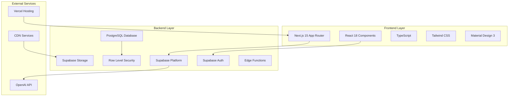
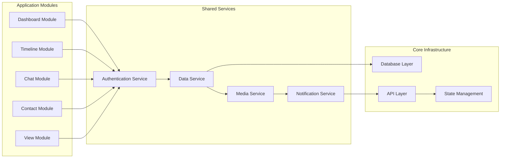
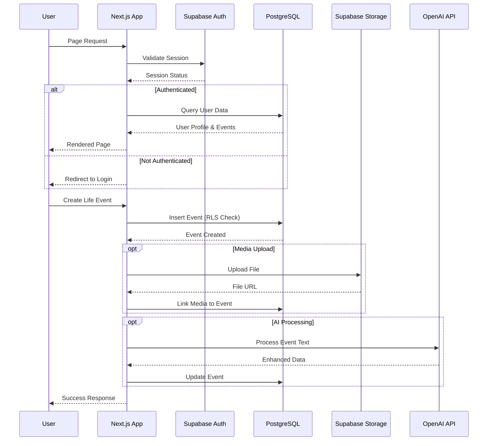
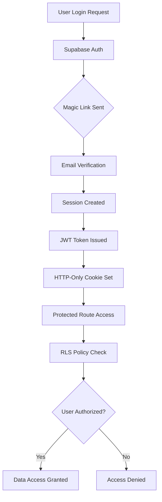
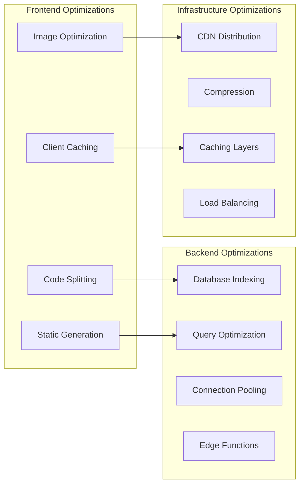
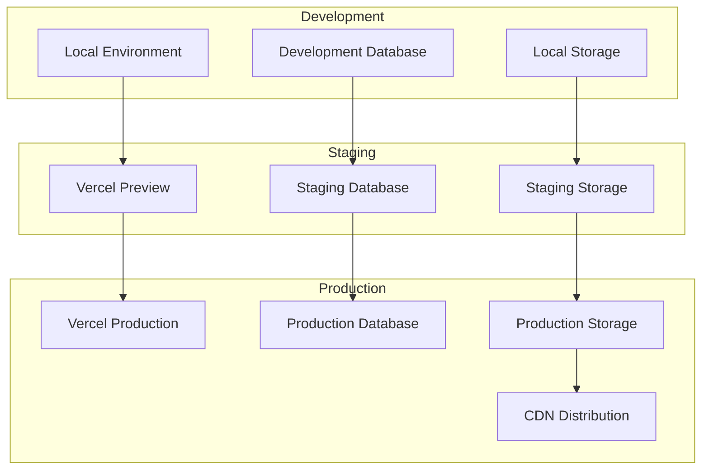
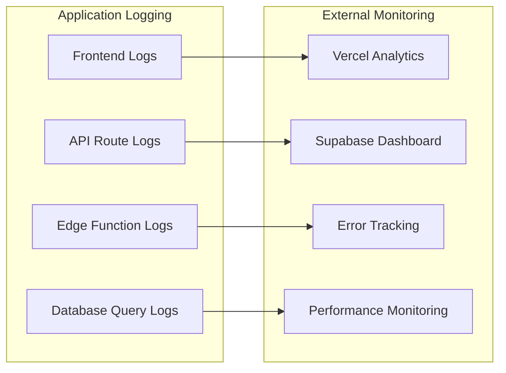

# System Architecture Overview

*High-level architecture of the Nality life timeline application*

---

## 🏗️ **Architecture Summary**

Nality is built as a modern, scalable web application using Next.js 15 with App Router and Supabase backend infrastructure. The architecture follows a modular, component-based design with strong separation of concerns and comprehensive security measures.

### **Technology Stack**



---

## 🏛️ **System Components**

### **Frontend Architecture**

**Next.js Application Structure:**
```
apps/web/
├── app/                      # App Router structure
│   ├── (protected)/         # Protected routes requiring authentication
│   ├── api/                 # API routes and server actions
│   ├── auth/                # Authentication pages
│   └── layout.tsx           # Root layout
├── components/              # Reusable UI components
├── modules/                 # Feature-specific modules
├── hooks/                   # Custom React hooks
├── lib/                     # Utility libraries
└── styles/                  # Styling and themes
```

**Key Principles:**
- **Observable Implementation**: Clear component hierarchy with predictable state flow
- **Dependency Transparency**: All external dependencies explicitly declared
- **Progressive Construction**: Modular architecture enabling incremental enhancement
- **Explicit Error Handling**: Comprehensive error boundaries and fallback states

### **Backend Architecture**

**Supabase Infrastructure:**
- **PostgreSQL Database**: Primary data store with advanced features
- **Row Level Security (RLS)**: Database-level access control
- **Authentication Service**: Magic link and session management
- **Storage Service**: Media file management with CDN
- **Edge Functions**: Serverless TypeScript functions for complex logic
- **Realtime Subscriptions**: Live data updates via WebSocket

### **Module Architecture**



---

## 🔄 **Data Flow Architecture**

### **Request/Response Flow**



### **State Management Flow**

1. **Local State**: Component-level state for UI interactions
2. **Client Cache**: TanStack Query for server state caching
3. **Global State**: Zustand for cross-component state
4. **Database State**: Authoritative source of truth in PostgreSQL
5. **Realtime Updates**: Supabase channels for live data synchronization

---

## 🔐 **Security Architecture**

### **Authentication & Authorization**



**Security Layers:**
1. **Transport Security**: HTTPS/TLS encryption for all communications
2. **Authentication**: Supabase Auth with magic link verification
3. **Session Management**: HTTP-only cookies with secure flags
4. **Authorization**: Row Level Security policies at database level
5. **Input Validation**: Zod schemas for all data inputs
6. **CSRF Protection**: Built-in Next.js CSRF protection
7. **XSS Prevention**: Content Security Policy and output encoding

### **Data Access Control**

**Row Level Security Policies:**
- Users can only access their own profile data
- Life events are scoped to the authenticated user
- Media objects inherit access from associated events
- Admin roles have auditing access with additional constraints

---

## 📊 **Performance Architecture**

### **Optimization Strategies**



**Performance Targets:**
- **First Contentful Paint**: < 1.5 seconds
- **Largest Contentful Paint**: < 2.5 seconds
- **Cumulative Layout Shift**: < 0.1
- **First Input Delay**: < 100ms
- **API Response Time**: < 200ms average

### **Scalability Considerations**

1. **Horizontal Scaling**: Serverless functions auto-scale based on demand
2. **Database Scaling**: PostgreSQL with read replicas for high availability
3. **Storage Scaling**: Supabase Storage with CDN for global distribution
4. **Cache Strategy**: Multi-level caching from browser to database
5. **Resource Optimization**: Lazy loading and code splitting for efficient resource usage

---

## 🚀 **Deployment Architecture**

### **Environment Strategy**



**Deployment Pipeline:**
1. **Development**: Local development with hot reloading
2. **Feature Branches**: Automatic preview deployments
3. **Staging**: Full integration testing environment
4. **Production**: Blue-green deployment with rollback capability
5. **Monitoring**: Comprehensive logging and performance tracking

---

## 🔧 **Development Architecture**

### **Monorepo Structure**

```
nality/
├── apps/
│   └── web/                 # Main Next.js application
├── packages/
│   ├── schema/              # Shared TypeScript schemas
│   └── ui/                  # Shared component library
├── supabase/
│   ├── migrations/          # Database schema migrations
│   ├── functions/           # Edge Functions
│   └── config.toml          # Supabase configuration
├── docs/                    # Technical documentation
└── documentation/           # Comprehensive documentation
```

**Development Principles:**
- **Type Safety**: Full TypeScript coverage with strict mode
- **Code Quality**: ESLint, Prettier, and automated formatting
- **Testing Strategy**: Unit tests, integration tests, and E2E testing
- **Version Control**: Git with conventional commits and semantic versioning
- **CI/CD**: Automated testing, building, and deployment

### **Tool Integration**

- **Package Management**: pnpm with workspace support
- **Build System**: Turbo for monorepo build optimization
- **Development Server**: Next.js with hot module replacement
- **Database Management**: Supabase CLI for migrations and local development
- **Deployment**: Vercel with automatic deployments

---

## 📈 **Monitoring & Observability**

### **Logging Strategy**



**Monitoring Components:**
1. **Application Performance**: Real-time performance metrics
2. **Error Tracking**: Comprehensive error logging and alerting
3. **Database Monitoring**: Query performance and connection health
4. **User Analytics**: Privacy-respecting usage analytics
5. **Security Monitoring**: Authentication and access pattern analysis

---

## 🔮 **Future Architecture Considerations**

### **Planned Enhancements**

1. **Microservices Evolution**: Gradual extraction of services for better scalability
2. **Event-Driven Architecture**: Implementation of event sourcing for complex workflows
3. **Advanced Caching**: Redis integration for high-performance caching
4. **Multi-Region Deployment**: Global distribution for improved performance
5. **AI/ML Integration**: Enhanced AI capabilities for content processing

### **Technical Debt Management**

- **Regular Refactoring**: Scheduled refactoring cycles to maintain code quality
- **Dependency Updates**: Automated dependency updates with security scanning
- **Performance Audits**: Regular performance reviews and optimizations
- **Security Reviews**: Periodic security assessments and penetration testing

---

## 📚 **Related Documentation**

- **[Component Architecture](./components.md)** - Detailed component structure
- **[Infrastructure Design](./infrastructure.md)** - Deployment and hosting architecture
- **[Database Schema](../database/schema.md)** - Database design and relationships
- **[API Documentation](../api/endpoints.md)** - Complete API reference

---

*This architecture overview provides the foundation for understanding the Nality system design. For implementation details, refer to the specific component documentation.*
