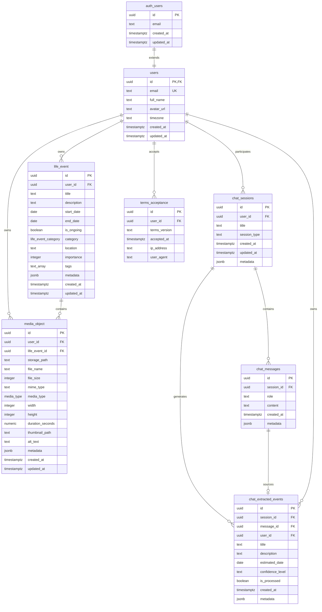
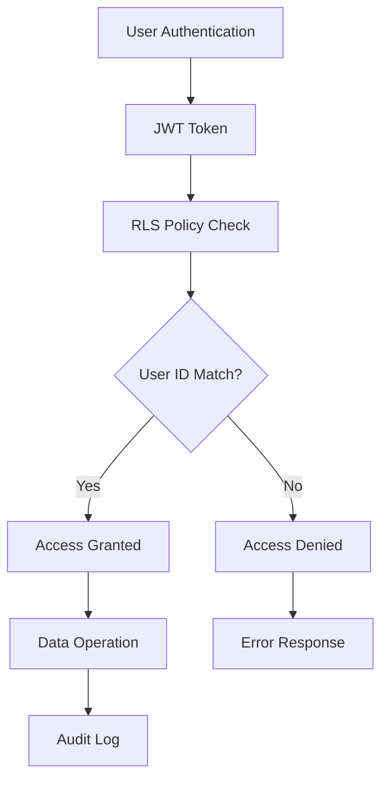

# Database Schema Documentation

*Complete database schema and data model for the Nality application*

---

## 🗄️ **Database Overview**

Nality uses PostgreSQL 15 as the primary database, hosted on Supabase with Row Level Security (RLS) for comprehensive access control. The schema is designed for optimal performance, data integrity, and scalability.

### **Schema Summary**



---

## 📋 **Core Tables**

### **users**
*User profiles extending Supabase auth.users*

| Column | Type | Constraints | Description |
|--------|------|-------------|-------------|
| `id` | `uuid` | `PK`, `FK` → `auth.users(id)` | User identifier |
| `email` | `text` | `UNIQUE`, `NOT NULL` | User email address |
| `full_name` | `text` | `NULL` | Full display name |
| `avatar_url` | `text` | `NULL` | Profile image URL |
| `timezone` | `text` | `DEFAULT 'UTC'` | User timezone |
| `created_at` | `timestamptz` | `DEFAULT NOW()` | Profile creation timestamp |
| `updated_at` | `timestamptz` | `DEFAULT NOW()` | Last update timestamp |

**Indexes:**
- Primary key on `id`
- Unique index on `email`

**Triggers:**
- `set_users_updated_at` - Auto-update `updated_at` on modifications

### **life_event**
*Core timeline events and experiences*

| Column | Type | Constraints | Description |
|--------|------|-------------|-------------|
| `id` | `uuid` | `PK`, `DEFAULT uuid_generate_v4()` | Event identifier |
| `user_id` | `uuid` | `FK` → `auth.users(id)`, `NOT NULL` | Event owner |
| `title` | `text` | `NOT NULL`, `CHECK (length > 0 AND length <= 200)` | Event title |
| `description` | `text` | `NULL` | Detailed description |
| `start_date` | `date` | `NOT NULL` | Event start date |
| `end_date` | `date` | `NULL` | Event end date (optional) |
| `is_ongoing` | `boolean` | `DEFAULT FALSE` | Whether event is still happening |
| `category` | `life_event_category` | `DEFAULT 'personal'` | Event category |
| `location` | `text` | `NULL` | Event location |
| `importance` | `integer` | `DEFAULT 5`, `CHECK (1 <= importance <= 10)` | Importance rating |
| `tags` | `text[]` | `DEFAULT ARRAY[]::TEXT[]` | Event tags |
| `metadata` | `jsonb` | `DEFAULT '{}'` | Additional structured data |
| `created_at` | `timestamptz` | `DEFAULT NOW()` | Creation timestamp |
| `updated_at` | `timestamptz` | `DEFAULT NOW()` | Last update timestamp |

**Constraints:**
- `valid_date_range`: Ensures end_date >= start_date when specified
- Category must be valid enum value
- Importance between 1-10

**Indexes:**
- Primary key on `id`
- Performance index on `user_id`
- Query optimization index on `start_date DESC`
- GIN index on `tags` for array operations

**Triggers:**
- `set_life_event_updated_at` - Auto-update `updated_at` on modifications

### **media_object**
*File attachments and media for life events*

| Column | Type | Constraints | Description |
|--------|------|-------------|-------------|
| `id` | `uuid` | `PK`, `DEFAULT uuid_generate_v4()` | Media identifier |
| `user_id` | `uuid` | `FK` → `auth.users(id)`, `NOT NULL` | Media owner |
| `life_event_id` | `uuid` | `FK` → `life_event(id)`, `NULL` | Associated event |
| `storage_path` | `text` | `NOT NULL`, `CHECK (length > 0)` | Supabase Storage path |
| `file_name` | `text` | `NOT NULL`, `CHECK (length > 0)` | Original filename |
| `file_size` | `integer` | `NOT NULL`, `CHECK (file_size > 0)` | File size in bytes |
| `mime_type` | `text` | `NOT NULL`, `CHECK (length > 0)` | MIME type |
| `media_type` | `media_type` | `NOT NULL` | Media category |
| `width` | `integer` | `NULL`, `CHECK (width > 0)` | Image/video width |
| `height` | `integer` | `NULL`, `CHECK (height > 0)` | Image/video height |
| `duration_seconds` | `numeric` | `NULL`, `CHECK (duration_seconds > 0)` | Audio/video duration |
| `thumbnail_path` | `text` | `NULL` | Thumbnail image path |
| `alt_text` | `text` | `NULL` | Accessibility description |
| `metadata` | `jsonb` | `DEFAULT '{}'` | Additional file metadata |
| `created_at` | `timestamptz` | `DEFAULT NOW()` | Upload timestamp |
| `updated_at` | `timestamptz` | `DEFAULT NOW()` | Last update timestamp |

**Indexes:**
- Primary key on `id`
- Performance index on `user_id`
- Performance index on `life_event_id`

**Triggers:**
- `set_media_object_updated_at` - Auto-update `updated_at` on modifications

---

## 🏷️ **Enums and Types**

### **life_event_category**
*Categories for organizing life events*

```sql
CREATE TYPE life_event_category AS ENUM (
    'personal',      -- Personal experiences and reflections
    'education',     -- Educational milestones and learning
    'career',        -- Professional development and work
    'family',        -- Family relationships and events
    'travel',        -- Travel experiences and adventures
    'achievement',   -- Accomplishments and awards
    'health',        -- Health and wellness events
    'relationship',  -- Romantic and friendship relationships
    'other'          -- Miscellaneous events
);
```

### **media_type**
*Media file classifications*

```sql
CREATE TYPE media_type AS ENUM (
    'image',         -- Photos, illustrations, graphics
    'video',         -- Video files and recordings
    'audio',         -- Audio recordings and music
    'document'       -- PDFs, documents, text files
);
```

---

## 💬 **Chat System Tables**

### **chat_sessions**
*Chat conversations with AI assistant*

| Column | Type | Constraints | Description |
|--------|------|-------------|-------------|
| `id` | `uuid` | `PK`, `DEFAULT gen_random_uuid()` | Session identifier |
| `user_id` | `uuid` | `FK` → `auth.users(id)`, `NOT NULL` | Session owner |
| `title` | `text` | `NULL` | Session title |
| `session_type` | `text` | `DEFAULT 'general'` | Session category |
| `created_at` | `timestamptz` | `DEFAULT NOW()` | Session start |
| `updated_at` | `timestamptz` | `DEFAULT NOW()` | Last activity |
| `metadata` | `jsonb` | `DEFAULT '{}'` | Session context |

### **chat_messages**
*Individual messages within chat sessions*

| Column | Type | Constraints | Description |
|--------|------|-------------|-------------|
| `id` | `uuid` | `PK`, `DEFAULT gen_random_uuid()` | Message identifier |
| `session_id` | `uuid` | `FK` → `chat_sessions(id)`, `NOT NULL` | Parent session |
| `role` | `text` | `NOT NULL`, `CHECK (role IN ('user', 'assistant', 'system', 'tool'))` | Message sender |
| `content` | `text` | `NOT NULL` | Message content |
| `created_at` | `timestamptz` | `DEFAULT NOW()` | Message timestamp |
| `metadata` | `jsonb` | `DEFAULT '{}'` | Additional message data |

### **chat_extracted_events**
*Life events extracted from chat conversations*

| Column | Type | Constraints | Description |
|--------|------|-------------|-------------|
| `id` | `uuid` | `PK`, `DEFAULT gen_random_uuid()` | Extraction identifier |
| `session_id` | `uuid` | `FK` → `chat_sessions(id)`, `NOT NULL` | Source session |
| `message_id` | `uuid` | `FK` → `chat_messages(id)`, `NULL` | Source message |
| `user_id` | `uuid` | `FK` → `auth.users(id)`, `NOT NULL` | Event owner |
| `title` | `text` | `NOT NULL` | Extracted event title |
| `description` | `text` | `NULL` | Extracted description |
| `estimated_date` | `date` | `NULL` | AI-estimated date |
| `confidence_level` | `text` | `DEFAULT 'medium'` | AI confidence rating |
| `is_processed` | `boolean` | `DEFAULT FALSE` | Whether converted to life_event |
| `created_at` | `timestamptz` | `DEFAULT NOW()` | Extraction timestamp |
| `metadata` | `jsonb` | `DEFAULT '{}'` | AI processing details |

---

## 🔐 **Row Level Security (RLS)**

### **Security Model Overview**



### **RLS Policies**

#### **users Table Policies**

```sql
-- Users can view their own profile
CREATE POLICY "Users can view own profile" 
    ON users FOR SELECT 
    USING (auth.uid() = id);

-- Users can update their own profile
CREATE POLICY "Users can update own profile" 
    ON users FOR UPDATE 
    USING (auth.uid() = id);

-- Users can insert their own profile (handled by trigger)
CREATE POLICY "Users can insert own profile"
    ON users FOR INSERT
    WITH CHECK (auth.uid() = id);
```

#### **life_event Table Policies**

```sql
-- Users can view their own life events
CREATE POLICY "Users can view own life events" 
    ON life_event FOR SELECT 
    USING (auth.uid() = user_id);

-- Users can create life events for themselves
CREATE POLICY "Users can create own life events" 
    ON life_event FOR INSERT 
    WITH CHECK (auth.uid() = user_id);

-- Users can update their own life events
CREATE POLICY "Users can update own life events" 
    ON life_event FOR UPDATE 
    USING (auth.uid() = user_id);

-- Users can delete their own life events
CREATE POLICY "Users can delete own life events" 
    ON life_event FOR DELETE 
    USING (auth.uid() = user_id);
```

#### **media_object Table Policies**

```sql
-- Users can view their own media objects
CREATE POLICY "Users can view own media objects" 
    ON media_object FOR SELECT 
    USING (auth.uid() = user_id);

-- Users can create media objects for themselves
CREATE POLICY "Users can create own media objects" 
    ON media_object FOR INSERT 
    WITH CHECK (auth.uid() = user_id);

-- Users can update their own media objects
CREATE POLICY "Users can update own media objects" 
    ON media_object FOR UPDATE 
    USING (auth.uid() = user_id);

-- Users can delete their own media objects
CREATE POLICY "Users can delete own media objects" 
    ON media_object FOR DELETE 
    USING (auth.uid() = user_id);
```

#### **Chat System Policies**

All chat-related tables follow the same pattern of user ownership verification through RLS policies ensuring users can only access their own chat sessions, messages, and extracted events.

---

## 🔧 **Database Functions**

### **Utility Functions**

#### **handle_updated_at()**
*Automatically updates the updated_at timestamp*

```sql
CREATE OR REPLACE FUNCTION handle_updated_at()
RETURNS TRIGGER AS $$
BEGIN
  NEW.updated_at = NOW();
  RETURN NEW;
END;
$$ LANGUAGE plpgsql;
```

#### **handle_new_user()**
*Creates user profile when new auth user is created*

```sql
CREATE OR REPLACE FUNCTION handle_new_user()
RETURNS TRIGGER AS $$
BEGIN
  INSERT INTO public.users (id, email, full_name)
  VALUES (
    NEW.id,
    NEW.email,
    COALESCE(NEW.raw_user_meta_data->>'full_name', NEW.email)
  );
  RETURN NEW;
END;
$$ LANGUAGE plpgsql SECURITY DEFINER;
```

### **Database Triggers**

```sql
-- Auto-update timestamps on all tables
CREATE TRIGGER set_users_updated_at
    BEFORE UPDATE ON users
    FOR EACH ROW EXECUTE FUNCTION handle_updated_at();

CREATE TRIGGER set_life_event_updated_at
    BEFORE UPDATE ON life_event
    FOR EACH ROW EXECUTE FUNCTION handle_updated_at();

CREATE TRIGGER set_media_object_updated_at
    BEFORE UPDATE ON media_object
    FOR EACH ROW EXECUTE FUNCTION handle_updated_at();

-- Auto-create user profile on auth signup
CREATE TRIGGER on_auth_user_created
    AFTER INSERT ON auth.users
    FOR EACH ROW EXECUTE FUNCTION handle_new_user();
```

---

## 📊 **Performance Optimizations**

### **Index Strategy**

```sql
-- Performance indexes for common queries
CREATE INDEX idx_life_event_user_id ON life_event(user_id);
CREATE INDEX idx_life_event_start_date ON life_event(start_date DESC);
CREATE INDEX idx_life_event_category ON life_event(category);
CREATE INDEX idx_life_event_importance ON life_event(importance DESC);

-- GIN index for tag array operations
CREATE INDEX idx_life_event_tags ON life_event USING GIN (tags);

-- Media object indexes
CREATE INDEX idx_media_object_user_id ON media_object(user_id);
CREATE INDEX idx_media_object_life_event_id ON media_object(life_event_id);
CREATE INDEX idx_media_object_media_type ON media_object(media_type);

-- Chat system indexes
CREATE INDEX idx_chat_sessions_user_id ON chat_sessions(user_id);
CREATE INDEX idx_chat_messages_session_id ON chat_messages(session_id);
CREATE INDEX idx_chat_extracted_events_user_id ON chat_extracted_events(user_id);
```

### **Query Optimization**

- **Prepared Statements**: All queries use parameterized statements
- **Connection Pooling**: Supabase manages database connections efficiently
- **Query Analysis**: Regular EXPLAIN ANALYZE for performance monitoring
- **Materialized Views**: Future consideration for complex aggregations

---

## 🔄 **Migration Strategy**

### **Migration Naming Convention**
```
YYYYMMDD_NNN_description.sql
```

Example: `20250730_001_create_users.sql`

### **Migration Order**
1. **Core Tables**: users, life_event, media_object
2. **Enums and Types**: life_event_category, media_type
3. **Constraints and Indexes**: Performance and data integrity
4. **RLS Policies**: Security layer implementation
5. **Functions and Triggers**: Automation and data consistency
6. **Chat System**: Extended functionality tables

### **Rollback Strategy**
- Each migration includes rollback scripts
- Database backups before major schema changes
- Feature flags for gradual rollout of schema-dependent features

---

## 🚦 **Data Validation**

### **Application-Level Validation**
Zod schemas in `packages/schema/` provide TypeScript validation:

```typescript
// Life Event validation
export const LifeEventSchema = z.object({
  id: z.string().uuid().optional(),
  user_id: z.string().uuid(),
  title: z.string().min(1).max(200),
  description: z.string().optional().nullable(),
  start_date: z.string().regex(/^\d{4}-\d{2}-\d{2}$/),
  // ... additional fields
});
```

### **Database-Level Constraints**
- Foreign key constraints ensure referential integrity
- Check constraints validate data ranges and formats
- NOT NULL constraints prevent missing required data
- Unique constraints prevent duplicate entries

---

## 📈 **Database Monitoring**

### **Key Metrics**
- **Connection Count**: Monitor concurrent database connections
- **Query Performance**: Track slow queries and execution times
- **Storage Usage**: Monitor database size and growth trends
- **RLS Policy Performance**: Ensure security policies don't impact performance
- **Index Usage**: Verify indexes are being utilized effectively

### **Alerting Thresholds**
- Query execution time > 1000ms
- Database storage > 80% capacity
- Connection pool > 90% utilization
- Failed authentication attempts > 10/minute

---

## 📚 **Related Documentation**

- **[Data Flow Diagrams](./data-flows.md)** - Information flow through the system
- **[Security Model](./security.md)** - Comprehensive security documentation
- **[Migration History](./migrations.md)** - Complete migration documentation
- **[API Data Contracts](../api/data-contracts.md)** - Request/response schemas

---

*This schema documentation reflects the current production database structure. All changes require migration scripts and documentation updates.*
