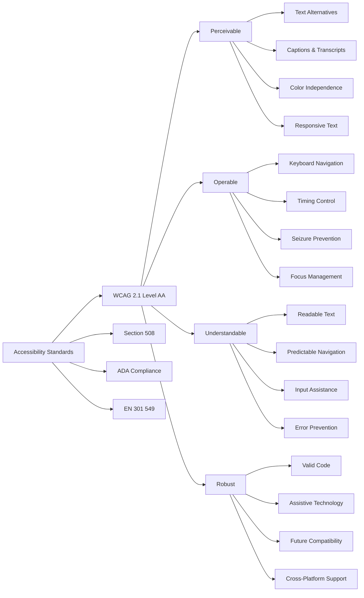
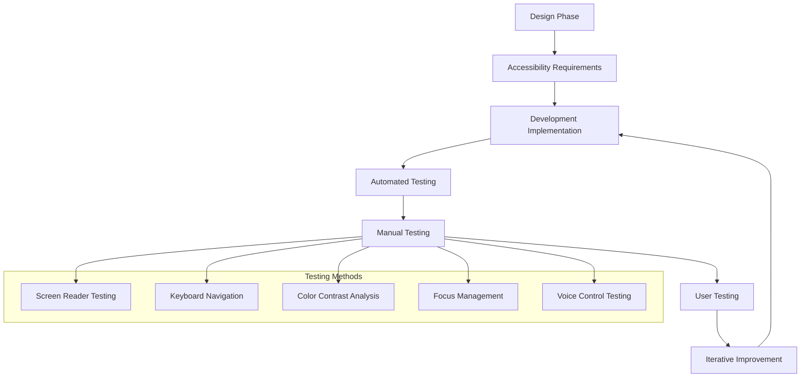
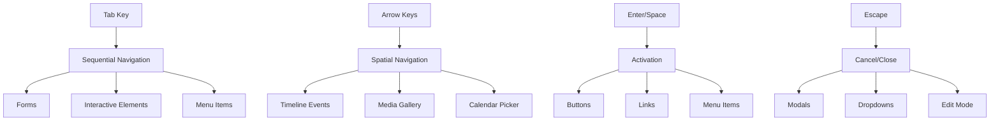

# Accessibility Guide

*Comprehensive accessibility implementation for Nality - ensuring inclusive design for all users*

---

## ♿ **Accessibility Overview**

Nality is designed from the ground up to be accessible to users of all abilities. Our commitment to accessibility goes beyond compliance requirements to create a truly inclusive experience that empowers everyone to preserve and share their life stories.

### **Accessibility Standards Compliance**



---

## 🎯 **Design Principles**

### **Universal Design Approach**

1. **Inclusive by Default**
   - Features work for everyone without requiring specialized adaptations
   - Multiple ways to access and interact with content
   - Flexible interface that adapts to user needs

2. **Progressive Enhancement**
   - Core functionality accessible without JavaScript
   - Enhanced features layered on top of accessible foundation
   - Graceful degradation when assistive technologies have limitations

3. **User Control**
   - Customizable interface elements
   - User-controlled preferences and settings
   - Respect for user's assistive technology configurations

### **Accessibility-First Development**



---

## 🔤 **Text and Typography**

### **Font and Reading Accessibility**

**Typography Specifications:**
- **Primary Font**: Inter (optimized for screen reading)
- **Fallback Fonts**: System fonts for maximum compatibility
- **Minimum Size**: 16px base font size
- **Line Height**: 1.5 for optimal readability
- **Character Spacing**: Normal with option to increase

**Text Scaling Support:**
```css
/* Responsive text scaling up to 200% without horizontal scrolling */
html {
  font-size: 100%; /* 16px base */
}

@media (prefers-reduced-motion: no-preference) {
  html {
    font-size: calc(1rem + 0.25vw);
  }
}

/* Ensure readability at 200% zoom */
.timeline-content {
  max-width: 65ch;
  line-height: 1.6;
}
```

### **Content Structure**

**Semantic HTML Structure:**
```html
<!-- Proper heading hierarchy -->
<h1>Timeline Overview</h1>
  <h2>2023 Events</h2>
    <h3>Summer Vacation</h3>
      <h4>Event Details</h4>

<!-- Descriptive landmarks -->
<header role="banner">
<nav role="navigation" aria-label="Main navigation">
<main role="main">
<aside role="complementary" aria-label="Timeline filters">
<footer role="contentinfo">
```

**Screen Reader Optimizations:**
- Descriptive link text (no "click here" or "read more")
- Image alt text that conveys meaning and context
- Table headers properly associated with data cells
- Form labels explicitly associated with inputs

---

## ⌨️ **Keyboard Navigation**

### **Complete Keyboard Support**

**Navigation Patterns:**


**Keyboard Shortcuts:**
- `Tab` / `Shift + Tab`: Navigate between interactive elements
- `Enter` / `Space`: Activate buttons and links
- `Arrow keys`: Navigate within component groups
- `Escape`: Close modals, cancel operations
- `Home` / `End`: Jump to beginning/end of lists
- `/`: Focus search input (global shortcut)

### **Focus Management**

**Focus Indicators:**
```css
/* High-contrast focus indicators */
.focus-visible {
  outline: 3px solid var(--color-focus);
  outline-offset: 2px;
  border-radius: 4px;
}

/* Custom focus for specific components */
.timeline-event:focus {
  box-shadow: 0 0 0 3px var(--color-focus);
  transform: translateY(-2px);
}
```

**Focus Trapping:**
- Modal dialogs trap focus within the dialog
- Skip links for efficient navigation
- Focus restoration when closing overlays
- Logical focus order throughout the application

### **Keyboard Interaction Patterns**

**Timeline Navigation:**
```typescript
// Timeline keyboard navigation implementation
const handleTimelineKeyboard = (event: KeyboardEvent) => {
  switch (event.key) {
    case 'ArrowUp':
      focusPreviousEvent();
      event.preventDefault();
      break;
    case 'ArrowDown':
      focusNextEvent();
      event.preventDefault();
      break;
    case 'Home':
      focusFirstEvent();
      event.preventDefault();
      break;
    case 'End':
      focusLastEvent();
      event.preventDefault();
      break;
    case 'Enter':
    case ' ':
      openEventDetails();
      event.preventDefault();
      break;
  }
};
```

---

## 🎨 **Visual Accessibility**

### **Color and Contrast**

**Color Contrast Standards:**
- **Normal Text**: Minimum 4.5:1 contrast ratio
- **Large Text**: Minimum 3:1 contrast ratio
- **UI Components**: Minimum 3:1 contrast ratio
- **Focus Indicators**: Minimum 3:1 contrast ratio

**Color Palette:**
```css
:root {
  /* Primary colors with AA compliance */
  --color-primary: #1976d2;      /* Contrast: 4.52:1 on white */
  --color-primary-dark: #1565c0; /* Contrast: 5.74:1 on white */
  --color-secondary: #dc004e;     /* Contrast: 4.51:1 on white */
  
  /* Status colors */
  --color-success: #2e7d32;      /* Contrast: 4.52:1 on white */
  --color-warning: #f57c00;      /* Contrast: 4.51:1 on white */
  --color-error: #d32f2f;        /* Contrast: 4.51:1 on white */
  
  /* Text colors */
  --color-text-primary: #212121;  /* Contrast: 16.5:1 on white */
  --color-text-secondary: #757575; /* Contrast: 4.54:1 on white */
}
```

**Dark Mode Support:**
```css
@media (prefers-color-scheme: dark) {
  :root {
    --color-background: #121212;
    --color-surface: #1e1e1e;
    --color-text-primary: #ffffff;
    --color-text-secondary: #b3b3b3;
    /* All colors maintain required contrast ratios */
  }
}
```

### **Color Independence**

**Information Conveyance:**
- Information never conveyed by color alone
- Multiple visual cues (icons, patterns, text labels)
- Status indicators use color + icon + text
- Interactive states indicated by multiple properties

**Example Implementation:**
```html
<!-- Event importance shown with multiple cues -->
<div class="event-card" data-importance="high">
  <span class="importance-indicator">
    <svg aria-label="High importance" class="icon-star-filled">
      <!-- Star icon -->
    </svg>
    <span class="importance-text">High</span>
  </span>
  <div class="importance-bar" style="width: 90%">
    <span class="sr-only">Importance level: 9 out of 10</span>
  </div>
</div>
```

### **Motion and Animation**

**Respecting User Preferences:**
```css
/* Reduced motion support */
@media (prefers-reduced-motion: reduce) {
  *,
  *::before,
  *::after {
    animation-duration: 0.01ms !important;
    animation-iteration-count: 1 !important;
    transition-duration: 0.01ms !important;
    scroll-behavior: auto !important;
  }
}

/* Safe animations for reduced motion users */
@media (prefers-reduced-motion: reduce) {
  .timeline-event {
    /* Use opacity/visibility changes instead of movement */
    transition: opacity 0.2s ease;
  }
}
```

**Animation Guidelines:**
- No auto-playing videos or animations
- Parallax and excessive motion avoided
- Essential animations can be paused or disabled
- Loading indicators remain functional with reduced motion

---

## 🔊 **Audio and Media Accessibility**

### **Image Accessibility**

**Alt Text Guidelines:**
```html
<!-- Descriptive alt text for meaningful images -->


<!-- Empty alt for decorative images -->


<!-- Complex images with detailed descriptions -->

<div id="family-tree-description" class="sr-only">
  Detailed description: The family tree starts with patriarch Robert Johnson...
</div>
```

**Image Categories and Alt Text Patterns:**

1. **Personal Photos:**
   - Who is in the photo
   - What they're doing
   - Where/when context
   - Emotional context if relevant

2. **Documents:**
   - Document type
   - Key information visible
   - Date and context

3. **Screenshots:**
   - What interface is shown
   - Key information displayed
   - Purpose/context

### **Video Accessibility**

**Video Requirements:**
```html
<video controls preload="metadata">
  <source src="wedding-video.mp4" type="video/mp4">
  <track kind="captions" src="wedding-captions.vtt" srclang="en" label="English" default>
  <track kind="descriptions" src="wedding-descriptions.vtt" srclang="en" label="Audio descriptions">
  <p>Your browser doesn't support HTML5 video. <a href="wedding-video.mp4">Download the video</a> instead.</p>
</video>
```

**Audio Description Support:**
- Captions for all spoken content
- Audio descriptions for visual content
- Transcript availability for all media
- User control over playback speed

### **Media Player Accessibility**

**Custom Media Controls:**
```typescript
// Accessible media player controls
const MediaPlayer = () => {
  return (
    <div className="media-player" role="region" aria-label="Video player">
      <video ref={videoRef} aria-describedby="video-description">
        {/* Video content */}
      </video>
      
      <div className="controls" role="toolbar" aria-label="Video controls">
        <button 
          aria-label={isPlaying ? "Pause video" : "Play video"}
          onClick={togglePlay}
        >
          {isPlaying ? <PauseIcon /> : <PlayIcon />}
        </button>
        
        <div className="progress-container">
          <input
            type="range"
            min="0"
            max={duration}
            value={currentTime}
            onChange={handleSeek}
            aria-label="Video progress"
            aria-valuetext={`${formatTime(currentTime)} of ${formatTime(duration)}`}
          />
        </div>
        
        <button aria-label="Mute video" onClick={toggleMute}>
          {isMuted ? <VolumeOffIcon /> : <VolumeOnIcon />}
        </button>
      </div>
    </div>
  );
};
```

---

## 📝 **Form Accessibility**

### **Form Design and Labels**

**Label Association:**
```html
<!-- Explicit labels -->
<label for="event-title">Event Title</label>
<input type="text" id="event-title" name="title" required aria-describedby="title-help">
<div id="title-help" class="help-text">
  Choose a memorable title that captures the essence of this moment
</div>

<!-- Complex form controls -->
<fieldset>
  <legend>Event Importance</legend>
  <div role="radiogroup" aria-labelledby="importance-legend">
    <input type="radio" id="low" name="importance" value="low">
    <label for="low">Low importance</label>
    
    <input type="radio" id="medium" name="importance" value="medium">
    <label for="medium">Medium importance</label>
    
    <input type="radio" id="high" name="importance" value="high">
    <label for="high">High importance</label>
  </div>
</fieldset>
```

### **Error Handling and Validation**

**Accessible Error Messages:**
```html
<!-- Form with error state -->
<div class="form-field" aria-invalid="true">
  <label for="event-date">Event Date</label>
  <input 
    type="date" 
    id="event-date" 
    name="date"
    aria-describedby="date-error date-help"
    aria-invalid="true"
  >
  <div id="date-error" class="error-message" role="alert">
    Event date cannot be in the future
  </div>
  <div id="date-help" class="help-text">
    Select the date when this event occurred
  </div>
</div>
```

**Error Prevention and Recovery:**
```typescript
// Accessible form validation
const validateForm = (formData: FormData) => {
  const errors: FormErrors = {};
  
  // Validate required fields
  if (!formData.title?.trim()) {
    errors.title = {
      message: "Event title is required",
      element: document.getElementById('event-title'),
      severity: 'error'
    };
  }
  
  // Announce errors to screen readers
  if (Object.keys(errors).length > 0) {
    announceToScreenReader(
      `Form has ${Object.keys(errors).length} error${Object.keys(errors).length === 1 ? '' : 's'}. Please review and correct.`
    );
    
    // Focus first error field
    const firstErrorField = Object.values(errors)[0].element;
    firstErrorField?.focus();
  }
  
  return errors;
};
```

### **Complex Form Components**

**Date Picker Accessibility:**
```html
<div class="date-picker-container">
  <label for="event-date">Event Date</label>
  <input 
    type="date" 
    id="event-date"
    aria-describedby="date-instructions"
    aria-expanded="false"
    aria-haspopup="dialog"
  >
  <button 
    type="button" 
    aria-label="Open calendar picker"
    aria-describedby="date-instructions"
  >
    📅
  </button>
  <div id="date-instructions" class="sr-only">
    Use arrow keys to navigate calendar, Enter to select date, Escape to close
  </div>
</div>
```

---

## 🖥️ **Screen Reader Support**

### **ARIA Implementation**

**Landmark Roles:**
```html
<div id="app">
  <header role="banner">
    <nav role="navigation" aria-label="Main navigation">
      <!-- Navigation content -->
    </nav>
  </header>
  
  <main role="main" aria-labelledby="page-title">
    <h1 id="page-title">Your Life Timeline</h1>
    
    <section aria-labelledby="timeline-heading">
      <h2 id="timeline-heading">Timeline Events</h2>
      <!-- Timeline content -->
    </section>
    
    <aside role="complementary" aria-labelledby="filters-heading">
      <h2 id="filters-heading">Timeline Filters</h2>
      <!-- Filter controls -->
    </aside>
  </main>
  
  <footer role="contentinfo">
    <!-- Footer content -->
  </footer>
</div>
```

**Dynamic Content Updates:**
```typescript
// Live region for dynamic updates
const announceToScreenReader = (message: string, priority: 'polite' | 'assertive' = 'polite') => {
  const liveRegion = document.getElementById('live-region');
  if (liveRegion) {
    liveRegion.setAttribute('aria-live', priority);
    liveRegion.textContent = message;
    
    // Clear after announcement
    setTimeout(() => {
      liveRegion.textContent = '';
    }, 1000);
  }
};

// Usage examples
announceToScreenReader("New event added to timeline");
announceToScreenReader("Error: Failed to save event", 'assertive');
```

### **Complex Component Accessibility**

**Timeline Event Cards:**
```html
<article 
  class="timeline-event" 
  role="article"
  aria-labelledby="event-title-123"
  aria-describedby="event-summary-123"
  tabindex="0"
>
  <header>
    <h3 id="event-title-123">College Graduation</h3>
    <time datetime="2019-06-15" aria-label="June 15, 2019">
      June 15, 2019
    </time>
  </header>
  
  <div id="event-summary-123" class="event-content">
    <p>Graduated with honors from Stanford University with a degree in Computer Science.</p>
    
    <div class="event-media" role="img" aria-label="2 photos attached">
      
      
    </div>
    
    <div class="event-actions">
      <button aria-label="Edit College Graduation event">Edit</button>
      <button aria-label="Share College Graduation event">Share</button>
      <button aria-label="Delete College Graduation event">Delete</button>
    </div>
  </div>
</article>
```

**Modal Dialog Accessibility:**
```typescript
const EventDetailModal = ({ event, onClose }) => {
  const modalRef = useRef<HTMLDivElement>(null);
  const previousFocus = useRef<HTMLElement | null>(null);
  
  useEffect(() => {
    // Store previous focus
    previousFocus.current = document.activeElement as HTMLElement;
    
    // Focus modal
    modalRef.current?.focus();
    
    // Trap focus within modal
    const trapFocus = (e: KeyboardEvent) => {
      if (e.key === 'Tab') {
        const focusableElements = modalRef.current?.querySelectorAll(
          'button, [href], input, select, textarea, [tabindex]:not([tabindex="-1"])'
        );
        
        if (focusableElements && focusableElements.length > 0) {
          const firstElement = focusableElements[0] as HTMLElement;
          const lastElement = focusableElements[focusableElements.length - 1] as HTMLElement;
          
          if (e.shiftKey && document.activeElement === firstElement) {
            lastElement.focus();
            e.preventDefault();
          } else if (!e.shiftKey && document.activeElement === lastElement) {
            firstElement.focus();
            e.preventDefault();
          }
        }
      } else if (e.key === 'Escape') {
        onClose();
      }
    };
    
    document.addEventListener('keydown', trapFocus);
    
    return () => {
      document.removeEventListener('keydown', trapFocus);
      // Restore previous focus
      previousFocus.current?.focus();
    };
  }, [onClose]);
  
  return (
    <div 
      className="modal-overlay" 
      role="dialog" 
      aria-modal="true"
      aria-labelledby="modal-title"
      ref={modalRef}
      tabIndex={-1}
    >
      <div className="modal-content">
        <header className="modal-header">
          <h2 id="modal-title">{event.title}</h2>
          <button 
            onClick={onClose}
            aria-label="Close event details"
            className="close-button"
          >
            ×
          </button>
        </header>
        
        <div className="modal-body">
          {/* Modal content */}
        </div>
      </div>
    </div>
  );
};
```

---

## 📱 **Mobile Accessibility**

### **Touch Accessibility**

**Touch Target Guidelines:**
```css
/* Minimum touch target size: 44px x 44px */
.touch-target {
  min-height: 44px;
  min-width: 44px;
  display: flex;
  align-items: center;
  justify-content: center;
}

/* Adequate spacing between touch targets */
.button-group .touch-target {
  margin: 4px;
}

/* Larger targets for critical actions */
.primary-action {
  min-height: 56px;
  min-width: 56px;
}
```

**Gesture Alternatives:**
- All gesture-based interactions have keyboard alternatives
- Swipe gestures supplemented with button controls
- Pinch-to-zoom accompanied by zoom controls
- Voice control support where available

### **Screen Reader Support on Mobile**

**Mobile-Specific ARIA:**
```html
<!-- Mobile navigation with proper roles -->
<nav role="navigation" aria-label="Main menu">
  <button 
    aria-expanded="false" 
    aria-controls="mobile-menu"
    aria-label="Open main menu"
    class="menu-toggle"
  >
    ☰
  </button>
  
  <ul id="mobile-menu" class="mobile-menu" hidden>
    <li><a href="/timeline">Timeline</a></li>
    <li><a href="/dashboard">Dashboard</a></li>
    <li><a href="/chat">AI Assistant</a></li>
  </ul>
</nav>
```

---

## 🧪 **Testing and Validation**

### **Automated Testing**

**Accessibility Testing Tools:**
```typescript
// Automated accessibility testing with jest-axe
import { axe, toHaveNoViolations } from 'jest-axe';

expect.extend(toHaveNoViolations);

describe('Timeline Component Accessibility', () => {
  test('should not have any accessibility violations', async () => {
    const { container } = render(<Timeline events={mockEvents} />);
    const results = await axe(container);
    expect(results).toHaveNoViolations();
  });
  
  test('should support keyboard navigation', async () => {
    const { getByRole } = render(<Timeline events={mockEvents} />);
    const firstEvent = getByRole('article', { name: /first event/i });
    
    firstEvent.focus();
    expect(document.activeElement).toBe(firstEvent);
    
    fireEvent.keyDown(firstEvent, { key: 'ArrowDown' });
    const secondEvent = getByRole('article', { name: /second event/i });
    expect(document.activeElement).toBe(secondEvent);
  });
});
```

**Continuous Integration Testing:**
```yaml
# GitHub Actions workflow for accessibility testing
name: Accessibility Testing
on: [push, pull_request]

jobs:
  a11y-test:
    runs-on: ubuntu-latest
    steps:
      - uses: actions/checkout@v2
      - name: Setup Node.js
        uses: actions/setup-node@v2
        with:
          node-version: '18'
      
      - name: Install dependencies
        run: npm ci
      
      - name: Run accessibility tests
        run: npm run test:a11y
      
      - name: Run axe-core analysis
        run: npm run axe-analysis
      
      - name: Lighthouse accessibility audit
        run: npm run lighthouse:a11y
```

### **Manual Testing Protocol**

**Screen Reader Testing Checklist:**
- [ ] NVDA (Windows) - Latest version
- [ ] JAWS (Windows) - Latest version  
- [ ] VoiceOver (macOS/iOS) - Built-in
- [ ] TalkBack (Android) - Built-in
- [ ] Orca (Linux) - Latest version

**Keyboard Navigation Testing:**
- [ ] Tab order is logical and complete
- [ ] All interactive elements are reachable
- [ ] Focus indicators are visible and clear
- [ ] Keyboard shortcuts work as expected
- [ ] Focus trapping works in modals
- [ ] Skip links function properly

**Visual Testing:**
- [ ] 200% zoom test (no horizontal scrolling)
- [ ] High contrast mode compatibility
- [ ] Color blindness simulation testing
- [ ] Dark mode accessibility
- [ ] Reduced motion preference respect

### **User Testing with Assistive Technologies**

**Testing Protocol:**
1. **Recruitment**: Include users with disabilities in testing groups
2. **Environment**: Test with real assistive technologies
3. **Tasks**: Complete realistic user scenarios
4. **Feedback**: Gather qualitative feedback on experience
5. **Iteration**: Implement improvements based on findings

**Regular Accessibility Audits:**
- Monthly automated testing runs
- Quarterly manual testing sessions
- Annual third-party accessibility audits
- Ongoing user feedback collection

---

## 📊 **Accessibility Metrics and Monitoring**

### **Key Performance Indicators**

**Technical Metrics:**
```typescript
// Accessibility monitoring implementation
const AccessibilityMonitor = {
  // Track keyboard navigation usage
  trackKeyboardNavigation: () => {
    let keyboardUser = false;
    
    document.addEventListener('keydown', (e) => {
      if (e.key === 'Tab') {
        keyboardUser = true;
        document.body.classList.add('keyboard-user');
      }
    });
    
    document.addEventListener('mousedown', () => {
      keyboardUser = false;
      document.body.classList.remove('keyboard-user');
    });
  },
  
  // Monitor screen reader usage
  trackScreenReaderUsage: () => {
    const isScreenReader = window.navigator.userAgent.includes('NVDA') ||
                          window.navigator.userAgent.includes('JAWS') ||
                          window.speechSynthesis ||
                          window.navigator.userAgent.includes('VoiceOver');
    
    if (isScreenReader) {
      analytics.track('screen_reader_detected');
    }
  },
  
  // Track accessibility preference usage
  trackAccessibilityPreferences: () => {
    const preferences = {
      reducedMotion: window.matchMedia('(prefers-reduced-motion: reduce)').matches,
      highContrast: window.matchMedia('(prefers-contrast: high)').matches,
      darkMode: window.matchMedia('(prefers-color-scheme: dark)').matches,
      largeText: window.matchMedia('(min-resolution: 2dppx)').matches
    };
    
    analytics.track('accessibility_preferences', preferences);
  }
};
```

**User Experience Metrics:**
- Task completion rates for users with disabilities
- Time-to-completion comparisons
- Error rates and recovery success
- Satisfaction scores from accessibility surveys
- Support ticket categorization and resolution

### **Compliance Reporting**

**Regular Accessibility Reports:**
```markdown
## Monthly Accessibility Report

### Automated Testing Results
- Total pages tested: 45
- Violations found: 0 critical, 2 minor
- WCAG 2.1 compliance: 98.7%

### Manual Testing Results
- Screen reader compatibility: PASS
- Keyboard navigation: PASS
- Color contrast: PASS
- Motion sensitivity: PASS

### User Feedback
- Accessibility-related support tickets: 1
- User satisfaction (accessibility): 4.8/5
- Feature requests: 3 new accessibility features

### Action Items
1. Fix minor color contrast issue in timeline filters
2. Implement requested keyboard shortcut for quick navigation
3. Update documentation based on user feedback
```

---

## 🔄 **Continuous Improvement**

### **Accessibility Roadmap**

```mermaid
timeline
    title Accessibility Improvement Timeline
    
    section Current (2024 Q1)
        : WCAG 2.1 AA Compliance
        : Screen Reader Optimization
        : Keyboard Navigation Enhancement
        
    section Next Quarter (2024 Q2)
        : Voice Control Integration
        : Enhanced Mobile Accessibility
        : Cognitive Accessibility Features
        
    section Mid-term (2024 Q3-Q4)
        : AI-Powered Accessibility Tools
        : Advanced Customization Options
        : Multi-language Accessibility
        
    section Long-term (2025+)
        : WCAG 3.0 Preparation
        : Emerging Technology Support
        : Global Accessibility Standards
```

### **Community Engagement**

**Accessibility Community Involvement:**
- Regular participation in accessibility conferences
- Contribution to open-source accessibility tools
- Collaboration with disability advocacy organizations
- Publication of accessibility best practices and learnings

**User Advisory Panel:**
- Monthly meetings with users who rely on assistive technologies
- Quarterly accessibility feature prioritization sessions
- Annual accessibility roadmap review and feedback
- Ongoing accessibility usability testing sessions

---

## 📚 **Resources and Documentation**

### **Internal Resources**

- **[Accessibility Design System](./design-system.md)** - Component accessibility specifications
- **[Testing Guidelines](../development/testing.md)** - Accessibility testing procedures
- **[Code Standards](../development/standards.md)** - Accessibility coding requirements

### **External Resources**

- **[Web Content Accessibility Guidelines (WCAG) 2.1](https://www.w3.org/WAI/WCAG21/quickref/)**
- **[ARIA Authoring Practices Guide](https://www.w3.org/WAI/ARIA/apg/)**
- **[WebAIM Accessibility Resources](https://webaim.org/)**
- **[Color Universal Design Organization](https://jfly.uni-koeln.de/color/)**

### **Tools and Extensions**

- **[axe DevTools](https://www.deque.com/axe/devtools/)** - Browser extension for accessibility testing
- **[Wave Web Accessibility Evaluator](https://wave.webaim.org/)** - Online accessibility checker
- **[Color Oracle](https://colororacle.org/)** - Color blindness simulator
- **[Stark](https://www.getstark.co/)** - Design tool accessibility plugin

---

*This accessibility guide ensures that Nality provides an inclusive experience for all users, regardless of their abilities or the assistive technologies they use. Regular updates to this guide reflect our ongoing commitment to accessibility excellence.*
