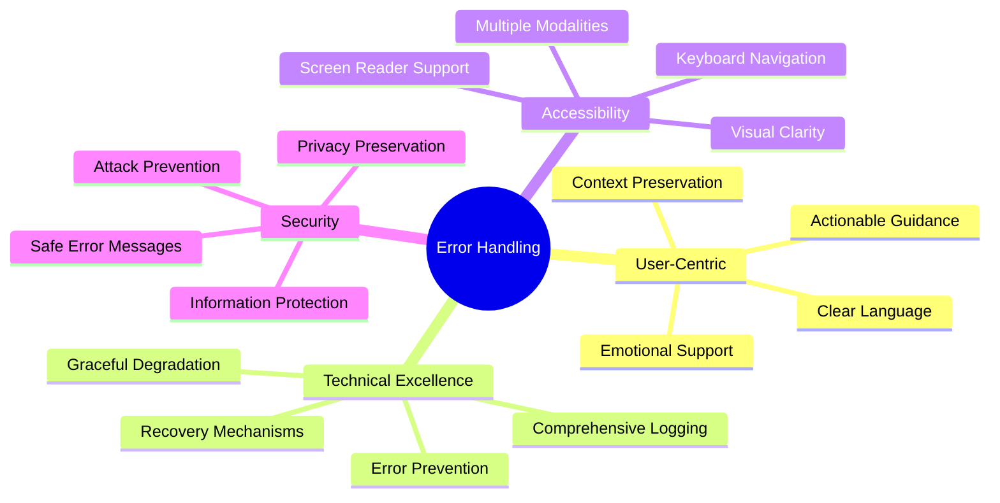
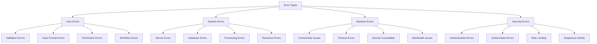

# Error Handling Documentation

*Comprehensive error handling strategy and user guidance system for Nality*

---

## ⚠️ **Error Handling Philosophy**

Nality's error handling approach prioritizes user understanding, graceful degradation, and clear recovery paths. Every error state is designed to maintain user trust while providing actionable guidance for resolution.

### **Core Principles**



### **Error Classification System**



---

## 📝 **User Error Handling**

### **Form Validation Errors**

**Real-Time Validation:**
```typescript
interface ValidationError {
  field: string;
  message: string;
  type: 'required' | 'format' | 'length' | 'custom';
  severity: 'error' | 'warning' | 'info';
}

const validateEventForm = (data: EventFormData): ValidationError[] => {
  const errors: ValidationError[] = [];
  
  // Title validation
  if (!data.title?.trim()) {
    errors.push({
      field: 'title',
      message: 'Event title is required to help you find this memory later',
      type: 'required',
      severity: 'error'
    });
  } else if (data.title.length > 200) {
    errors.push({
      field: 'title',
      message: 'Title should be under 200 characters for better readability',
      type: 'length',
      severity: 'warning'
    });
  }
  
  // Date validation
  if (!data.startDate) {
    errors.push({
      field: 'startDate',
      message: 'Please select when this event occurred',
      type: 'required',
      severity: 'error'
    });
  } else if (new Date(data.startDate) > new Date()) {
    errors.push({
      field: 'startDate',
      message: 'Event date cannot be in the future',
      type: 'custom',
      severity: 'error'
    });
  }
  
  return errors;
};
```

**Error Display Component:**
```typescript
const FormErrorDisplay: React.FC<{
  errors: ValidationError[];
  field: string;
}> = ({ errors, field }) => {
  const fieldErrors = errors.filter(error => error.field === field);
  
  if (fieldErrors.length === 0) return null;
  
  return (
    <div className="error-container">
      {fieldErrors.map((error, index) => (
        <div
          key={index}
          className={`error-message error-${error.severity}`}
          role="alert"
          aria-live="polite"
        >
          <Icon name={error.severity === 'error' ? 'error' : 'warning'} />
          <span>{error.message}</span>
          {error.type === 'required' && (
            <div className="error-help">
              This field is required to save your event
            </div>
          )}
        </div>
      ))}
    </div>
  );
};
```

### **Input Format Errors**

**Media Upload Errors:**
```typescript
interface MediaUploadError {
  file: File;
  error: string;
  errorCode: string;
  recoveryAction?: string;
}

const handleMediaUploadError = (error: MediaUploadError): UserMessage => {
  switch (error.errorCode) {
    case 'FILE_TOO_LARGE':
      return {
        type: 'error',
        title: 'File too large',
        message: `"${error.file.name}" is ${formatFileSize(error.file.size)}, but the maximum allowed size is ${formatFileSize(MAX_FILE_SIZE)}.`,
        actions: [
          {
            label: 'Compress image',
            action: () => openImageCompressor(error.file),
            primary: true
          },
          {
            label: 'Choose different file',
            action: () => openFilePicker(),
            primary: false
          }
        ]
      };
      
    case 'UNSUPPORTED_FORMAT':
      return {
        type: 'error',
        title: 'Unsupported file format',
        message: `"${error.file.name}" is a ${getFileExtension(error.file.name)} file, which isn't supported.`,
        additionalInfo: 'Supported formats: JPEG, PNG, WebP, MP4, MOV, PDF',
        actions: [
          {
            label: 'Convert file',
            action: () => openFileConverter(error.file),
            primary: true
          },
          {
            label: 'Learn about formats',
            action: () => openHelpArticle('supported-formats'),
            primary: false
          }
        ]
      };
      
    case 'CORRUPT_FILE':
      return {
        type: 'error',
        title: 'File appears to be corrupted',
        message: `We couldn't read "${error.file.name}". The file might be damaged or corrupted.`,
        actions: [
          {
            label: 'Try different file',
            action: () => openFilePicker(),
            primary: true
          },
          {
            label: 'Get help',
            action: () => openSupportChat(),
            primary: false
          }
        ]
      };
      
    default:
      return {
        type: 'error',
        title: 'Upload failed',
        message: `We couldn't upload "${error.file.name}". Please try again.`,
        actions: [
          {
            label: 'Retry upload',
            action: () => retryUpload(error.file),
            primary: true
          }
        ]
      };
  }
};
```

### **Permission and Access Errors**

**Access Control Messages:**
```typescript
const AccessErrorHandler = {
  handleUnauthorizedAccess: (resource: string, requiredPermission: string) => ({
    type: 'warning' as const,
    title: 'Access restricted',
    message: `You don't have permission to ${requiredPermission} this ${resource}.`,
    explanation: 'This might be because the content is private or you need to be invited to access it.',
    actions: [
      {
        label: 'Request access',
        action: () => requestAccess(resource),
        primary: true
      },
      {
        label: 'Return to timeline',
        action: () => navigateToTimeline(),
        primary: false
      }
    ]
  }),
  
  handleTimelinePrivacy: (ownerName: string) => ({
    type: 'info' as const,
    title: 'Private timeline',
    message: `${ownerName}'s timeline is set to private.`,
    explanation: 'Only the timeline owner and invited family members can view private timelines.',
    actions: [
      {
        label: 'Browse public timelines',
        action: () => browsePublicTimelines(),
        primary: true
      },
      {
        label: 'Create your own timeline',
        action: () => startTimelineCreation(),
        primary: false
      }
    ]
  }),
  
  handleAccountSuspension: (reason: string, appealProcess: boolean) => ({
    type: 'error' as const,
    title: 'Account access limited',
    message: 'Your account access has been temporarily limited.',
    explanation: `Reason: ${reason}`,
    actions: appealProcess ? [
      {
        label: 'Submit appeal',
        action: () => openAppealForm(),
        primary: true
      },
      {
        label: 'Learn about policies',
        action: () => openPolicyPage(),
        primary: false
      }
    ] : [
      {
        label: 'Contact support',
        action: () => openSupportChat(),
        primary: true
      }
    ]
  })
};
```

---

## 🔧 **System Error Handling**

### **Server Error Management**

**Error Response Structure:**
```typescript
interface ApiErrorResponse {
  error: {
    code: string;
    message: string;
    details?: Record<string, any>;
    timestamp: string;
    requestId: string;
    retryable: boolean;
  };
}

interface UserFriendlyError {
  title: string;
  message: string;
  technicalDetails?: string;
  actions: ErrorAction[];
  severity: 'low' | 'medium' | 'high' | 'critical';
}

const translateServerError = (apiError: ApiErrorResponse): UserFriendlyError => {
  const { code, message, retryable } = apiError.error;
  
  switch (code) {
    case 'SERVER_OVERLOADED':
      return {
        title: 'Service temporarily busy',
        message: 'Our servers are experiencing high traffic. Your request will be processed shortly.',
        actions: [
          {
            label: 'Try again',
            action: () => retryLastAction(),
            primary: true,
            delay: 5000 // 5 second delay
          },
          {
            label: 'Work offline',
            action: () => enableOfflineMode(),
            primary: false
          }
        ],
        severity: 'medium'
      };
      
    case 'DATABASE_TIMEOUT':
      return {
        title: 'Request timed out',
        message: 'The request took longer than expected. Your data is safe.',
        technicalDetails: retryable ? 'This is usually temporary and will resolve automatically.' : undefined,
        actions: retryable ? [
          {
            label: 'Retry',
            action: () => retryLastAction(),
            primary: true
          }
        ] : [
          {
            label: 'Refresh page',
            action: () => window.location.reload(),
            primary: true
          }
        ],
        severity: 'medium'
      };
      
    case 'STORAGE_QUOTA_EXCEEDED':
      return {
        title: 'Storage limit reached',
        message: 'You\'ve reached your storage limit. Some features may be limited until you free up space.',
        actions: [
          {
            label: 'Manage storage',
            action: () => openStorageManager(),
            primary: true
          },
          {
            label: 'Upgrade plan',
            action: () => openUpgradeDialog(),
            primary: false
          }
        ],
        severity: 'high'
      };
      
    default:
      return {
        title: 'Something went wrong',
        message: 'We encountered an unexpected error. Our team has been notified.',
        technicalDetails: `Error code: ${code}`,
        actions: [
          {
            label: 'Try again',
            action: () => retryLastAction(),
            primary: true
          },
          {
            label: 'Report issue',
            action: () => reportError(apiError),
            primary: false
          }
        ],
        severity: 'medium'
      };
  }
};
```

### **Database Error Handling**

**Connection and Query Errors:**
```typescript
const DatabaseErrorHandler = {
  handleConnectionError: () => ({
    type: 'error' as const,
    title: 'Connection lost',
    message: 'We lost connection to our servers. Your work is saved locally.',
    explanation: 'Your timeline will sync automatically when connection is restored.',
    actions: [
      {
        label: 'Continue offline',
        action: () => enableOfflineMode(),
        primary: true
      },
      {
        label: 'Reconnect',
        action: () => attemptReconnection(),
        primary: false
      }
    ],
    persistent: true
  }),
  
  handleDataCorruption: (affectedData: string[]) => ({
    type: 'error' as const,
    title: 'Data sync issue detected',
    message: 'Some of your data may not be displaying correctly.',
    explanation: `Affected: ${affectedData.join(', ')}`,
    actions: [
      {
        label: 'Refresh data',
        action: () => refreshAffectedData(affectedData),
        primary: true
      },
      {
        label: 'Contact support',
        action: () => openSupportWithContext(affectedData),
        primary: false
      }
    ],
    severity: 'high'
  }),
  
  handleMigrationError: () => ({
    type: 'warning' as const,
    title: 'System update in progress',
    message: 'We\'re improving our systems. Some features may be temporarily unavailable.',
    actions: [
      {
        label: 'Check status',
        action: () => openStatusPage(),
        primary: true
      }
    ],
    autoRecheck: 30000 // Check again in 30 seconds
  })
};
```

---

## 🌐 **Network Error Handling**

### **Connectivity Issues**

**Network State Management:**
```typescript
interface NetworkState {
  isOnline: boolean;
  connectionType: 'wifi' | 'cellular' | 'ethernet' | 'unknown';
  speed: 'slow' | 'medium' | 'fast';
  latency: number;
}

const NetworkErrorHandler = {
  handleOfflineState: () => ({
    type: 'info' as const,
    title: 'You\'re offline',
    message: 'You can continue working. Changes will sync when you\'re back online.',
    actions: [
      {
        label: 'Continue offline',
        action: () => acknowledgeOfflineMode(),
        primary: true
      },
      {
        label: 'Retry connection',
        action: () => testConnection(),
        primary: false
      }
    ],
    persistent: true,
    icon: 'offline'
  }),
  
  handleSlowConnection: () => ({
    type: 'warning' as const,
    title: 'Slow connection detected',
    message: 'Upload and sync may take longer than usual.',
    actions: [
      {
        label: 'Optimize for slow connection',
        action: () => enableLowBandwidthMode(),
        primary: true
      },
      {
        label: 'Continue normally',
        action: () => dismissSlowConnectionWarning(),
        primary: false
      }
    ],
    timeout: 10000 // Auto-dismiss after 10 seconds
  }),
  
  handleTimeoutError: (operation: string, retryCount: number) => {
    const maxRetries = 3;
    const isLastRetry = retryCount >= maxRetries;
    
    return {
      type: 'error' as const,
      title: 'Request timed out',
      message: `${operation} is taking longer than expected.`,
      explanation: isLastRetry 
        ? 'We\'ve tried multiple times. Please check your connection.'
        : `Attempt ${retryCount} of ${maxRetries}`,
      actions: isLastRetry ? [
        {
          label: 'Save offline',
          action: () => saveOffline(),
          primary: true
        },
        {
          label: 'Report issue',
          action: () => reportNetworkIssue(),
          primary: false
        }
      ] : [
        {
          label: 'Retry',
          action: () => retryOperation(operation, retryCount + 1),
          primary: true
        },
        {
          label: 'Cancel',
          action: () => cancelOperation(),
          primary: false
        }
      ]
    };
  }
};
```

### **Media Upload Error Handling**

**Progressive Upload Error Management:**
```typescript
interface UploadError {
  file: File;
  progress: number;
  error: string;
  retryCount: number;
  canRetry: boolean;
}

const MediaUploadErrorHandler = {
  handleUploadFailure: (error: UploadError) => {
    const { file, progress, retryCount, canRetry } = error;
    
    if (progress > 50 && canRetry) {
      return {
        type: 'warning' as const,
        title: 'Upload interrupted',
        message: `"${file.name}" upload was ${progress}% complete when it failed.`,
        actions: [
          {
            label: 'Resume upload',
            action: () => resumeUpload(file, progress),
            primary: true
          },
          {
            label: 'Start over',
            action: () => restartUpload(file),
            primary: false
          }
        ]
      };
    }
    
    if (retryCount < 3 && canRetry) {
      return {
        type: 'error' as const,
        title: 'Upload failed',
        message: `Couldn't upload "${file.name}". This might be due to a connection issue.`,
        actions: [
          {
            label: `Retry (${3 - retryCount} attempts left)`,
            action: () => retryUpload(file),
            primary: true
          },
          {
            label: 'Upload later',
            action: () => saveForLaterUpload(file),
            primary: false
          }
        ]
      };
    }
    
    return {
      type: 'error' as const,
      title: 'Upload unsuccessful',
      message: `We couldn't upload "${file.name}" after multiple attempts.`,
      actions: [
        {
          label: 'Save for offline upload',
          action: () => queueForOfflineUpload(file),
          primary: true
        },
        {
          label: 'Get help',
          action: () => openSupportWithFile(file),
          primary: false
        }
      ]
    };
  },
  
  handleStorageQuotaExceeded: (file: File, availableSpace: number) => ({
    type: 'error' as const,
    title: 'Not enough storage space',
    message: `"${file.name}" (${formatFileSize(file.size)}) exceeds your available space (${formatFileSize(availableSpace)}).`,
    actions: [
      {
        label: 'Manage storage',
        action: () => openStorageManager(),
        primary: true
      },
      {
        label: 'Compress file',
        action: () => compressFile(file),
        primary: false
      },
      {
        label: 'Upgrade storage',
        action: () => openUpgradeDialog(),
        primary: false
      }
    ]
  })
};
```

---

## 🔐 **Security Error Handling**

### **Authentication Errors**

**Auth Error Management:**
```typescript
const AuthErrorHandler = {
  handleSessionExpired: () => ({
    type: 'warning' as const,
    title: 'Session expired',
    message: 'For your security, you\'ve been signed out due to inactivity.',
    explanation: 'Your work has been saved. Please sign in to continue.',
    actions: [
      {
        label: 'Sign in again',
        action: () => redirectToLogin(window.location.pathname),
        primary: true
      },
      {
        label: 'View as guest',
        action: () => enableGuestMode(),
        primary: false
      }
    ],
    persistent: true
  }),
  
  handleInvalidToken: () => ({
    type: 'error' as const,
    title: 'Authentication issue',
    message: 'There was a problem verifying your identity.',
    actions: [
      {
        label: 'Sign in again',
        action: () => clearAuthAndRedirect(),
        primary: true
      },
      {
        label: 'Contact support',
        action: () => openSupportChat(),
        primary: false
      }
    ]
  }),
  
  handleSuspiciousActivity: (activityType: string) => ({
    type: 'error' as const,
    title: 'Security alert',
    message: 'Unusual activity detected on your account.',
    explanation: `Activity type: ${activityType}`,
    actions: [
      {
        label: 'Secure my account',
        action: () => startSecurityReview(),
        primary: true
      },
      {
        label: 'Learn more',
        action: () => openSecurityHelp(),
        primary: false
      }
    ],
    severity: 'critical'
  })
};
```

### **Rate Limiting and Abuse Prevention**

**Rate Limit Error Handling:**
```typescript
const RateLimitErrorHandler = {
  handleRateLimit: (limitType: string, resetTime: Date) => {
    const timeUntilReset = formatTimeUntil(resetTime);
    
    return {
      type: 'warning' as const,
      title: 'Rate limit reached',
      message: `You've made too many ${limitType} requests. Please wait ${timeUntilReset} before trying again.`,
      explanation: 'This helps us keep the service running smoothly for everyone.',
      actions: [
        {
          label: 'Wait and retry',
          action: () => scheduleRetry(resetTime),
          primary: true
        },
        {
          label: 'Learn about limits',
          action: () => openRateLimitHelp(),
          primary: false
        }
      ],
      countdown: resetTime
    };
  },
  
  handleAPIQuotaExceeded: (quotaType: string, upgradeAvailable: boolean) => ({
    type: 'error' as const,
    title: 'Usage limit reached',
    message: `You've reached your ${quotaType} limit for this month.`,
    actions: upgradeAvailable ? [
      {
        label: 'Upgrade plan',
        action: () => openUpgradeDialog(),
        primary: true
      },
      {
        label: 'View usage',
        action: () => openUsageDashboard(),
        primary: false
      }
    ] : [
      {
        label: 'View usage',
        action: () => openUsageDashboard(),
        primary: true
      },
      {
        label: 'Contact support',
        action: () => openSupportChat(),
        primary: false
      }
    ]
  })
};
```

---

## 🎨 **Error UI Components**

### **Error Message Component**

**Accessible Error Display:**
```typescript
interface ErrorMessageProps {
  error: UserFriendlyError;
  onDismiss?: () => void;
  onAction?: (action: ErrorAction) => void;
}

const ErrorMessage: React.FC<ErrorMessageProps> = ({ 
  error, 
  onDismiss, 
  onAction 
}) => {
  const [countdown, setCountdown] = useState<number | null>(null);
  const [isExpanded, setIsExpanded] = useState(false);
  
  // Handle countdown for timed actions
  useEffect(() => {
    if (error.countdown) {
      const updateCountdown = () => {
        const remaining = Math.max(0, error.countdown!.getTime() - Date.now());
        setCountdown(Math.ceil(remaining / 1000));
        
        if (remaining <= 0) {
          setCountdown(null);
        }
      };
      
      updateCountdown();
      const interval = setInterval(updateCountdown, 1000);
      
      return () => clearInterval(interval);
    }
  }, [error.countdown]);
  
  const getSeverityIcon = (severity: string) => {
    switch (severity) {
      case 'critical': return 'error';
      case 'high': return 'warning';
      case 'medium': return 'info';
      default: return 'info';
    }
  };
  
  return (
    <div 
      className={`error-message error-${error.severity}`}
      role="alert"
      aria-live="assertive"
    >
      <div className="error-header">
        <Icon 
          name={getSeverityIcon(error.severity)} 
          aria-hidden="true"
        />
        <h3 className="error-title">{error.title}</h3>
        {onDismiss && !error.persistent && (
          <button
            onClick={onDismiss}
            aria-label="Dismiss error message"
            className="error-dismiss"
          >
            <Icon name="close" />
          </button>
        )}
      </div>
      
      <div className="error-content">
        <p className="error-message-text">{error.message}</p>
        
        {error.explanation && (
          <p className="error-explanation">{error.explanation}</p>
        )}
        
        {countdown && (
          <p className="error-countdown">
            Retrying in {countdown} seconds...
          </p>
        )}
        
        {error.technicalDetails && (
          <details className="error-technical">
            <summary>Technical details</summary>
            <pre>{error.technicalDetails}</pre>
          </details>
        )}
        
        {error.actions.length > 0 && (
          <div className="error-actions">
            {error.actions.map((action, index) => (
              <button
                key={index}
                onClick={() => onAction?.(action)}
                className={action.primary ? 'primary' : 'secondary'}
                disabled={action.delay ? countdown !== null : false}
              >
                {action.label}
                {action.delay && countdown && ` (${countdown}s)`}
              </button>
            ))}
          </div>
        )}
      </div>
    </div>
  );
};
```

### **Error Boundary Implementation**

**React Error Boundary:**
```typescript
interface ErrorBoundaryState {
  hasError: boolean;
  error: Error | null;
  errorInfo: ErrorInfo | null;
}

class ErrorBoundary extends React.Component<
  React.PropsWithChildren<{}>,
  ErrorBoundaryState
> {
  constructor(props: React.PropsWithChildren<{}>) {
    super(props);
    this.state = {
      hasError: false,
      error: null,
      errorInfo: null
    };
  }
  
  static getDerivedStateFromError(error: Error): Partial<ErrorBoundaryState> {
    return { hasError: true, error };
  }
  
  componentDidCatch(error: Error, errorInfo: ErrorInfo) {
    this.setState({
      error,
      errorInfo
    });
    
    // Log error to monitoring service
    logger.error('React Error Boundary caught error', {
      error: error.message,
      stack: error.stack,
      componentStack: errorInfo.componentStack,
      errorBoundary: 'ErrorBoundary'
    });
  }
  
  handleRetry = () => {
    this.setState({
      hasError: false,
      error: null,
      errorInfo: null
    });
  };
  
  render() {
    if (this.state.hasError) {
      return (
        <div className="error-boundary">
          <div className="error-boundary-content">
            <Icon name="error" size="large" />
            <h2>Something went wrong</h2>
            <p>We're sorry, but something unexpected happened.</p>
            
            <div className="error-actions">
              <button 
                onClick={this.handleRetry}
                className="primary"
              >
                Try again
              </button>
              <button 
                onClick={() => window.location.reload()}
                className="secondary"
              >
                Refresh page
              </button>
              <button
                onClick={() => reportError(this.state.error, this.state.errorInfo)}
                className="secondary"
              >
                Report issue
              </button>
            </div>
            
            {process.env.NODE_ENV === 'development' && (
              <details className="error-details">
                <summary>Error details (development only)</summary>
                <pre>
                  {this.state.error?.stack}
                  {'\n\n'}
                  {this.state.errorInfo?.componentStack}
                </pre>
              </details>
            )}
          </div>
        </div>
      );
    }
    
    return this.props.children;
  }
}
```

---

## 📊 **Error Monitoring and Analytics**

### **Error Tracking Implementation**

**Error Logging Service:**
```typescript
interface ErrorLogEntry {
  id: string;
  timestamp: Date;
  level: 'error' | 'warning' | 'info';
  message: string;
  context: {
    userId?: string;
    sessionId: string;
    userAgent: string;
    url: string;
    component?: string;
    errorBoundary?: string;
  };
  stack?: string;
  additionalData?: Record<string, any>;
}

class ErrorLogger {
  private queue: ErrorLogEntry[] = [];
  private isProcessing = false;
  
  log(entry: Omit<ErrorLogEntry, 'id' | 'timestamp'>) {
    const logEntry: ErrorLogEntry = {
      id: generateUniqueId(),
      timestamp: new Date(),
      ...entry
    };
    
    this.queue.push(logEntry);
    this.processQueue();
    
    // Also log to console in development
    if (process.env.NODE_ENV === 'development') {
      console.error('Error logged:', logEntry);
    }
  }
  
  private async processQueue() {
    if (this.isProcessing || this.queue.length === 0) return;
    
    this.isProcessing = true;
    
    try {
      const batch = this.queue.splice(0, 10); // Process in batches
      await this.sendToService(batch);
    } catch (error) {
      // If logging fails, store locally for later retry
      this.storeLocallyForRetry(this.queue);
    } finally {
      this.isProcessing = false;
      
      // Process remaining items
      if (this.queue.length > 0) {
        setTimeout(() => this.processQueue(), 1000);
      }
    }
  }
  
  private async sendToService(entries: ErrorLogEntry[]) {
    // Send to external logging service (e.g., Sentry, LogRocket)
    await fetch('/api/errors', {
      method: 'POST',
      headers: { 'Content-Type': 'application/json' },
      body: JSON.stringify({ entries })
    });
  }
  
  private storeLocallyForRetry(entries: ErrorLogEntry[]) {
    try {
      const existing = JSON.parse(
        localStorage.getItem('pendingErrorLogs') || '[]'
      );
      localStorage.setItem(
        'pendingErrorLogs',
        JSON.stringify([...existing, ...entries])
      );
    } catch {
      // If localStorage fails, silently ignore
    }
  }
}

const errorLogger = new ErrorLogger();
```

### **Error Analytics Dashboard**

**Error Metrics Tracking:**
```typescript
interface ErrorMetrics {
  totalErrors: number;
  errorsByType: Record<string, number>;
  errorsByComponent: Record<string, number>;
  userImpact: {
    affectedUsers: number;
    sessionsWithErrors: number;
    errorRate: number;
  };
  trends: {
    hourly: number[];
    daily: number[];
    weekly: number[];
  };
}

const ErrorAnalytics = {
  trackError: (error: UserFriendlyError, context: any) => {
    // Track error occurrence
    analytics.track('error_occurred', {
      error_type: error.severity,
      error_title: error.title,
      component: context.component,
      user_id: context.userId,
      session_id: context.sessionId,
      timestamp: Date.now()
    });
  },
  
  trackErrorResolution: (error: UserFriendlyError, action: string) => {
    // Track how users resolve errors
    analytics.track('error_resolved', {
      error_type: error.severity,
      resolution_action: action,
      time_to_resolution: Date.now() - error.timestamp
    });
  },
  
  trackErrorRecovery: (originalError: string, recoveryMethod: string) => {
    // Track successful error recovery
    analytics.track('error_recovery', {
      original_error: originalError,
      recovery_method: recoveryMethod,
      recovery_successful: true
    });
  }
};
```

---

## 🔄 **Error Recovery Mechanisms**

### **Automatic Recovery**

**Self-Healing Strategies:**
```typescript
const AutoRecovery = {
  // Automatic retry with exponential backoff
  retryWithBackoff: async <T>(
    operation: () => Promise<T>,
    maxRetries: number = 3,
    baseDelay: number = 1000
  ): Promise<T> => {
    for (let attempt = 1; attempt <= maxRetries; attempt++) {
      try {
        return await operation();
      } catch (error) {
        if (attempt === maxRetries) throw error;
        
        const delay = baseDelay * Math.pow(2, attempt - 1);
        await new Promise(resolve => setTimeout(resolve, delay));
      }
    }
    throw new Error('Max retries exceeded');
  },
  
  // Graceful degradation for feature failures
  gracefulDegradation: (featureName: string, fallback: () => void) => {
    try {
      // Attempt feature
      return loadFeature(featureName);
    } catch (error) {
      errorLogger.log({
        level: 'warning',
        message: `Feature ${featureName} failed, using fallback`,
        context: getErrorContext(),
        additionalData: { featureName }
      });
      
      return fallback();
    }
  },
  
  // Circuit breaker pattern for failing services
  circuitBreaker: (() => {
    const breakers = new Map<string, {
      failures: number;
      lastFailure: Date;
      state: 'closed' | 'open' | 'half-open';
    }>();
    
    return {
      call: async <T>(
        serviceName: string,
        operation: () => Promise<T>,
        fallback?: () => T
      ): Promise<T> => {
        const breaker = breakers.get(serviceName) || {
          failures: 0,
          lastFailure: new Date(0),
          state: 'closed' as const
        };
        
        // Check if circuit is open
        if (breaker.state === 'open') {
          const timeSinceLastFailure = Date.now() - breaker.lastFailure.getTime();
          if (timeSinceLastFailure < 60000) { // 1 minute timeout
            if (fallback) return fallback();
            throw new Error(`Service ${serviceName} is temporarily unavailable`);
          }
          breaker.state = 'half-open';
        }
        
        try {
          const result = await operation();
          
          // Success - reset breaker
          breaker.failures = 0;
          breaker.state = 'closed';
          breakers.set(serviceName, breaker);
          
          return result;
        } catch (error) {
          breaker.failures++;
          breaker.lastFailure = new Date();
          
          if (breaker.failures >= 5) {
            breaker.state = 'open';
          }
          
          breakers.set(serviceName, breaker);
          
          if (fallback) return fallback();
          throw error;
        }
      }
    };
  })()
};
```

### **User-Initiated Recovery**

**Recovery Action Framework:**
```typescript
interface RecoveryAction {
  id: string;
  label: string;
  description: string;
  steps: RecoveryStep[];
  estimatedTime: number;
  successRate: number;
}

interface RecoveryStep {
  id: string;
  title: string;
  description: string;
  action: () => Promise<boolean>;
  canSkip: boolean;
  errorOnFailure?: string;
}

const RecoveryActions = {
  clearCacheAndRefresh: {
    id: 'clear-cache-refresh',
    label: 'Clear cache and refresh',
    description: 'Clears stored data and refreshes the page',
    estimatedTime: 30,
    successRate: 85,
    steps: [
      {
        id: 'clear-cache',
        title: 'Clear cached data',
        description: 'Removing locally stored data that might be corrupted',
        action: async () => {
          try {
            await caches.delete('nality-cache');
            localStorage.clear();
            sessionStorage.clear();
            return true;
          } catch {
            return false;
          }
        },
        canSkip: false
      },
      {
        id: 'refresh-page',
        title: 'Refresh page',
        description: 'Reloading the page with fresh data',
        action: async () => {
          window.location.reload();
          return true;
        },
        canSkip: false
      }
    ]
  },
  
  resyncData: {
    id: 'resync-data',
    label: 'Resync your data',
    description: 'Synchronizes your timeline with the server',
    estimatedTime: 60,
    successRate: 90,
    steps: [
      {
        id: 'backup-local',
        title: 'Backup local changes',
        description: 'Saving any unsaved changes locally',
        action: async () => {
          return await backupLocalChanges();
        },
        canSkip: true
      },
      {
        id: 'fetch-server-data',
        title: 'Fetch latest data',
        description: 'Getting the most recent data from our servers',
        action: async () => {
          return await fetchLatestTimelineData();
        },
        canSkip: false
      },
      {
        id: 'merge-changes',
        title: 'Merge changes',
        description: 'Combining your local changes with server data',
        action: async () => {
          return await mergeLocalAndServerData();
        },
        canSkip: false,
        errorOnFailure: 'Unable to merge changes. Some data may be lost.'
      }
    ]
  }
};
```

---

## 📚 **Error Documentation and Help**

### **Contextual Help System**

**Error-Specific Help:**
```typescript
const ErrorHelpSystem = {
  getHelpContent: (errorCode: string) => {
    const helpContent = {
      'UPLOAD_FAILED': {
        title: 'File Upload Issues',
        sections: [
          {
            title: 'Common Causes',
            content: [
              'File size exceeds the limit (10MB for images, 100MB for videos)',
              'Unsupported file format',
              'Poor internet connection',
              'Temporary server issues'
            ]
          },
          {
            title: 'Solutions',
            content: [
              'Check file size and compress if needed',
              'Verify file format is supported (JPEG, PNG, WebP, MP4, MOV, PDF)',
              'Check your internet connection',
              'Try uploading again in a few minutes'
            ]
          },
          {
            title: 'Prevention',
            content: [
              'Use recommended file formats',
              'Keep file sizes reasonable',
              'Upload during off-peak hours for better performance'
            ]
          }
        ],
        relatedArticles: [
          'supported-file-formats',
          'optimizing-media-files',
          'troubleshooting-uploads'
        ]
      }
      // More error help content...
    };
    
    return helpContent[errorCode] || {
      title: 'General Help',
      sections: [
        {
          title: 'Need Help?',
          content: [
            'Contact our support team for assistance',
            'Check our help center for common solutions',
            'Report the issue if it persists'
          ]
        }
      ]
    };
  }
};
```

### **Error Prevention Education**

**Proactive User Guidance:**
```typescript
const ErrorPrevention = {
  showPreventiveTips: (context: string) => {
    const tips = {
      'file-upload': [
        'Files larger than 10MB may take longer to upload',
        'Use JPEG format for photos to reduce file size',
        'Check your internet connection before uploading large files'
      ],
      'event-creation': [
        'Double-check dates before saving',
        'Use descriptive titles to find events later',
        'Add locations to enrich your memories'
      ],
      'timeline-navigation': [
        'Use the search function to find specific events quickly',
        'Filter by category to focus on specific types of memories',
        'Regular backups help protect your data'
      ]
    };
    
    return tips[context] || [];
  },
  
  getSmartSuggestions: (userBehavior: UserBehaviorData) => {
    const suggestions = [];
    
    if (userBehavior.frequentUploadFailures) {
      suggestions.push({
        type: 'prevention',
        message: 'Consider compressing images before uploading to avoid failures',
        action: 'Learn about image compression'
      });
    }
    
    if (userBehavior.frequentValidationErrors) {
      suggestions.push({
        type: 'education',
        message: 'Quick tip: Required fields are marked with a red asterisk (*)',
        action: 'View form help guide'
      });
    }
    
    return suggestions;
  }
};
```

---

## 🔄 **Continuous Improvement**

### **Error Analysis and Improvement**

**Error Pattern Analysis:**
```typescript
const ErrorAnalysisSystem = {
  analyzeErrorPatterns: (timeframe: 'day' | 'week' | 'month') => {
    // Analyze error logs to identify patterns and trends
    return {
      mostCommonErrors: [
        { error: 'UPLOAD_FAILED', count: 45, trend: 'decreasing' },
        { error: 'VALIDATION_ERROR', count: 32, trend: 'stable' },
        { error: 'NETWORK_TIMEOUT', count: 18, trend: 'increasing' }
      ],
      userImpactMetrics: {
        affectedUserPercentage: 12,
        averageErrorsPerUser: 2.3,
        errorRecoveryRate: 89
      },
      recommendations: [
        'Improve upload error messaging clarity',
        'Add more robust network timeout handling',
        'Implement better form validation feedback'
      ]
    };
  },
  
  generateImprovementTasks: (analysis: ErrorAnalysis) => {
    return analysis.recommendations.map(rec => ({
      priority: calculatePriority(rec),
      description: rec,
      estimatedEffort: estimateEffort(rec),
      expectedImpact: estimateImpact(rec)
    }));
  }
};
```

---

## 📚 **Related Documentation**

- **[User Experience Guidelines](./user-journeys.md)** - How errors fit into user workflows
- **[Accessibility Requirements](./accessibility.md)** - Accessible error messaging
- **[API Documentation](../api/endpoints.md)** - Backend error response formats
- **[Monitoring Setup](../development/monitoring.md)** - Error tracking implementation

---

*This error handling documentation ensures that Nality provides clear, helpful, and accessible error messages that guide users toward successful resolution while maintaining their trust and confidence in the platform.*
