# Feature Documentation

*Comprehensive feature specifications and implementation details for Nality*

---

## 🎯 **Feature Overview**

Nality's feature set is designed around the core mission of helping users create, organize, and share their life stories through an intuitive timeline experience. Each feature is built with accessibility, performance, and user privacy as foundational principles.

### **Feature Categories**

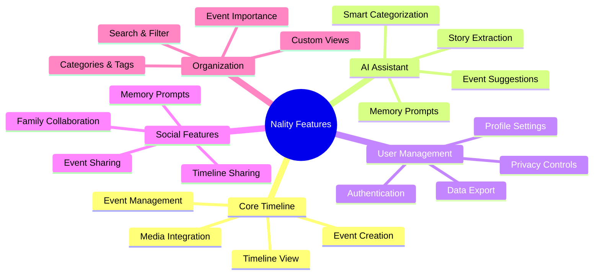

---

## 📅 **Core Timeline Features**

### **Life Event Creation**

**Feature Description:**
The primary content creation feature allowing users to document significant life moments with rich detail, media attachments, and contextual information.

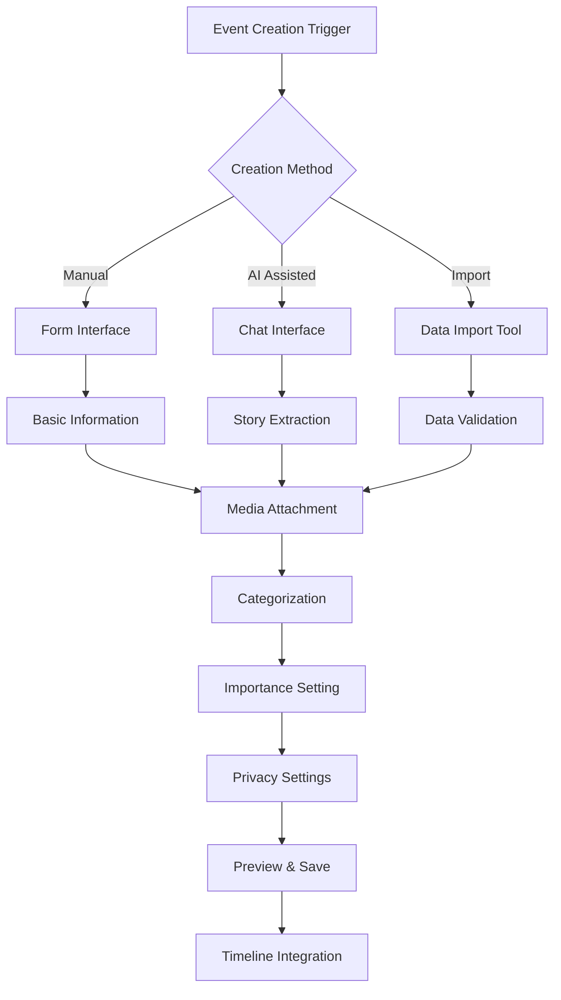

**Technical Specifications:**

- **Input Fields:**
  - `title` (required): 1-200 characters, text
  - `description` (optional): Up to 5,000 characters, rich text
  - `start_date` (required): Date picker with year precision option
  - `end_date` (optional): Date picker, must be >= start_date
  - `location` (optional): Free text or geo-location
  - `category` (required): Predefined categories with custom options
  - `tags` (optional): Free-form tags, auto-suggest from existing
  - `importance` (required): 1-10 scale with descriptive labels

- **Media Support:**
  - **Images**: JPEG, PNG, WebP, HEIC (up to 10MB each)
  - **Videos**: MP4, MOV, AVI (up to 100MB each)
  - **Documents**: PDF (up to 25MB each)
  - **Maximum**: 20 media items per event

- **Validation Rules:**
  - Title cannot be empty or whitespace only
  - Start date cannot be in the future
  - End date must be >= start date
  - Media files must pass security scanning
  - Total event size cannot exceed 200MB

**User Experience Features:**

1. **Smart Defaults**
   - Current date pre-filled
   - Location detection (with permission)
   - Category suggestion based on recent events
   - Importance level defaulted to 5

2. **Progressive Enhancement**
   - Core functionality works without JavaScript
   - Rich text editor enhancement with JavaScript
   - Drag-and-drop media upload
   - Real-time preview updates

3. **Error Handling**
   - Inline validation with helpful messages
   - Auto-save draft functionality
   - Graceful handling of upload failures
   - Offline creation with sync when connected

### **Timeline Visualization**

**Feature Description:**
The central interface displaying user's life events in chronological order with multiple view modes and interactive capabilities.

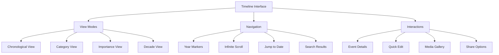

**Technical Implementation:**

- **Responsive Layout:**
  - Mobile: Single column, vertical timeline
  - Tablet: Enhanced spacing, larger media previews
  - Desktop: Alternating left/right event placement

- **Performance Optimizations:**
  - Virtual scrolling for large timelines (1000+ events)
  - Lazy loading of media thumbnails
  - Incremental data fetching
  - Client-side caching with TTL

- **Accessibility Features:**
  - Full keyboard navigation support
  - Screen reader optimized markup
  - High contrast mode support
  - Focus management for modal interactions

**Visual Design System:**

1. **Event Card Structure:**
   ```
   [Date Badge] [Category Icon]
   Event Title
   Event Description Preview
   [Media Thumbnails]
   [Tags] [Importance Indicator]
   ```

2. **Timeline Styling:**
   - Central timeline line with year markers
   - Event cards connected with visual lines
   - Importance affects card size and prominence
   - Category colors for visual organization

3. **Interactive States:**
   - Hover: Subtle elevation and border highlight
   - Focus: Visible focus ring for keyboard users
   - Selected: Distinct selection state for bulk operations
   - Loading: Skeleton screens during data fetching

### **Event Management**

**Feature Description:**
Comprehensive tools for editing, organizing, and managing life events after creation.

**Core Management Features:**

1. **Event Editing:**
   - Inline editing for quick changes
   - Full modal editing for comprehensive updates
   - Bulk editing for multiple events
   - Version history for premium users

2. **Organization Tools:**
   - Category reassignment with confirmation
   - Tag management with auto-suggestions
   - Importance level adjustments
   - Event merging for related moments

3. **Deletion and Recovery:**
   - Soft delete with 30-day recovery period
   - Permanent deletion after confirmation
   - Bulk deletion with safety confirmations
   - Data export before deletion

**Advanced Management:**

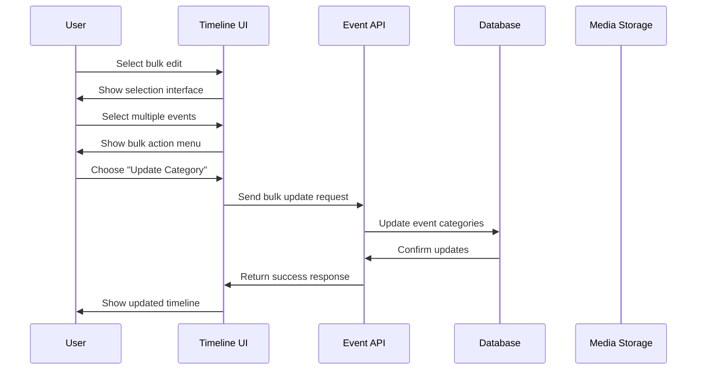

---

## 🤖 **AI-Powered Features**

### **Story Extraction Engine**

**Feature Description:**
Advanced AI system that processes natural language narratives to identify and extract structured life events.

**Technical Architecture:**

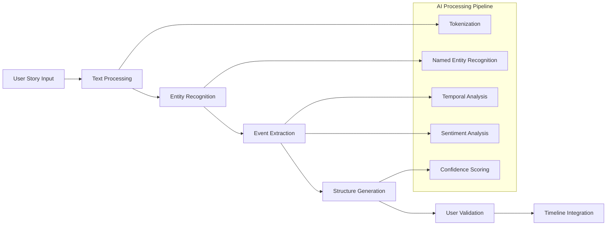

**Extraction Capabilities:**

1. **Temporal Information:**
   - Explicit dates ("June 15, 1995")
   - Relative dates ("three years later")
   - Age-based dates ("when I was 25")
   - Decade approximations ("in the 80s")
   - Life stage indicators ("during college")

2. **Location Data:**
   - City and country names
   - Landmark references
   - Geographic descriptors
   - Address information

3. **People and Relationships:**
   - Family members
   - Friends and colleagues
   - Romantic partners
   - Professional contacts

4. **Event Classification:**
   - Automatic category assignment
   - Importance level estimation
   - Emotional tone detection
   - Milestone identification

**Quality Assurance:**

- **Confidence Scoring**: Each extraction includes confidence level (0-100%)
- **User Validation**: All extractions require user confirmation
- **Learning System**: User corrections improve future extractions
- **Fallback Handling**: Manual entry for low-confidence extractions

### **Memory Prompts and Suggestions**

**Feature Description:**
AI-driven conversation system that helps users recall and document forgotten memories.

**Prompt Categories:**

1. **Life Stage Prompts:**
   - Childhood memories (ages 0-12)
   - Adolescence experiences (ages 13-18)
   - Early adulthood (ages 19-25)
   - Career development (ages 26-65)
   - Later life reflections (65+)

2. **Thematic Prompts:**
   - Family and relationships
   - Education and learning
   - Career and achievements
   - Travel and adventures
   - Challenges and growth

3. **Time-Based Prompts:**
   - Decade exploration
   - Year-specific events
   - Seasonal memories
   - Holiday traditions

**Conversation Flow:**

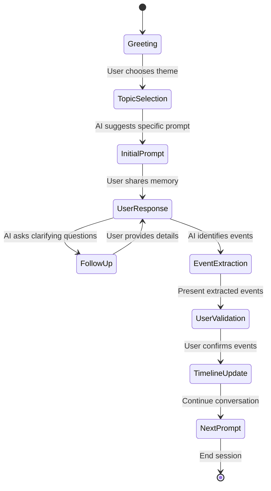

---

## 👤 **User Management Features**

### **Authentication System**

**Feature Description:**
Secure, user-friendly authentication using magic links for passwordless login.

**Authentication Flow:**

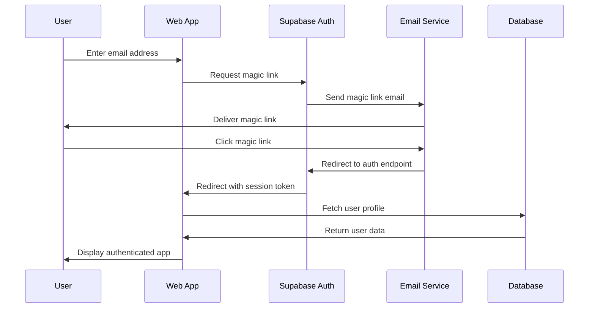

**Security Features:**

1. **Session Management:**
   - HTTP-only cookies for session storage
   - Automatic session refresh
   - Secure logout across all devices
   - Session timeout after inactivity

2. **Email Verification:**
   - Magic links expire after 1 hour
   - One-time use tokens
   - Rate limiting for email requests
   - Email address validation

3. **Account Security:**
   - Account lockout after failed attempts
   - Login notification emails
   - Device tracking and management
   - Two-factor authentication (planned)

### **Profile Management**

**Feature Description:**
Comprehensive user profile management with privacy controls and customization options.

**Profile Components:**

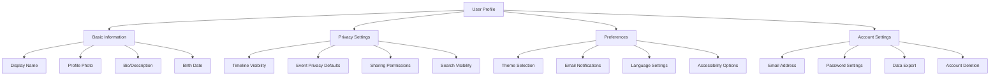

**Privacy Controls:**

1. **Granular Permissions:**
   - Public timeline (discoverable)
   - Friends only (invited access)
   - Private (owner only)
   - Custom sharing per event

2. **Data Control:**
   - Download all user data
   - Selective data deletion
   - Account anonymization
   - Complete account removal

---

## 🔍 **Search and Organization**

### **Advanced Search System**

**Feature Description:**
Powerful search functionality allowing users to find specific events, media, and content across their timeline.

**Search Capabilities:**

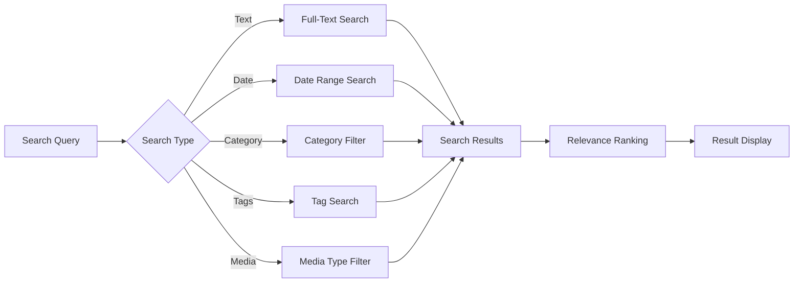

**Search Features:**

1. **Full-Text Search:**
   - Event titles and descriptions
   - Media file names and metadata
   - Tag content and categories
   - Location information

2. **Advanced Filters:**
   - Date range selection
   - Category multiselect
   - Importance level range
   - Media type filtering
   - Privacy level filtering

3. **Search Results:**
   - Relevance-based ranking
   - Timeline context preview
   - Quick actions (edit, share, delete)
   - Search result highlighting

### **Category and Tag System**

**Feature Description:**
Flexible organization system using predefined categories and user-generated tags.

**Category Structure:**

```yaml
categories:
  personal:
    - Family & Relationships
    - Health & Wellness
    - Personal Growth
    - Hobbies & Interests
  
  professional:
    - Career Milestones
    - Education & Learning
    - Skills Development
    - Networking Events
  
  life_events:
    - Celebrations & Holidays
    - Travel & Adventures
    - Achievements & Awards
    - Challenges & Setbacks
  
  milestones:
    - Birth & Childhood
    - Coming of Age
    - Marriage & Partnership
    - Parenthood
    - Retirement
```

**Tag Management:**

1. **Auto-Suggestions:**
   - Based on existing user tags
   - Popular tags from category
   - AI-suggested tags from content
   - Smart typo correction

2. **Tag Organization:**
   - Hierarchical tag structure
   - Tag merging and cleanup
   - Bulk tag operations
   - Tag usage analytics

---

## 📤 **Sharing and Collaboration**

### **Event Sharing**

**Feature Description:**
Secure sharing system allowing users to share individual events or entire timeline sections with family and friends.

**Sharing Options:**

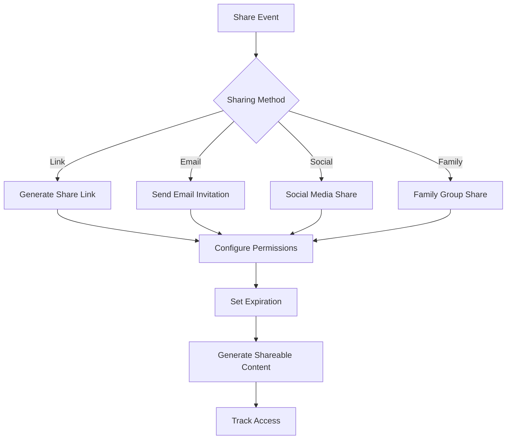

**Sharing Controls:**

1. **Permission Levels:**
   - View only (default)
   - Comment access
   - Collaborative editing
   - Full administrative access

2. **Access Management:**
   - Time-limited access
   - Password protection
   - Email verification required
   - Revoke access anytime

3. **Privacy Protection:**
   - Watermarked media for shared content
   - Download restrictions
   - View tracking and notifications
   - Content expiration dates

### **Family Collaboration**

**Feature Description:**
Tools for families to collaborate on shared timelines and contribute to collective memory keeping.

**Collaboration Features:**

1. **Family Groups:**
   - Invite family members
   - Shared family timeline
   - Collaborative event creation
   - Family milestone tracking

2. **Contribution Systems:**
   - Guest event submissions
   - Photo and video contributions
   - Story sharing and comments
   - Memory prompts for family members

---

## 📱 **Mobile Experience**

### **Progressive Web App (PWA)**

**Feature Description:**
Native-like mobile experience through Progressive Web App technology.

**PWA Features:**

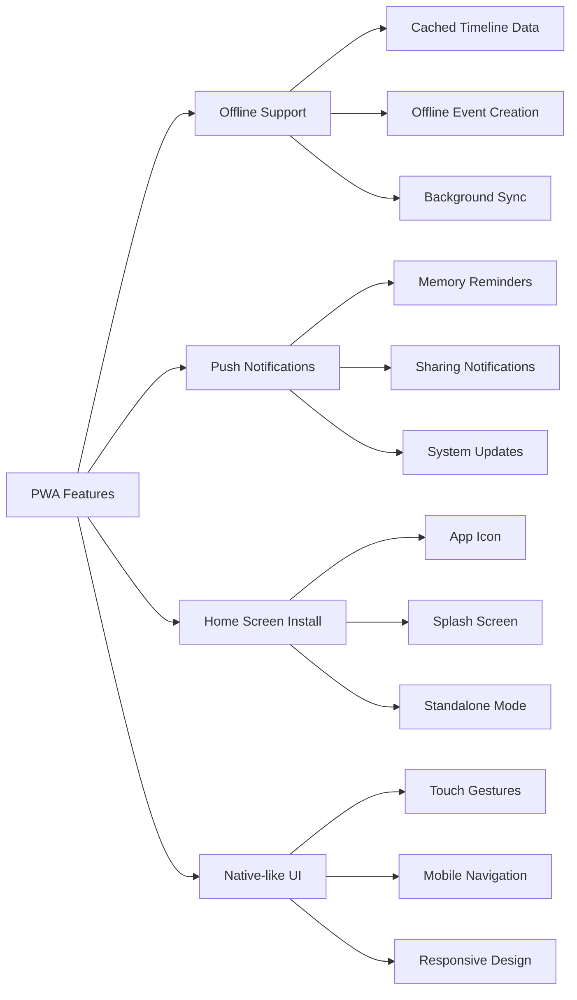

**Mobile-Specific Features:**

1. **Touch Interactions:**
   - Swipe gestures for navigation
   - Pinch-to-zoom for media
   - Long-press context menus
   - Pull-to-refresh timeline

2. **Camera Integration:**
   - Direct photo capture
   - Video recording
   - Gallery access
   - Metadata preservation

3. **Offline Capabilities:**
   - View cached timeline data
   - Create events offline
   - Queue media uploads
   - Sync when connected

---

## 🔧 **Administrative Features**

### **Data Management**

**Feature Description:**
Comprehensive tools for users to manage their data, privacy, and account settings.

**Data Tools:**

1. **Export Functionality:**
   - Complete data export (JSON format)
   - Media archive download
   - Timeline PDF generation
   - Custom date range exports

2. **Import Capabilities:**
   - CSV timeline import
   - Photo metadata import
   - Social media data import
   - Migration from other platforms

3. **Backup and Recovery:**
   - Automatic cloud backups
   - Manual backup creation
   - Point-in-time recovery
   - Data integrity verification

### **Analytics and Insights**

**Feature Description:**
Personal analytics to help users understand their timeline and memory-keeping patterns.

**Insight Categories:**

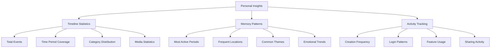

---

## 🔄 **Feature Development Pipeline**

### **Current Development Status**

```mermaid
gantt
    title Feature Development Timeline
    dateFormat  YYYY-MM-DD
    section Core Features
    Timeline Creation     :done, timeline, 2024-01-01, 2024-03-01
    Event Management      :done, events, 2024-02-01, 2024-04-01
    Media Integration     :done, media, 2024-03-01, 2024-05-01
    section AI Features
    Story Extraction      :active, ai-extract, 2024-04-01, 2024-06-01
    Memory Prompts        :future, ai-prompts, 2024-05-01, 2024-07-01
    section Social Features
    Event Sharing         :active, sharing, 2024-05-01, 2024-07-01
    Family Collaboration  :future, family, 2024-06-01, 2024-08-01
    section Advanced
    Mobile App            :future, mobile, 2024-07-01, 2024-09-01
    Analytics Dashboard   :future, analytics, 2024-08-01, 2024-10-01
```

### **Planned Features**

**Next Quarter (Q2 2024):**
- Enhanced AI conversation capabilities
- Advanced search and filtering
- Mobile PWA improvements
- Family collaboration tools

**Following Quarter (Q3 2024):**
- Native mobile applications
- Advanced sharing features
- Analytics and insights dashboard
- API for third-party integrations

**Future Roadmap:**
- Multi-language support
- Advanced privacy controls
- Professional genealogy tools
- AI-powered life insights

---

## 📚 **Related Documentation**

- **[User Journeys](./user-journeys.md)** - Complete user experience flows
- **[Accessibility Guide](./accessibility.md)** - Accessibility implementation details
- **[API Documentation](../api/endpoints.md)** - Backend integration specifications
- **[Database Schema](../database/schema.md)** - Data structure and relationships

---

*This feature documentation provides comprehensive specifications for all Nality features. Each feature is designed with user needs, technical feasibility, and scalability in mind.*
