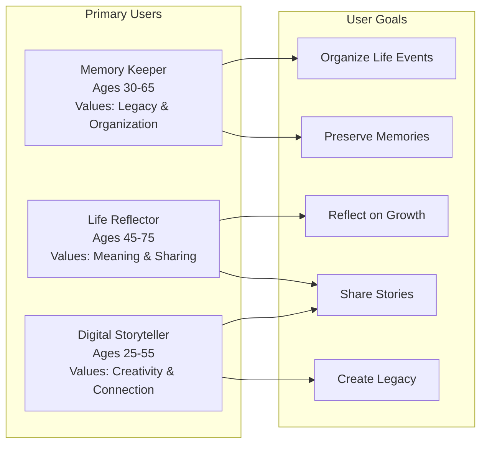
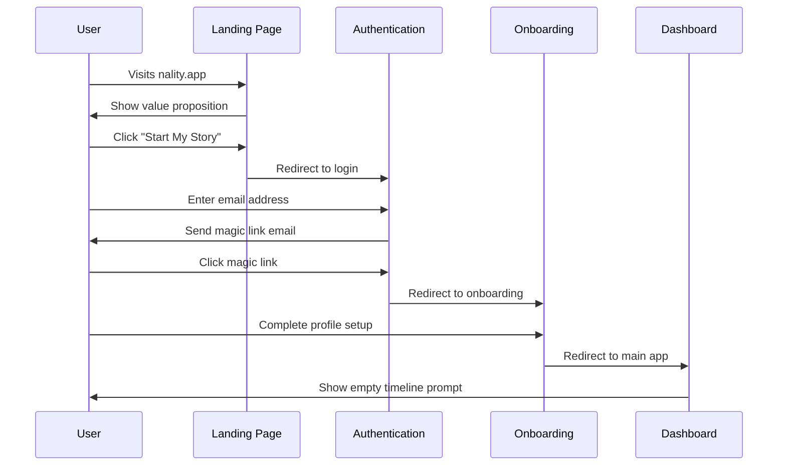
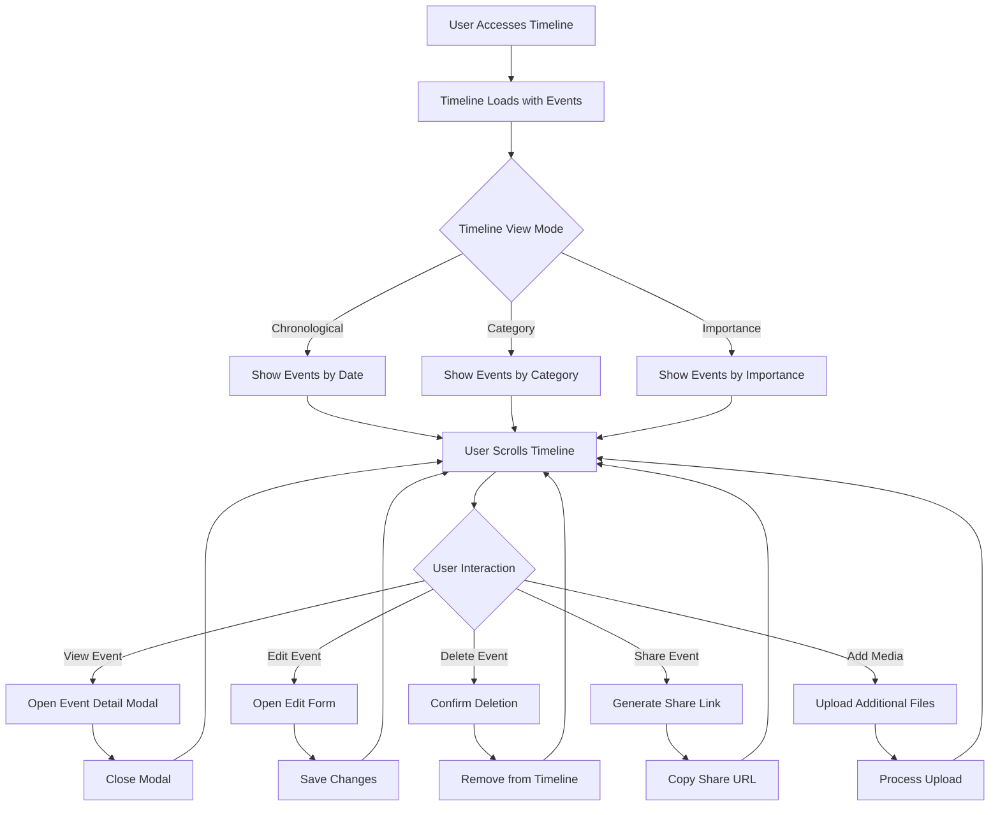
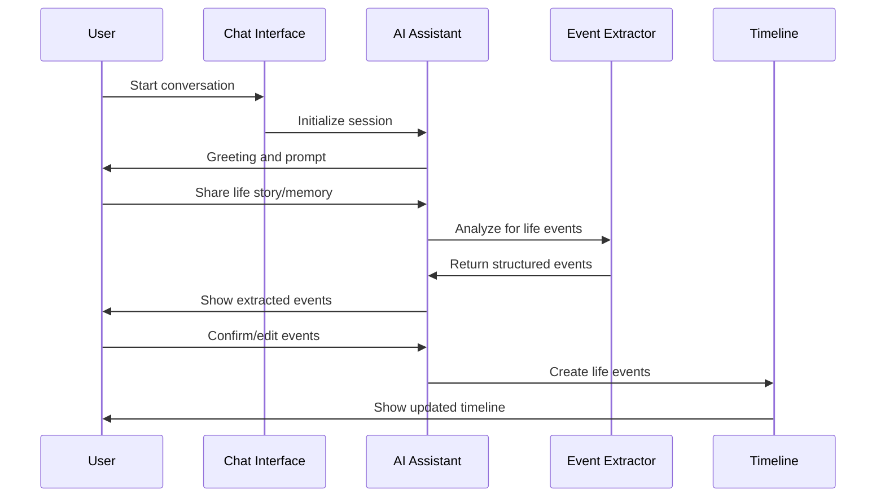
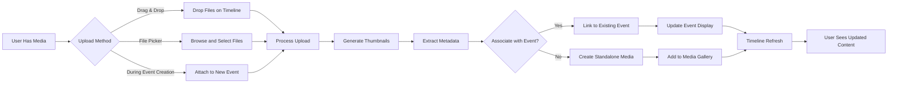
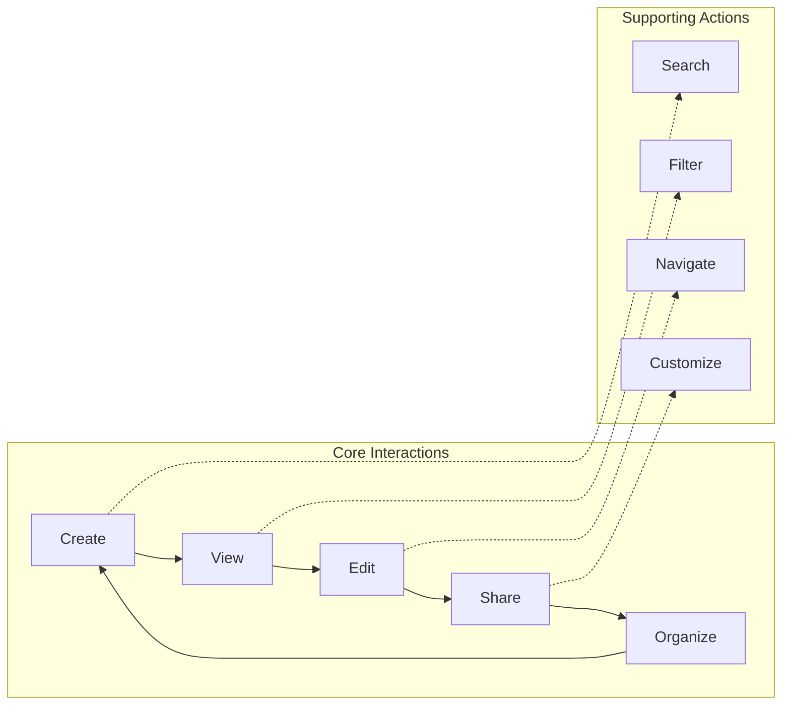
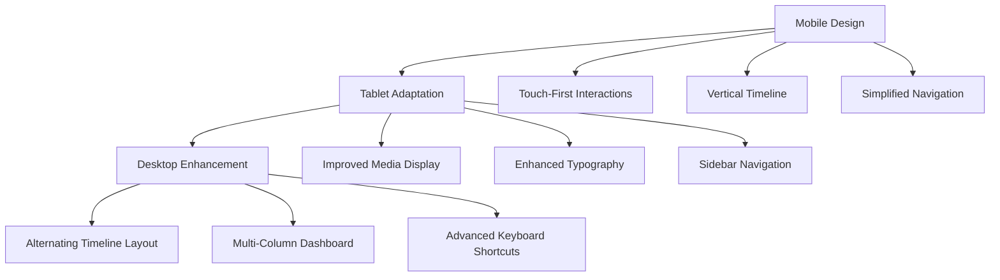
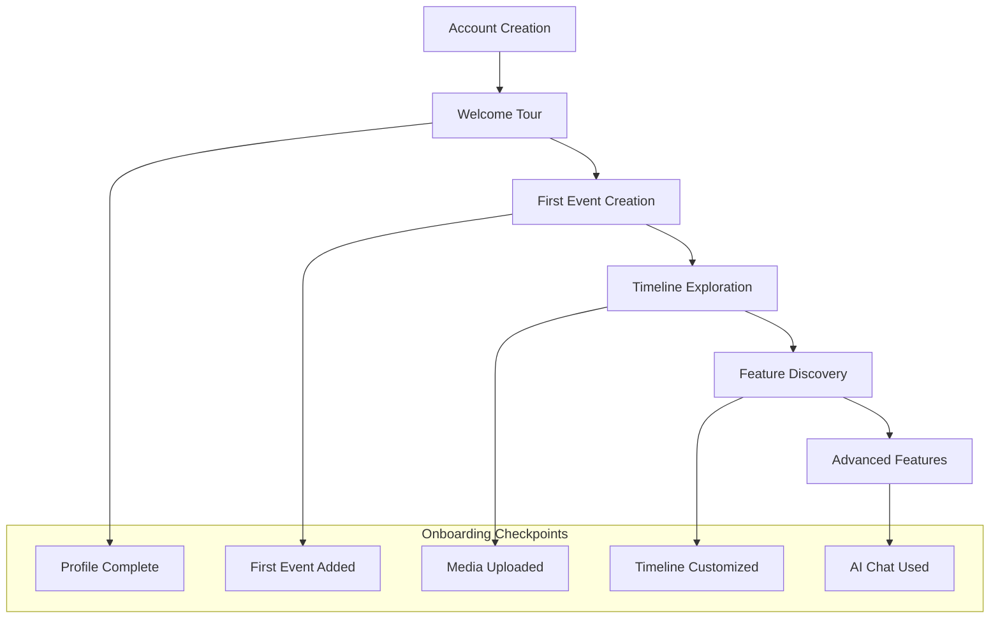
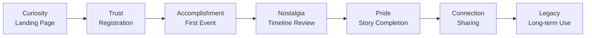

# User Journey Documentation

*Complete user workflow and interaction documentation for Nality*

---

## 👤 **User Journey Overview**

Nality provides a comprehensive life timeline experience through intuitive user journeys designed for simplicity, engagement, and personal storytelling. Each journey is crafted to help users capture, organize, and reflect on their life experiences.

### **Primary User Personas**



---

## 🚀 **Core User Journeys**

### **Journey 1: First-Time User Registration**



**Journey Steps:**

1. **Landing Page Discovery**
   - *User Action*: Visits Nality website
   - *System Response*: Display value proposition and call-to-action
   - *Success Criteria*: User understands product value and clicks "Start My Story"

2. **Authentication Process**
   - *User Action*: Enters email address for magic link
   - *System Response*: Sends secure magic link via email
   - *Success Criteria*: User receives and clicks magic link successfully

3. **Account Creation**
   - *User Action*: Clicks magic link from email
   - *System Response*: Creates account and establishes session
   - *Success Criteria*: User is authenticated and profile is created

4. **Onboarding Experience**
   - *User Action*: Completes basic profile information
   - *System Response*: Guides through app features and first event creation
   - *Success Criteria*: User understands core functionality and feels confident to proceed

5. **Dashboard Introduction**
   - *User Action*: Explores main dashboard
   - *System Response*: Shows timeline overview and creation prompts
   - *Success Criteria*: User is oriented and ready to add their first life event

### **Journey 2: Creating First Life Event**

```mermaid
flowchart TD
    A[User on Dashboard] --> B{Has Existing Events?}
    B -->|No| C[Show Empty State CTA]
    B -->|Yes| D[Show Add Memory Button]
    
    C --> E[Click "Add Your First Memory"]
    D --> E
    
    E --> F[Open Life Event Form]
    F --> G[Fill Basic Information]
    G --> H{Add Media?}
    
    H -->|Yes| I[Upload Photos/Videos]
    H -->|No| J[Set Event Details]
    
    I --> J
    J --> K[Choose Category & Tags]
    K --> L[Set Importance Level]
    L --> M[Preview Event]
    M --> N{Satisfied with Event?}
    
    N -->|No| O[Edit Event Details]
    N -->|Yes| P[Save Life Event]
    
    O --> G
    P --> Q[Event Added to Timeline]
    Q --> R[Return to Dashboard]
    R --> S[See Updated Timeline]
```

**Detailed Steps:**

1. **Event Creation Trigger**
   - *Entry Points*: Dashboard CTA, Timeline "Add Memory" button, AI chat suggestion
   - *User Motivation*: Capture meaningful life moment
   - *System Preparation*: Pre-populate current date, user context

2. **Basic Information Entry**
   - *Required Fields*: Title, start date
   - *Optional Fields*: Description, end date, location
   - *User Experience*: Progressive disclosure, smart defaults
   - *Validation*: Real-time field validation with helpful error messages

3. **Media Attachment (Optional)**
   - *Supported Types*: Images (JPEG, PNG, WebP), Videos (MP4, MOV), Documents (PDF)
   - *Upload Process*: Drag-and-drop or file picker
   - *Processing*: Automatic thumbnail generation, metadata extraction
   - *Storage*: Secure Supabase Storage with CDN delivery

4. **Event Categorization**
   - *Categories*: Personal, Education, Career, Family, Travel, Achievement, Health, Relationship, Other
   - *Tags*: Free-form tags for flexible organization
   - *Importance*: 1-10 scale for timeline prominence
   - *Smart Suggestions*: AI-powered category and tag recommendations

5. **Event Confirmation**
   - *Preview*: Shows how event will appear on timeline
   - *Editing*: Inline editing for quick adjustments
   - *Validation*: Final data integrity checks
   - *Save Options*: Save and continue, save and add another

### **Journey 3: Timeline Exploration and Management**



**Timeline Features:**

1. **Visual Timeline Display**
   - *Layout*: Vertical chronological timeline with alternating event cards
   - *Responsive Design*: Mobile-first with desktop enhancements
   - *Visual Hierarchy*: Event importance affects card size and prominence
   - *Loading Strategy*: Incremental loading for performance

2. **Event Interaction**
   - *Quick View*: Hover/tap for event preview
   - *Detailed View*: Full modal with all event details and media
   - *Inline Editing*: Quick edit for title, date, and basic fields
   - *Bulk Operations*: Multi-select for category changes, deletion

3. **Timeline Navigation**
   - *Decade Markers*: Visual decade separators for easy navigation
   - *Year Jumpers*: Quick navigation to specific years
   - *Search Functionality*: Full-text search across events
   - *Filter Options*: Category, importance, date range filters

4. **Timeline Customization**
   - *View Modes*: Chronological, categorical, importance-based
   - *Density Control*: Compact vs. expanded view options
   - *Theme Options*: Color schemes and visual preferences
   - *Privacy Settings*: Event visibility and sharing controls

### **Journey 4: AI-Assisted Memory Addition**



**AI Interaction Flow:**

1. **Chat Initiation**
   - *Entry Points*: Dashboard chat widget, dedicated chat page
   - *AI Personality*: Warm, encouraging, and insightful
   - *Initial Prompts*: Contextual questions based on user's timeline gaps

2. **Story Collection**
   - *Conversation Style*: Natural, conversational prompts
   - *Follow-up Questions*: Smart follow-ups to gather details
   - *Memory Triggers*: Decade-based prompts, category suggestions
   - *Context Awareness*: References existing timeline events

3. **Event Extraction**
   - *AI Processing*: Identifies discrete events within narratives
   - *Structured Data*: Extracts dates, locations, people, emotions
   - *Confidence Scoring*: AI confidence levels for each extraction
   - *User Validation*: Present extracted events for user confirmation

4. **Timeline Integration**
   - *Batch Processing*: Multiple events can be added simultaneously
   - *Smart Categorization*: AI suggests appropriate categories
   - *Duplicate Detection*: Identifies and prevents duplicate events
   - *Seamless Addition*: Events appear on timeline with smooth animations

### **Journey 5: Media Management and Organization**



**Media Handling:**

1. **Upload Experience**
   - *Multiple Methods*: Drag-and-drop, file picker, camera capture
   - *Batch Upload*: Multiple files simultaneously
   - *Progress Indication*: Real-time upload progress and status
   - *Error Handling*: Clear error messages with retry options

2. **Media Processing**
   - *Thumbnail Generation*: Automatic thumbnails for all media types
   - *Metadata Extraction*: EXIF data, dimensions, duration
   - *Format Optimization*: Automatic compression and format conversion
   - *Security Scanning*: Malware and content validation

3. **Organization Features**
   - *Event Association*: Link media to specific life events
   - *Bulk Operations*: Move, delete, or re-categorize multiple items
   - *Search Capability*: Search by filename, metadata, or AI-generated descriptions
   - *Storage Management*: Storage usage monitoring and optimization

---

## 🎯 **User Experience Principles**

### **Design Philosophy**

1. **Simplicity First**
   - *Principle*: Complex functionality hidden behind simple interfaces
   - *Implementation*: Progressive disclosure, smart defaults
   - *Validation*: User testing for cognitive load assessment

2. **Emotional Connection**
   - *Principle*: Design that honors and celebrates life experiences
   - *Implementation*: Thoughtful animations, meaningful interactions
   - *Validation*: Emotional response testing and feedback collection

3. **Privacy and Trust**
   - *Principle*: User data is sacred and completely under user control
   - *Implementation*: Transparent privacy controls, clear data policies
   - *Validation*: Security audits and privacy compliance verification

4. **Accessibility for All**
   - *Principle*: Usable by people of all abilities and technical skill levels
   - *Implementation*: WCAG 2.1 AA compliance, keyboard navigation
   - *Validation*: Accessibility testing with diverse user groups

### **Interaction Patterns**



1. **Primary Actions**: Clear, prominent placement for main user goals
2. **Secondary Actions**: Accessible but not competing with primary actions
3. **Destructive Actions**: Protected with confirmation dialogs
4. **Bulk Operations**: Efficient multi-item management capabilities

---

## 📱 **Responsive Experience**

### **Mobile-First Design**



**Responsive Breakpoints:**
- **Mobile**: 320px - 767px (Primary experience)
- **Tablet**: 768px - 1023px (Enhanced layout)
- **Desktop**: 1024px+ (Full feature set)

### **Progressive Enhancement**

1. **Core Functionality**: Works on all devices without JavaScript
2. **Enhanced Interactions**: JavaScript adds smooth animations and advanced features
3. **Offline Capability**: Service worker for offline viewing of cached content
4. **Performance Optimization**: Critical path rendering and lazy loading

---

## 🔄 **User Feedback Loops**

### **Continuous Improvement Process**

```mermaid
cycle
    A[User Interaction] --> B[Data Collection]
    B --> C[Analysis & Insights]
    C --> D[Design Updates]
    D --> E[Implementation]
    E --> F[User Testing]
    F --> A
```

**Feedback Mechanisms:**
1. **In-App Feedback**: Contextual feedback widgets
2. **Usage Analytics**: Privacy-respecting behavior analysis
3. **User Interviews**: Regular qualitative research sessions
4. **A/B Testing**: Careful testing of UX improvements
5. **Support Channels**: Multiple ways for users to get help

### **Success Metrics**

**User Engagement:**
- Time spent in application
- Number of events created per session
- Return visit frequency
- Feature adoption rates

**User Satisfaction:**
- Net Promoter Score (NPS)
- Customer Satisfaction Score (CSAT)
- User interview feedback themes
- Support ticket volume and resolution

**Technical Performance:**
- Page load times
- User error rates
- Conversion funnel completion
- Accessibility compliance scores

---

## 🚪 **User Onboarding Strategy**

### **Progressive Onboarding**



**Onboarding Phases:**

1. **Initial Setup** (0-5 minutes)
   - Account creation and email verification
   - Basic profile information
   - Privacy settings configuration

2. **First Success** (5-15 minutes)
   - Guided creation of first life event
   - Understanding of timeline concept
   - Initial success and engagement

3. **Feature Exploration** (Ongoing)
   - Gradual introduction of advanced features
   - Contextual tips and guidance
   - Achievement-based progression

4. **Mastery Development** (Long-term)
   - Advanced organization techniques
   - AI-assisted content creation
   - Sharing and collaboration features

---

## 💝 **Emotional Journey Design**

### **Emotional Arc**



**Emotional Touchpoints:**

1. **Moment of Discovery**: Users feel excited about preserving their memories
2. **Initial Hesitation**: Overcome through simple, non-intimidating first steps
3. **First Success**: Pride in creating their first documented life event
4. **Growing Engagement**: Satisfaction as timeline fills with meaningful content
5. **Reflection and Insight**: Emotional connection through reviewing life journey
6. **Sharing and Legacy**: Joy in sharing stories with family and friends

---

## 📚 **Related Documentation**

- **[Feature Documentation](./features.md)** - Detailed feature specifications
- **[Accessibility Guide](./accessibility.md)** - Accessibility implementation details
- **[Error Handling](./error-handling.md)** - Error states and user guidance
- **[API Endpoints](../api/endpoints.md)** - Backend integration details

---

*This user journey documentation guides the design and development of all user-facing features. Regular user testing validates these journeys and informs iterative improvements.*
